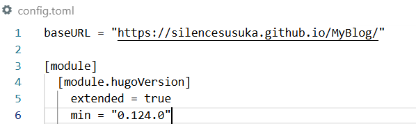
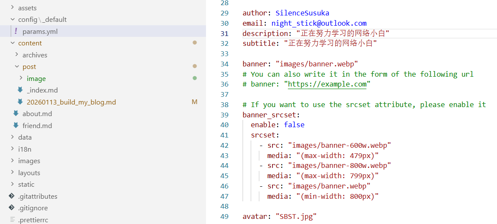
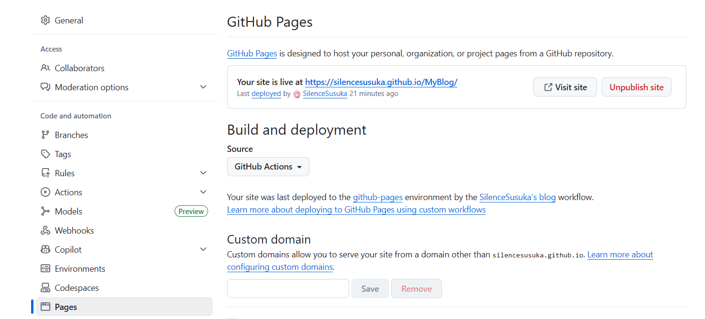
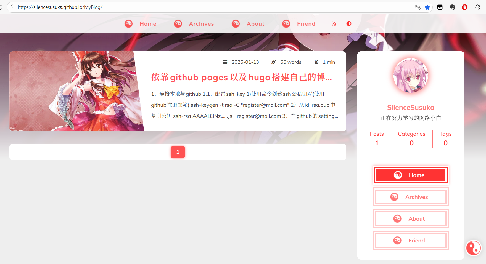

## 1、连接本地与github

### 1.1、配置ssh_key

1)使用命令创建ssh公私钥对(使用github注册邮箱)

```
ssh-keygen -t rsa -C "register@mail.com"
```

2）从id_rsa.pub中复制公钥

```
ssh-rsa AAAAB3Nz......Js= register@mail.com
```

3）在github的settings中添加该ssh公钥

4）使用命令测试连通

```
ssh -T git@github.com
Hi SilenceSusuka! You've successfully authenticated, but GitHub does not provide shell access.
```

### 1.2、配置本地git仓库

1)打开文件夹后，clone远程仓库

```
git clone https://github.com/SilenceSusuka/MyBlog.git
```

2)检查remote是否正确以及分支是否正确

```
git remote -v
git branch -vv
```

若remote与branch不正确则分别执行以下设置

```
git remote add origin https://github.com/SilenceSusuka/MyBlog.git
git branch -M main
```

## 2、配置博客页面

### 2.1、下载博客模板

这边使用hugo进行博客网站搭建，因此可以使用hugo的模板

[https://themes.gohugo.io/](https://themes.gohugo.io/)

下载至本地仓库后提交，并且可根据README进行安装以及对相关文件进行配置

我当前下载的模板主要配置文件为config.toml以及config\_default\params.yml

config.toml为hugo的旧版配置文件(新版为hugo.toml)其中必须配置正确的baseurl

```
baseURL = "https://silencesusuka.github.io/MyBlog/"
```



而config_default\params.yml主要用于配置网页内的内容，一般只需要修改主页头像，昵称，简介这些内容即可



## 3、使用gihub pages以及action部署博客网站

### 3.1、配置github actions

在项目根目录新建文件.github\workflows\deploy.yml，进行配置

```
name: SilenceSusuka's blog

on:
  push:
    branches:
      - main

permissions:
  contents: read
  pages: write
  id-token: write

jobs:
  build:
    runs-on: ubuntu-latest
    steps:
      - uses: actions/checkout@v4
      - uses: peaceiris/actions-hugo@v2
        with:
          hugo-version: latest
          extended: true
      - run: hugo
      - uses: actions/upload-pages-artifact@v3
        with:
          path: ./public

  deploy:
    needs: build
    runs-on: ubuntu-latest
    steps:
      - uses: actions/deploy-pages@v4
```

随后提交至仓库

### 3.2、配置github pages

接着在仓库的settings下的page设置中将source设置为github actions



等待action启动成功后即可访问博客


