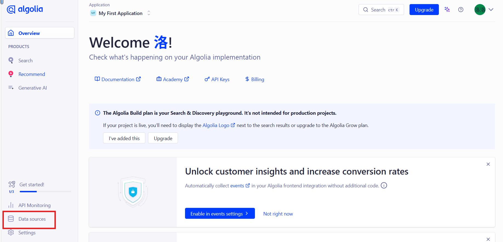
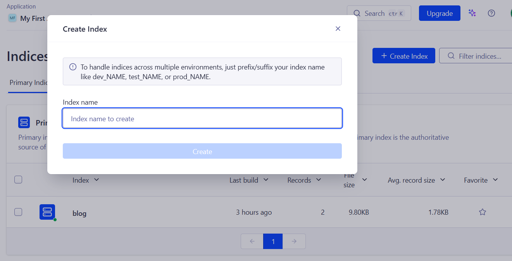
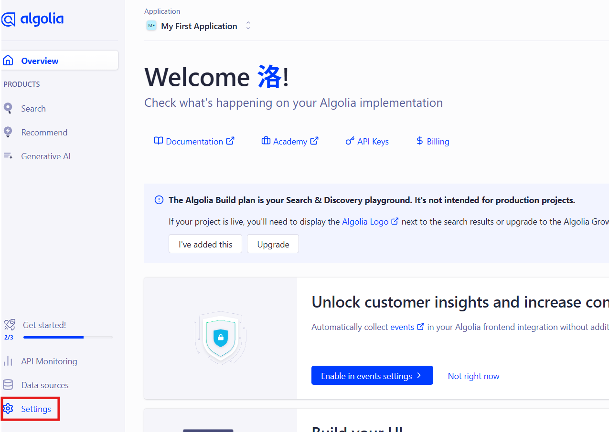
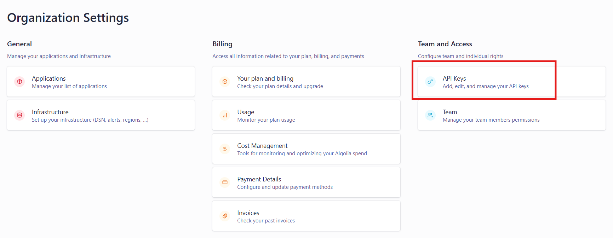
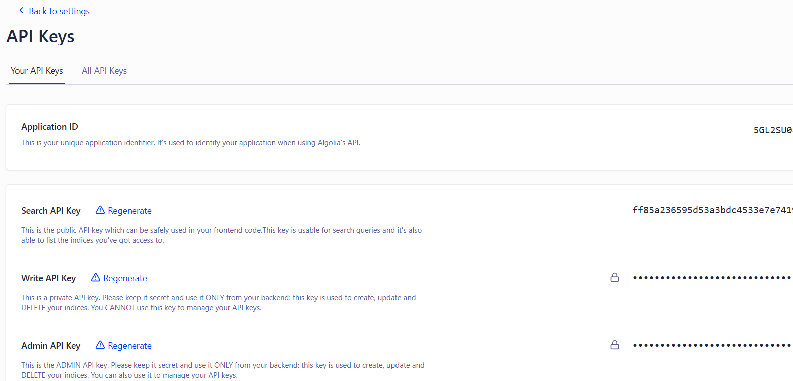
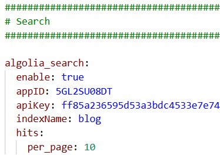
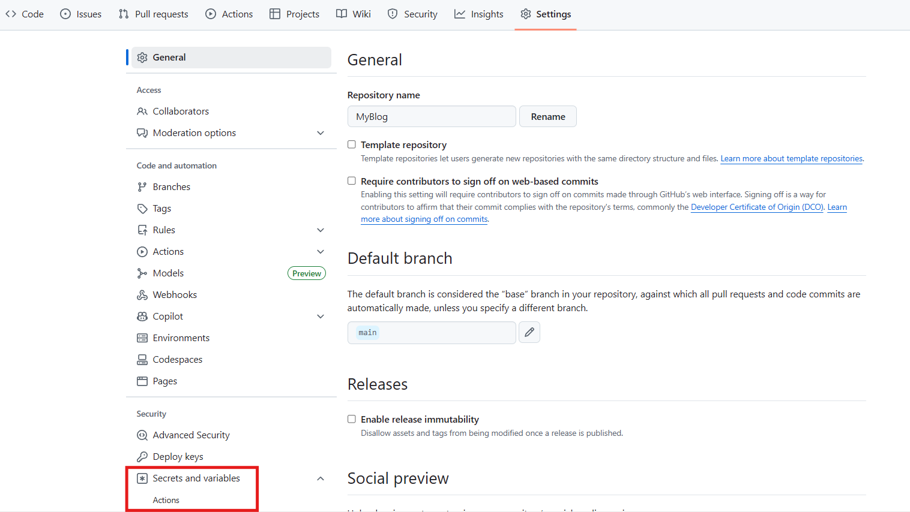
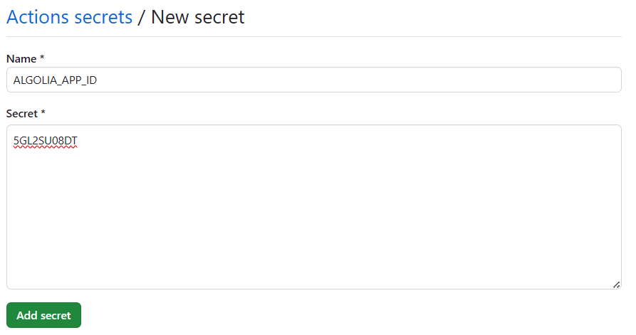
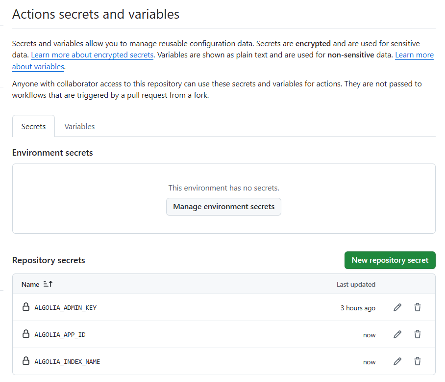

## 1、algolia账号配置

注册地址：[algolia](https://dashboard.algolia.com/users/sign_up)

1）注册后，所有内容全部skip直接来到控制面板页，点击Data sources并且选择indices




2）在indices中创建一个索引，比如我这边创建了一个blog索引，记住索引名称，后续会在上传博客内容时用到



3）点击settings选择api keys





4）获取algolia的应用ID，搜索key，以及admin key



## 2、hugo模板的博客配置

1）在config.toml或者hugo.toml中加入以下配置，用于生成上传文章的algolia.json

```
[outputs]
home = ["Algolia", "HTML", "RSS"]

[outputFormats.Algolia]
baseName = "algolia"
isPlainText = true
mediaType = "application/json"
notAlternative = true
```

2）在模板的params.yml中找到algolia_search部分，并将其置为true设置好搜素api，应用ID以及刚刚创建的索引名称



3）在用于部署github actions的.github\workflows\deploy.yml中写入上传文章的任务

```
      # 上传搜索数据到 Algolia
      - name: Upload to Algolia
        env:
          ALGOLIA_APP_ID: ${{ secrets.ALGOLIA_APP_ID }}
          ALGOLIA_ADMIN_KEY: ${{ secrets.ALGOLIA_ADMIN_KEY }}
          ALGOLIA_INDEX_NAME: ${{ secrets.ALGOLIA_INDEX_NAME }}
          ALGOLIA_INDEX_FILE: public/algolia.json
        run: |
            npm install -g atomic-algolia
            atomic-algolia
      - uses: actions/upload-pages-artifact@v3
        with:
          path: ./public
```

全部配置如下：

```
name: SilenceSusuka's blog

on:
  push:
    branches:
      - main

permissions:
  contents: read
  pages: write
  id-token: write

jobs:
  build:
    runs-on: ubuntu-latest
    steps:
      - uses: actions/checkout@v4
      - uses: peaceiris/actions-hugo@v2
        with:
          hugo-version: latest
          extended: true
      - run: hugo
      # 上传搜索数据到 Algolia
      - name: Upload to Algolia
        env:
          ALGOLIA_APP_ID: ${{ secrets.ALGOLIA_APP_ID }}
          ALGOLIA_ADMIN_KEY: ${{ secrets.ALGOLIA_ADMIN_KEY }}
          ALGOLIA_INDEX_NAME: ${{ secrets.ALGOLIA_INDEX_NAME }}
          ALGOLIA_INDEX_FILE: public/algolia.json
        run: |
            npm install -g atomic-algolia
            atomic-algolia
      - uses: actions/upload-pages-artifact@v3
        with:
          path: ./public

  deploy:
    needs: build
    runs-on: ubuntu-latest
    steps:
      - uses: actions/deploy-pages@v4
```

## 3、配置github secret存储重要key

1）在项目的settings中找到Secrets并且选择其中的actions



2）创建三个Repository secrets

分别为ALGOLIA_APP_ID、ALGOLIA_ADMIN_KEY、ALGOLIA_INDEX_NAME

即之前algolia中配置的应用ID，admin_key以及创建的索引名称(如:blog)



3）创建好后页面如下



最后把刚刚的更新推送上去，自动执行actions后就可以成功使用搜索了
