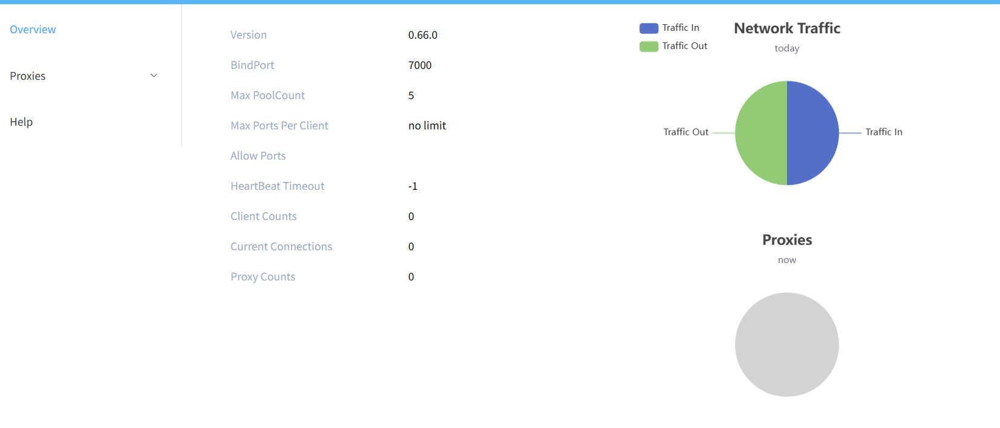
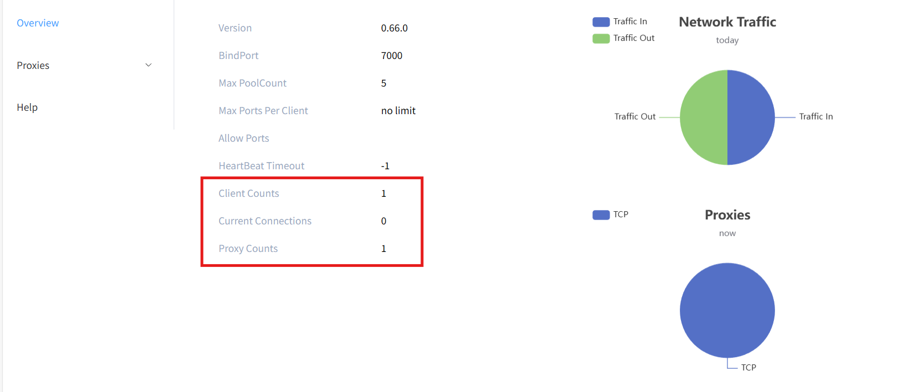

## 服务端frps部署

服务端frps一般使用部署于公网的服务器或vps

### 1、创建项目目录

目录结构:

```
/frps
    |_docker-compose.yml
    |_/frp
        |_frps.toml
```

### 2、配置docker-compose

docker-compose.yml：

```
services:
  frps:
    image: fatedier/frps:v0.66.0
    container_name: frps
    restart: always
    network_mode: host
    volumes:
      - /绝对路径/frps/frp/frps.toml:/etc/frp/frps.toml:ro


    # 可选：限制资源，防止异常情况拖垮宿主机
    deploy:
      resources:
        limits:
          memory: 256M
    command: ["-c", "/etc/frp/frps.toml"]
```

### 3、配置frps

frps.toml：

```
# frps.toml


bindPort = 7000


# 强烈建议设置鉴权
auth.method = "token"
auth.token = "******"


# 可选：Dashboard（建议仅本机访问）
webServer.addr = "127.0.0.1"
webServer.port = 7500
webServer.user = "admin"
webServer.password = "******"


# 可选：如果你要用域名转发 HTTP/HTTPS（vhost）
# vhostHTTPPort = 80
# vhostHTTPSPort = 443


# 可选：日志
log.to = "console"
log.level = "info"
```

最后启动docker

```
docker compose up -d
```

### 4、验证frps服务

*如果是云服务器，注意开启云服务器安全组7000端口以及后续设置的映射端口(如下文的60022)*

1）使用ssh映射内网7500端口(用户名与密码均为frps服务器本身的ssh用户与密码)

```
ssh -L 7500:127.0.0.1:7500 用户名@域名或IP
```

2）浏览器访问地址 `http://127.0.0.1:7500`

网页的用户密码为之前frps.toml中设置的dashboard的用户名与密码



## 客户端frpc部署

### 1、下载与frps相同版本号的frpc

先前docker-compose中拉取的是0.66.0版本的frps，所以需要下载0.66.0版本的frpc

[frpc下载链接](https://github.com/fatedier/frp/releases/)

下载好后在文件夹中找到frpc.toml文件复制为frpc-test.toml(注意frps服务器上安全组须开启 `remotePort`所设置的端口)

frpc-ssh.toml：

```
serverAddr = "frps服务器IP"
serverPort = 7000


auth.method = "token"
auth.token = "frps设置的token"


[[proxies]]
name = "ssh-test"
type = "tcp"
localIP = "127.0.0.1"
localPort = 22
remotePort = 60022
```

### 2、运行frpc并连接ssh

1）运行命令

```
./frpc -c ./frpc-test.toml
```

运行后在dashboard中就能看到连接数量+1了



2）使用frps服务器的公网IP或域名连接内网设备的ssh

```
ssh -p 60022 frpc用户@frps域名
```

## 遇到的问题

F：docker部署网速较慢

Q：注意docker设置host模式，即 `network_mode: host`

F：docker网络正常，但无法拉取镜像

Q：注意拉取的镜像是否为 `fatedier/frps`，该镜像为官方，其他镜像可能国内源中没有，可以尝试换其他源或者拉取 `fatedier/frps`
