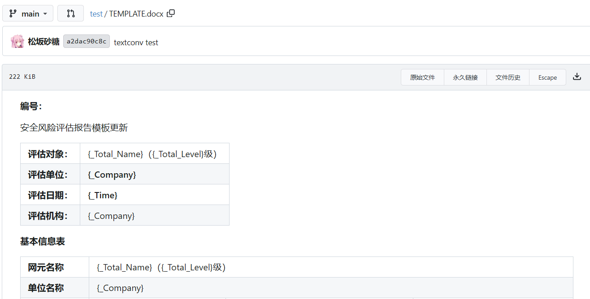

**1）在gitea的工程目录下即 `docker-compose.yml`同目录下创建Dockerfile文件**

Dockerfile：

```
FROM gitea/gitea:1.24-nightly-rootless

USER root

# ① 把所有官方仓库域名替换为清华镜像
RUN sed -i 's@dl-cdn.alpinelinux.org@mirror.tuna.tsinghua.edu.cn@g' /etc/apk/repositories
# ② 追加 edge/community 用于安装 pandoc-cli
RUN echo "https://mirror.tuna.tsinghua.edu.cn/alpine/edge/community" >> /etc/apk/repositories \
&& apk update \
&& apk add --no-cache pandoc-cli ttf-dejavu   # 如不需要中文字体可删 ttf-dejavu
USER git
```

**2）编译Dockerfile**

```
docker build
```

**3）在config/app.ini中设置解析命令**

```
#######################################
[markup.docx]
ENABLED         = true
FILE_EXTENSIONS = .docx
RENDER_COMMAND  = pandoc --from docx --to html --self-contained
IS_INPUT_FILE   = true


[markup.sanitizer.docx.img]
ALLOW_DATA_URI_IMAGES = true
#######################################
```

**4）启动docker**

```
docker compose up -d
```

docker-compose参考：[博客链接](https://blog.silencesusuka.com/post/20260114_docker%E9%83%A8%E7%BD%B2gitea%E4%BB%93%E5%BA%93/)

**成功渲染**


