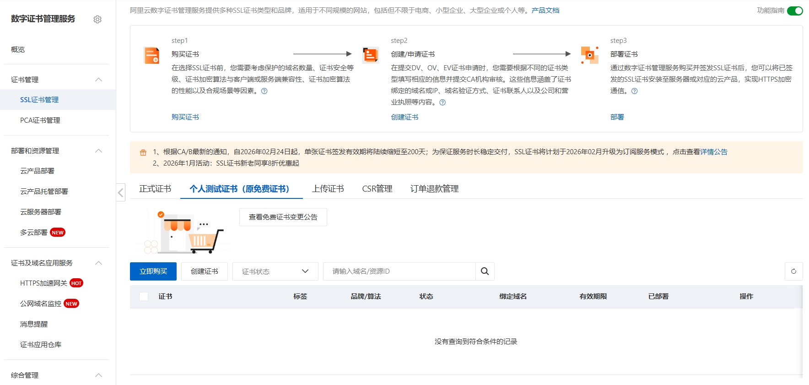
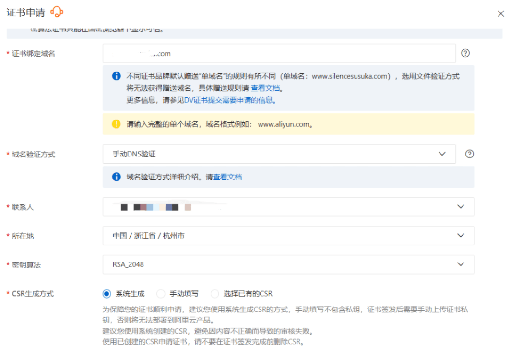
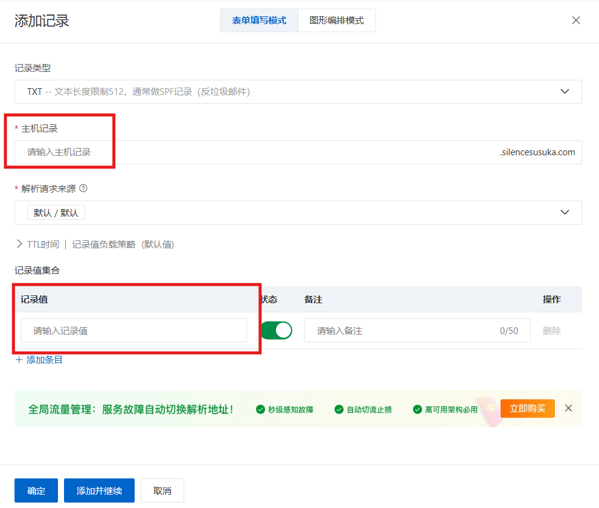
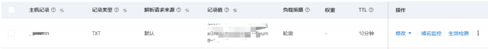
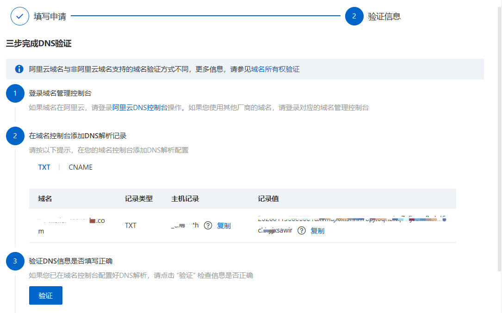
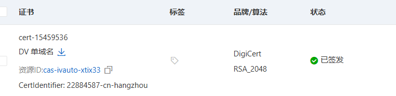
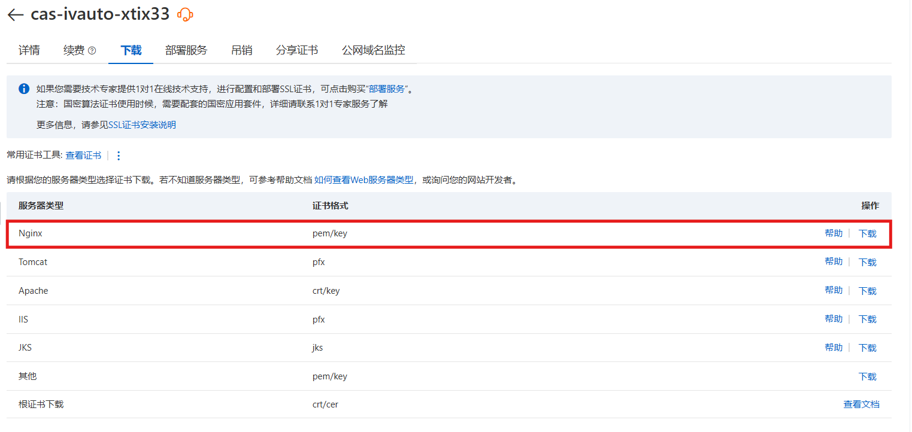
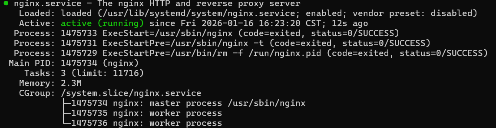
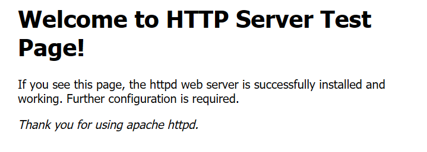

## 1、申请免费的个人测试证书

*由于服务器部署于阿里云，因此使用阿里云进行演示*

1）选择个人测试证书购买并创建



2）填写申请内容，域名验证方式建议选择"手动DNS验证"，绑定域名建议为子域名，不推荐使用裸域名(主域名)，除非这个域名只有一个http站点



3）由于使用的是手动DNS验证，因此需要在域名管理中设置给出的主机记录与记录值，记录类型选择TXT



设置好后可以使用该[拨测网站](https://boce.aliyun.com/detect/dns)进行拨测，测试""主机记录值.your-domain"，并查看解析记录是否正确



若正确直接点击验证即可



4）验证成功后等待证书签发



5）点击 `更多`选项，选择nginx并下载证书



## 2、服务器部署nignx并配置反向代理

### 2.1、部署nginx

**1）安装nignx并设置自启**

```
yum install -y nginx
systemctl enable nginx
systemctl start nginx
```

*别忘了放行阿里云安全组端口*

**2）验证nignx是否启动成功**

执行status查看服务状态是否存活

```
system status nginx
```



访问 `http://your-domain`，成功显示welcome nginx



### 2.2、部署反向代理

1）创建配置文件

```
vim /etc/nginx/conf.d/service.conf
```

service.conf:

```
server {
    listen 80;
    server_name your-domain;

    location / {
        proxy_pass http://your-service:port;
        proxy_set_header Host $host;
        proxy_set_header X-Real-IP $remote_addr;
        proxy_set_header X-Forwarded-For $proxy_add_x_forwarded_for;
        proxy_set_header X-Forwarded-Proto $scheme;
    }
}

```

2）重载nginx并测试

```
nginx -t
systemctl reload nginx
```

访问http://your-domain，可以直接访问到被代理的服务


## 3、为nginx配置SSL证书

**1）将刚刚的证书上传至服务器**

记住存在哪里就行，我这里建了一个ssl文件夹存储

```
/etc/nginx/ssl/your-domain.com/domain.pem
/etc/nginx/ssl/your-domain.com/domain.key

```

*可以使用云厂商自带的上传面板或者按照winscp进行上传*

**2）修改之前的nginx配置文件**

```
vim /etc/nginx/conf.d/service.conf
```

修改service.conf：

```
# 80 -> 443
server {
    listen 80;
    server_name your-domain.com;
    return 301 https://your-domain.com$request_uri;
}

server {
    listen 443 ssl;
    server_name your-domain.com;

    ssl_certificate     /etc/nginx/ssl/your-domain.com/domain.pem;
    ssl_certificate_key /etc/nginx/ssl/your-domain.com/domain.key;

    location / {
        proxy_pass http://your-service:port;
        proxy_set_header Host $host;
        proxy_set_header X-Real-IP $remote_addr;
        proxy_set_header X-Forwarded-For $proxy_add_x_forwarded_for;
        proxy_set_header X-Forwarded-Proto https;
    }
}

```

**3）重新载入配置**

```
nginx -t
systemctl reload nginx
```
