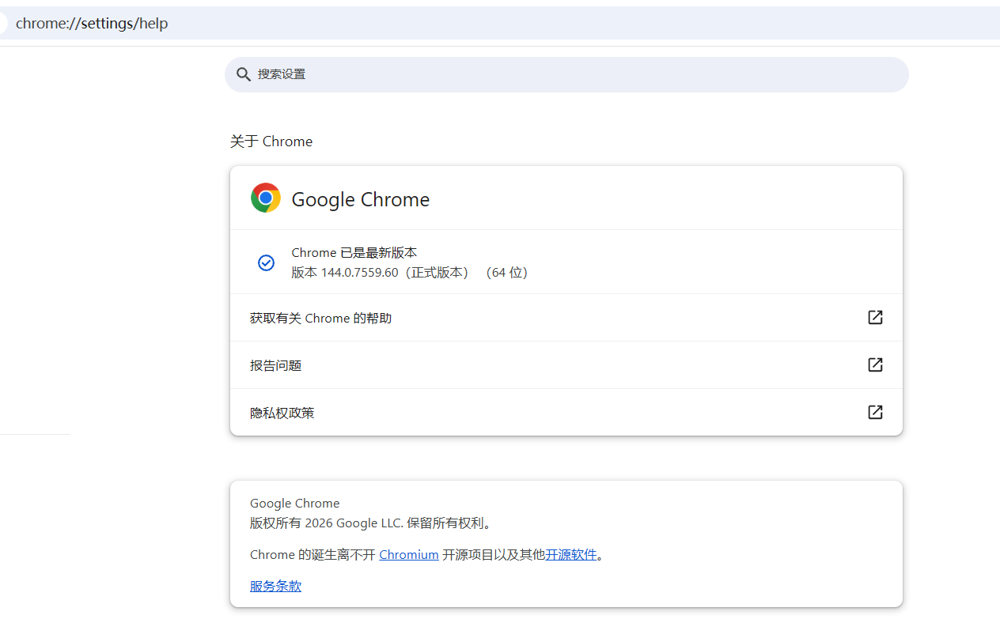
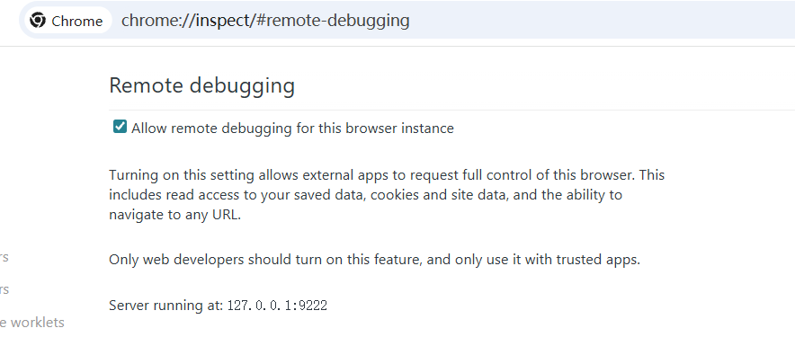
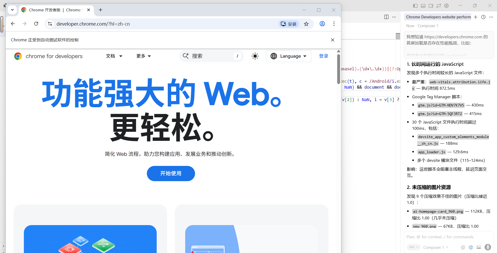

项目地址：[chrome-devtools-mcp](https://github.com/ChromeDevTools/chrome-devtools-mcp)

## 1、所需环境

```
Chrome>=144(支持远程调试)
Cursor>=0.45.7(支持MCP)
Nodejs>=20.19(建议更新最新版本)
npm
```

## 2、配置Chrome的远程调试

访问 `chrome://settings/help`查看chrome版本，确保chrome版本>=144（若非该版本则不支持远程调试）



访问 `chrome://inspect/#remote-debugging`打开chrome的远程调试设置，默认监听9222



## 3、配置Cursor的MCP设置

在右上角 `Cursor Settings`中找到 `Tools&MCP`选项，并选择 `New MCP Server`选项

输入以下json设置

*node会自动使用npx拉取，无需手动拉取，启用 --autoConnect 后，每次请求调试连接，Chrome 会弹窗让你授权（防止滥用）*

```
{
  "mcpServers": {
    "chrome-devtools": {
      "command": "npx",
      "args": ["-y", "chrome-devtools-mcp@latest", "--autoConnect"]
    }
  }
}
```

## 4、验证效果

新建一个Chat，进行简单分析



对一些加密站点的js同样也可以进行分析，方便找出加密方式和密钥
