## 1、目标站点的前端文件的抓取与固定

1、清空目标站点全部cookie

*由于必须抓取目标站点的412响应报文，而若携带已获取并生成的cookie进行访问时将无法捕获412报文，因此在此之前建议清空站点cookie*

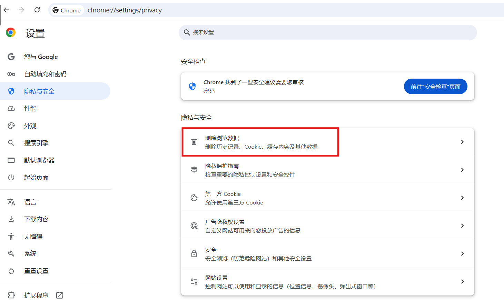

2、在访问站点前，使用F12在 `源代码(source)`选项中勾选 `脚本`选项

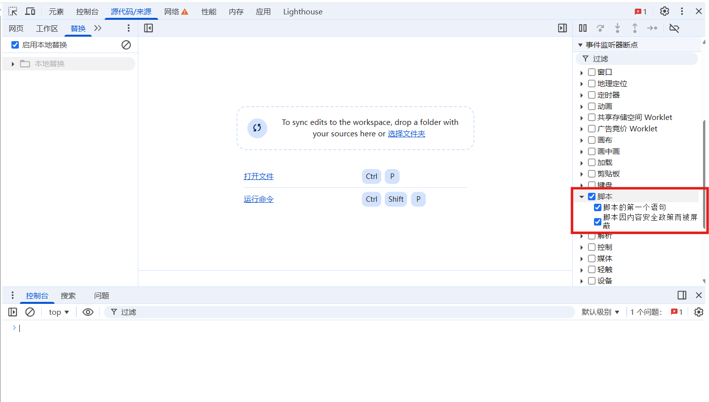

然后点开右上角 `设置`选项，确认忽略列表中取消勾选 `eval或控制台的匿名脚本`

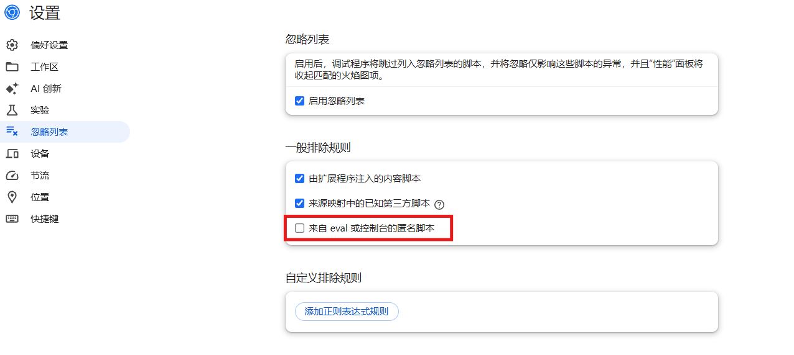

并且在 `源代码`页面选择启用 `本地替换`选项并设置用于存储文件的文件夹

3、访问目标站点，此时应该会停留在一个脚本页面

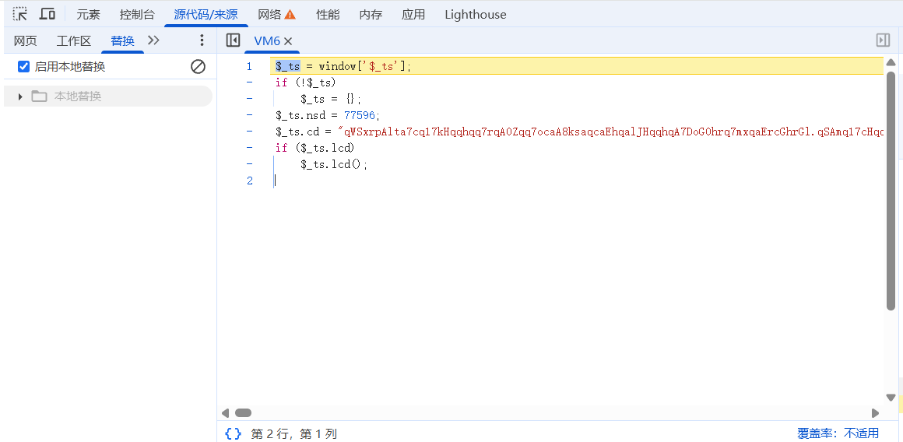

该页面是瑞数动态生成js的关键之一，可以将其另存为 `ts.js`备用

4、使用 `F8`继续执行，当前页面的js为瑞数调用生成cookie的js

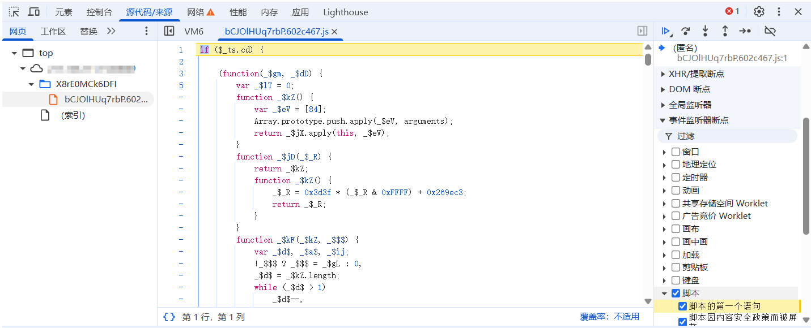

可以将该动态js另存为保存至与先前的 `ts.js`相同文件夹内

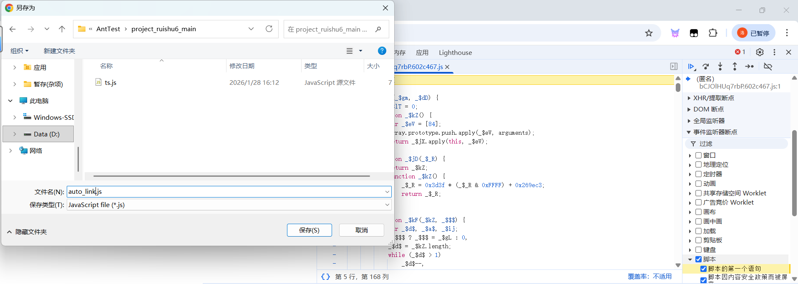

并且右键 `替换内容`将该js固定

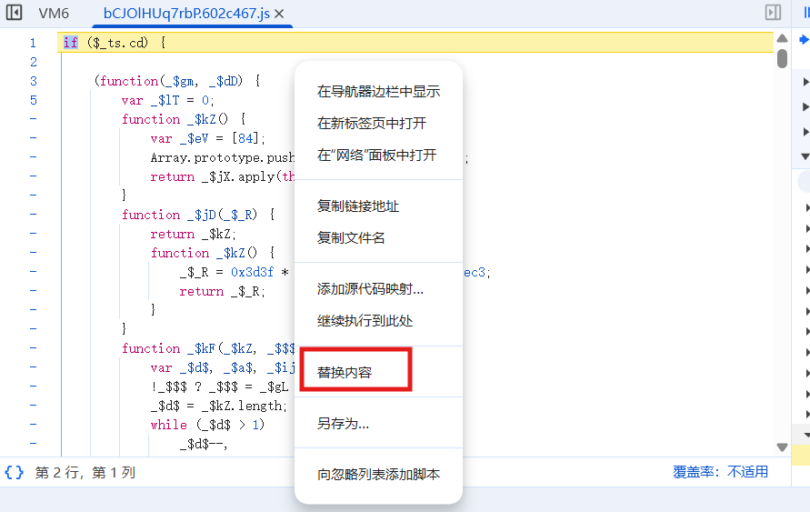

进入 `网络`选项卡，将第一条响应为412的报文也同样右键 `替换内容`，将其固定(相当于固定住ts.js)

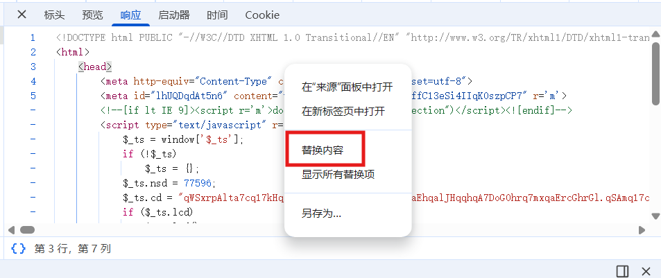

此时，保存了 `ts.js`的动态加载js文件以及用于调用生成cookie的 `auto_link.js`文件，并且将浏览器上两者对应的页面成功固定，这样后续删除cookie刷新页面重新调试也不需要动本地在调试的代码了

## 2、找到cookie生成入口

由于瑞数6代一般使用 `eval.call`进行js调用，而eval大概率已被混淆，因此通过查询关键词 `.call`来寻找js调用的入口

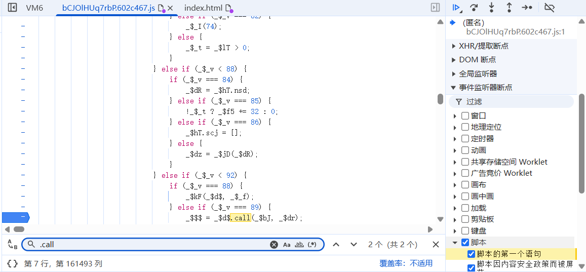

在该js文件中查询 `.call`，共两个结果，第一个显然不是，因此在此处打上断点并执行

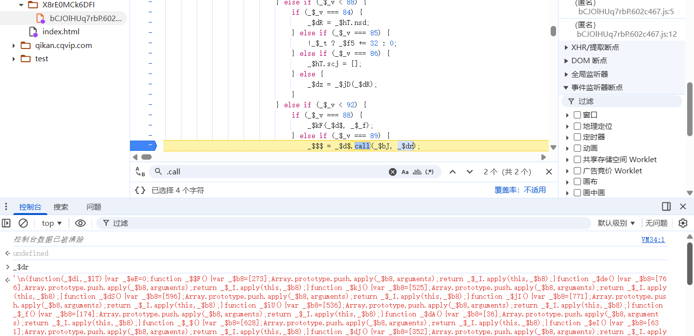

可以看到其call的 `_$dr`参数即为调用的js脚本

使用 `单步执行(F9)`进入被调用的js

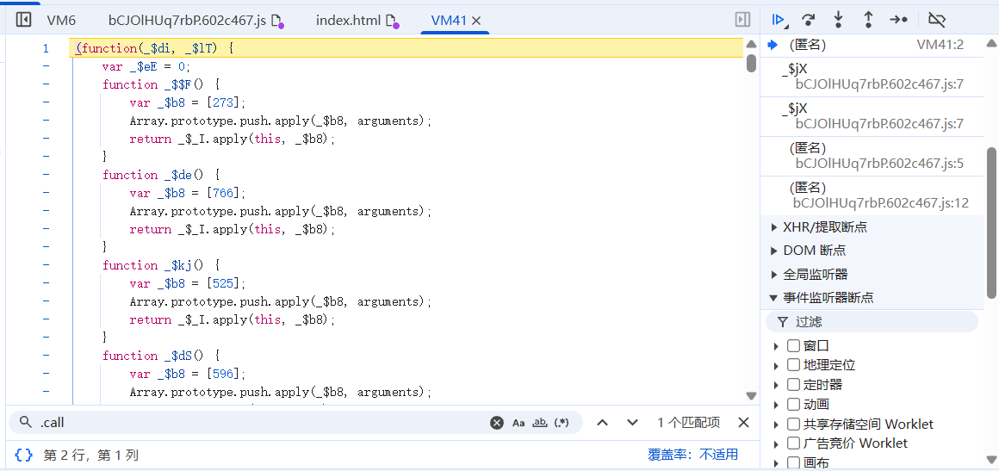

当前的VM环境即为后续调试代码所参照的环境，后续补环境所需的内容都可以在此寻找

## 3、使用代理调试保存的js文件

我使用的代理：

```
dtavm = {}
dtavm.log = console.log
 
function proxy(obj, objname, type) {
    function getMethodHandler(WatchName, target_obj) {
        let methodhandler = {
            apply(target, thisArg, argArray) {
                if (this.target_obj) {
                    thisArg = this.target_obj
                }
                let result = Reflect.apply(target, thisArg, argArray)
                if (target.name !== "toString") {
                    if (target.name === "addEventListener") {
                        dtavm.log(`调用者 => [${WatchName}] 函数名 => [${target.name}], 传参 => [${argArray[0]}], 结果 => [${result}].`)
                    } else if (WatchName === "window.console") {
                    } else {
                        dtavm.log(`调用者 => [${WatchName}] 函数名 => [${target.name}], 传参 => [${argArray}], 结果 => [${result}].`)
                    }
                } else {
                    dtavm.log(`调用者 => [${WatchName}] 函数名 => [${target.name}], 传参 => [${argArray}], 结果 => [${result}].`)
                }
                return result
            },
            construct(target, argArray, newTarget) {
                var result = Reflect.construct(target, argArray, newTarget)
                dtavm.log(`调用者 => [${WatchName}] 构造函数名 => [${target.name}], 传参 => [${argArray}], 结果 => [${(result)}].`)
                return result;
            }
        }
        methodhandler.target_obj = target_obj
        return methodhandler
    }
 
    function getObjhandler(WatchName) {
        let handler = {
            get(target, propKey, receiver) {
                let result = target[propKey]
                if (result instanceof Object) {
                    if (typeof result === "function") {
                        dtavm.log(`调用者 => [${WatchName}] 获取属性名 => [${propKey}] , 是个函数`)
                        return new Proxy(result, getMethodHandler(WatchName, target))
                    } else {
                        dtavm.log(`调用者 => [${WatchName}] 获取属性名 => [${propKey}], 结果 => [${(result)}]`);
                    }
                    return new Proxy(result, getObjhandler(`${WatchName}.${propKey}`))
                }
                if (typeof (propKey) !== "symbol") {
                    dtavm.log(`调用者 => [${WatchName}] 获取属性名 => [${propKey?.description ?? propKey}], 结果 => [${result}]`);
                }
                return result;
            },
            set(target, propKey, value, receiver) {
                if (value instanceof Object) {
                    dtavm.log(`调用者 => [${WatchName}] 设置属性名 => [${propKey}], 值为 => [${(value)}]`);
                } else {
                    dtavm.log(`调用者 => [${WatchName}] 设置属性名 => [${propKey}], 值为 => [${value}]`);
                }
                return Reflect.set(target, propKey, value, receiver);
            },
            has(target, propKey) {
                var result = Reflect.has(target, propKey);
                dtavm.log(`针对in操作符的代理has=> [${WatchName}] 有无属性名 => [${propKey}], 结果 => [${result}]`)
                return result;
            },
            deleteProperty(target, propKey) {
                var result = Reflect.deleteProperty(target, propKey);
                dtavm.log(`拦截属性delete => [${WatchName}] 删除属性名 => [${propKey}], 结果 => [${result}]`)
                return result;
            },
            defineProperty(target, propKey, attributes) {
                var result = Reflect.defineProperty(target, propKey, attributes);
                dtavm.log(`拦截对象define操作 => [${WatchName}] 待检索属性名 => [${propKey.toString()}] 属性描述 => [${(attributes)}], 结果 => [${result}]`)
                // debugger
                return result
            },
            getPrototypeOf(target) {
                var result = Reflect.getPrototypeOf(target)
                dtavm.log(`被代理的目标对象 => [${WatchName}] 代理结果 => [${(result)}]`)
                return result;
            },
            setPrototypeOf(target, proto) {
                dtavm.log(`被拦截的目标对象 => [${WatchName}] 对象新原型==> [${(proto)}]`)
                return Reflect.setPrototypeOf(target, proto);
            },
            preventExtensions(target) {
                dtavm.log(`方法用于设置preventExtensions => [${WatchName}] 防止扩展`)
                return Reflect.preventExtensions(target);
            },
            isExtensible(target) {
                var result = Reflect.isExtensible(target)
                dtavm.log(`拦截对对象的isExtensible() => [${WatchName}] isExtensible, 返回值==> [${result}]`)
                return result;
            },
        }
        return handler;
    }
 
    if (type === "method") {
        return new Proxy(obj, getMethodHandler(objname, obj));
    }
    return new Proxy(obj, getObjhandler(objname));
}
 
 
EventTarget = function EventTarget(){}
//这里放你要代理的对象 --->

//document
document = {}
 
// navigator
navigator = {}

//location
location = {}
 
//history
history = {}
 
 
//screen
screen = {}
 
//localStorage
localStorage = {}
 
localStorage = proxy(localStorage, 'localStorage')
screen = proxy(screen, 'screen')
location = proxy(location, 'location')
history = proxy(history, 'history')
window = proxy(window, 'window')
document = proxy(document, 'document')
navigator = proxy(navigator, 'navigator')
```

1、将其保存为 `test.js`，接着在底下引用需要调试的文件，以及需要输出的结果

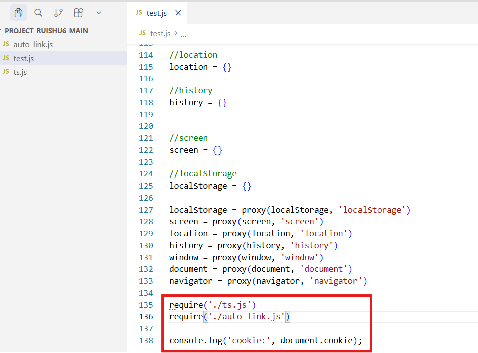

2、执行该js，查看报错，报错内容为 `window is not defined`，根据报错补充一下 `window`

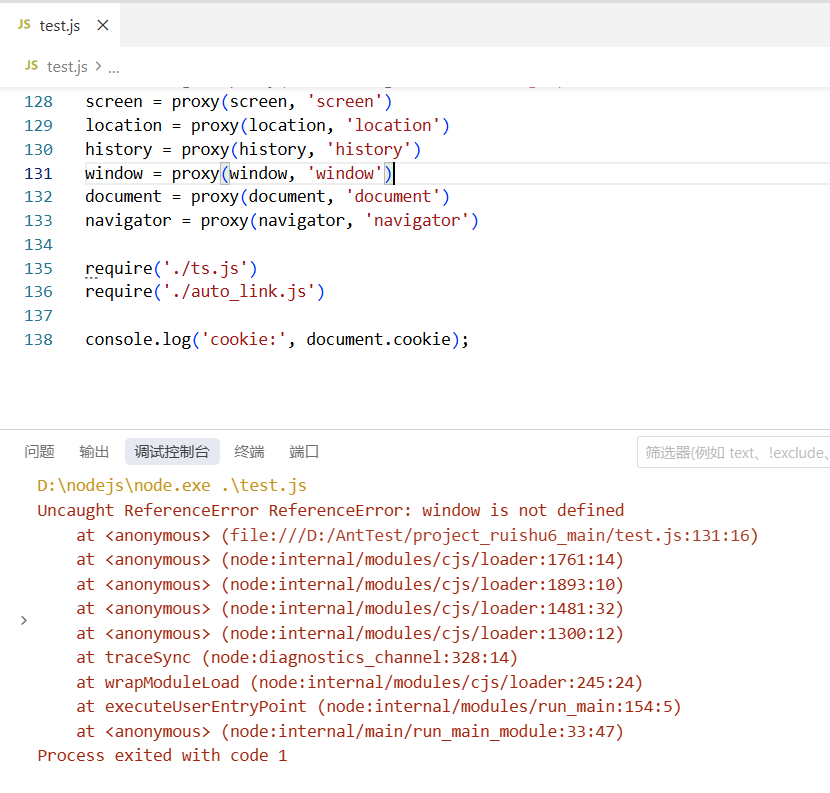

3、补充window以后继续执行

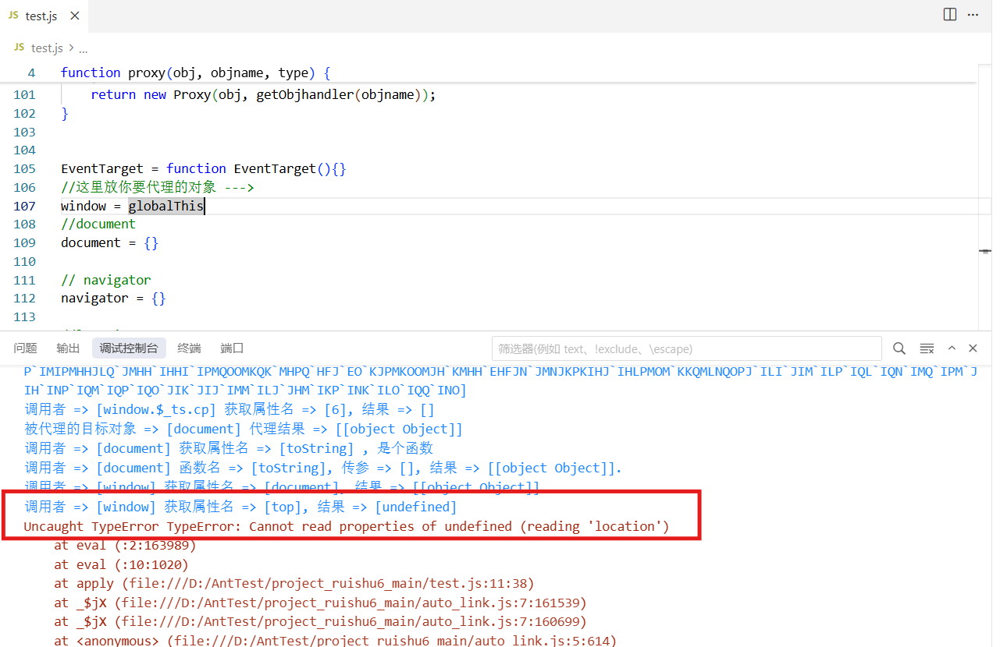

可以看到根据代理的显示，top属性没有定义，后续出现了报错没有读取到location，因此需要先给top属性定义，在补上location的内容，location直接在控制台查询即可

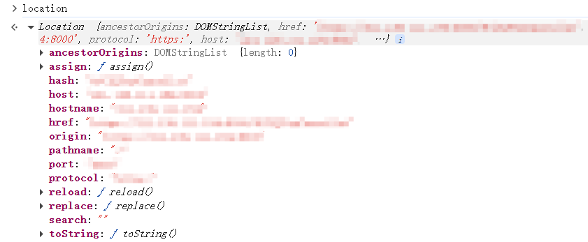

4、补充好报错内容以后继续执行

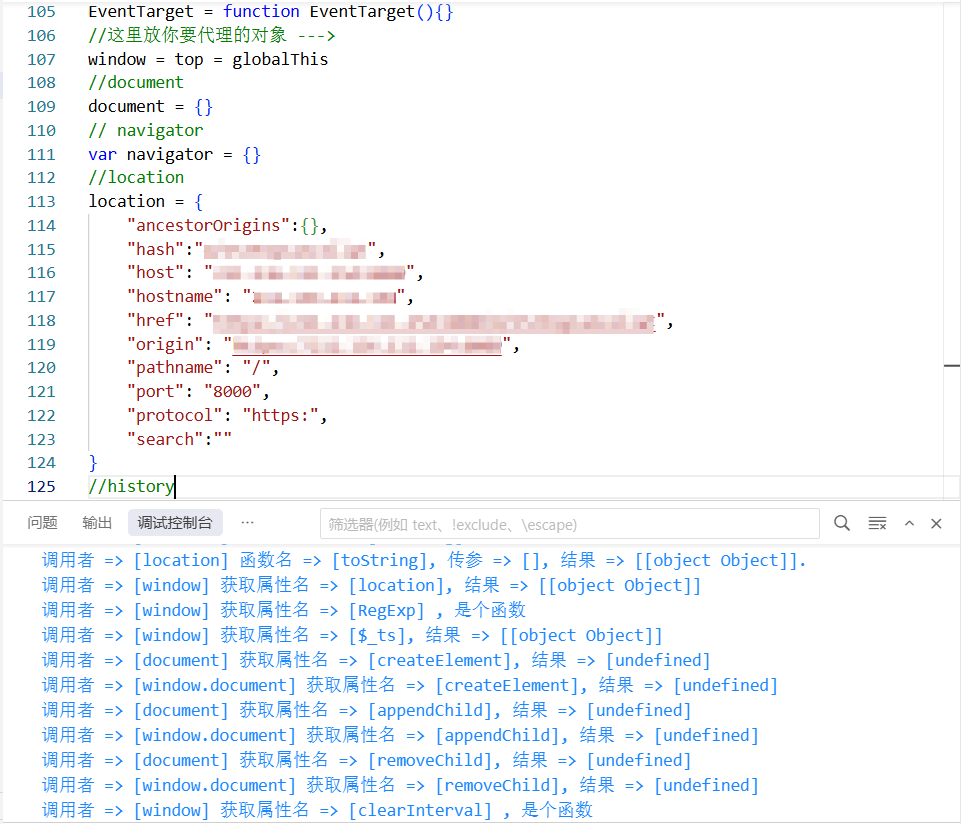

可以看到处于无报错的循环执行状态，那就说明没有进入到所需的功能入口，直接看代理调试的最后几行

```
调用者 => [window] 获取属性名 => [$_ts], 结果 => [[object Object]]
调用者 => [document] 获取属性名 => [createElement], 结果 => [undefined]
调用者 => [window.document] 获取属性名 => [createElement], 结果 => [undefined]
调用者 => [document] 获取属性名 => [appendChild], 结果 => [undefined]
调用者 => [window.document] 获取属性名 => [appendChild], 结果 => [undefined]
调用者 => [document] 获取属性名 => [removeChild], 结果 => [undefined]
调用者 => [window.document] 获取属性名 => [removeChild], 结果 => [undefined]
调用者 => [window] 获取属性名 => [clearInterval] , 是个函数
```

    其中`createElement`、`appendChild`、`removeChild`均没有定义，调试信息中 `createElement`、`appendChild`、`removeChild`的调用者均为 `document`，因此在代理模板的 `document{}`中补充

5、补上 `createElement`、`appendChild`、`removeChild`的定义后继续执行

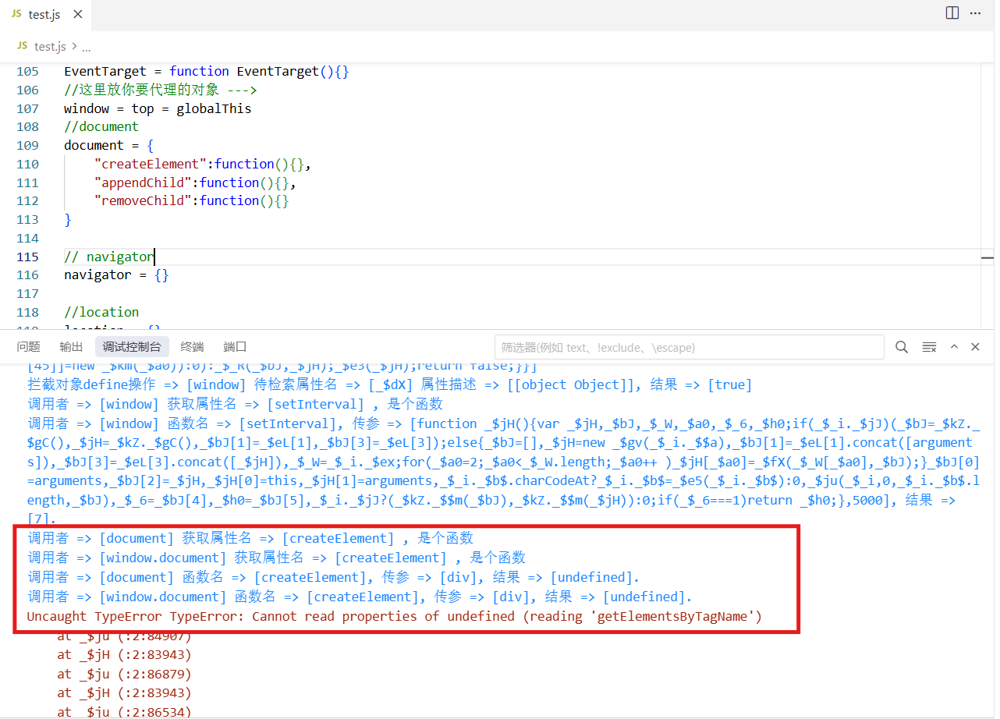

可以看到调试信息显示调用createElement后传入了`div`参数，但是返回的结果为`undefined`，并且报错了没有定义 `getElementsByTagName`这个函数

6、在 `createElement`定义的代码中加入 `div`，但我们此时并不知道 `div`的具体情况，因此我们同时加上 `div`的代理，继续执行查看结果

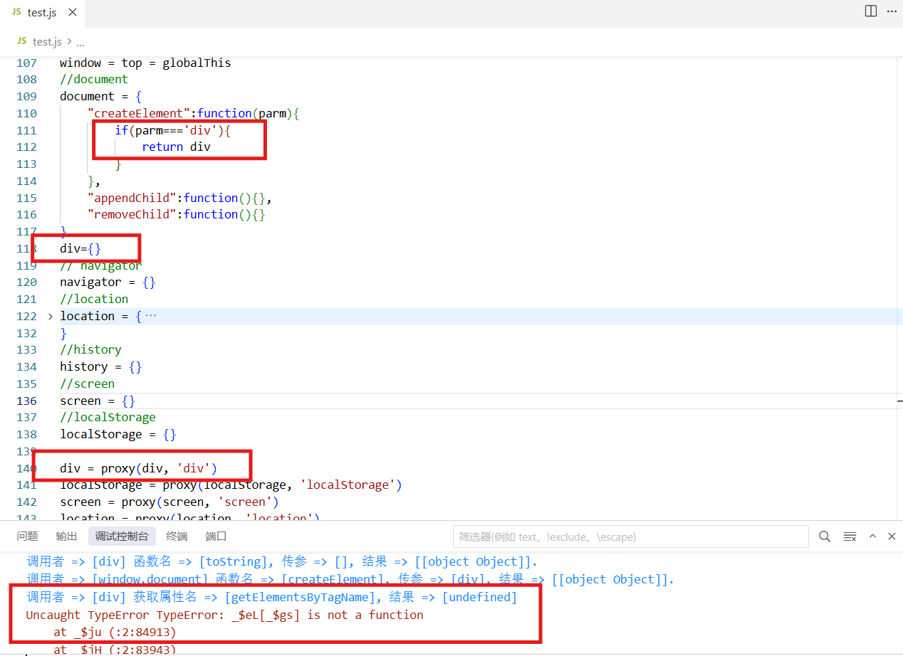

这时候 `div`传入了后，报错了一个`_`，根据代理的回显，我们可以知道这个`_`所对应的就是 `getElementsByTagName`，那么我们就去浏览器中找一下这个函数在哪

7、在浏览器中找到对应的函数

搜索`_`，可以看到总共40个结果，但是由于报错是`_`，因此说明`_`肯定是个函数，所以我们加上一个 `(`搜索，可以看到结果就12个了，然后可以观察刚刚的报错中其实有这个函数的所在地 `at _$ju (:2:84913)`，找一下这12个中哪个是和这个所在地匹配的就能找到这个函数了，可以看到这里第二个就是第 `2`行第 `84913`列了

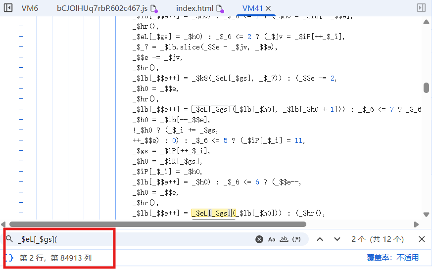

在这里打上断点并F8直接执行到此处

如果途中遇到了`debugger`，可以右键左边的行头，选择一律不在此处暂停，节省一些时间

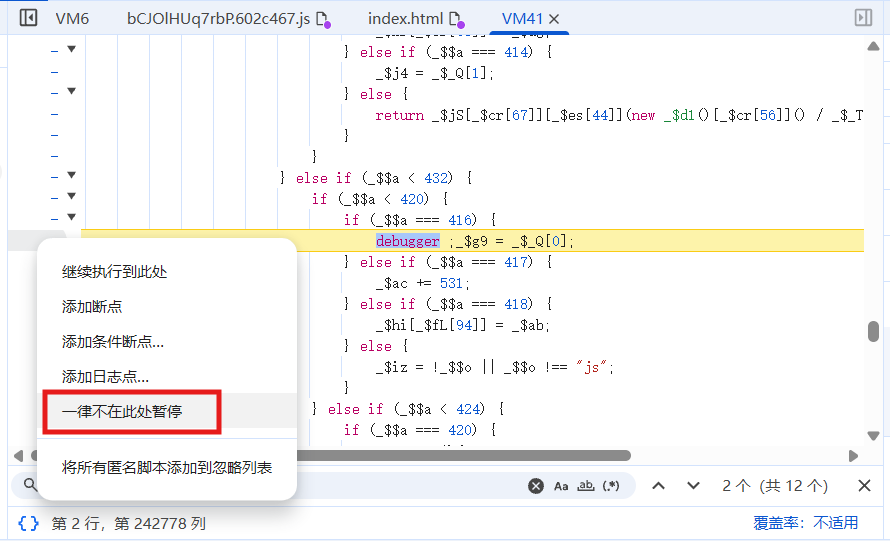

第一次执行到断点位置会发现此时这个函数是 `random`,这说明这里触发了函数索引，正在通过索引找真正的调用函数，包括后续的 `charCodeAt`，都可以无视，继续执行就行了

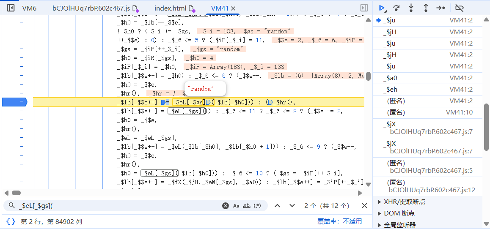

在执行到第三次会发现是 `createElement`，并且可以看到传参就是 `div`

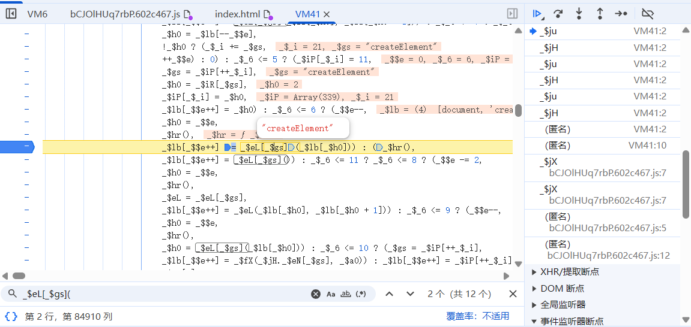

但是此时我们要找的并不是 `createElement`，而应该是 `getElementsByTagName`，我们继续执行

再执行一次，就是我们需要找的 `getElementsByTagName`了

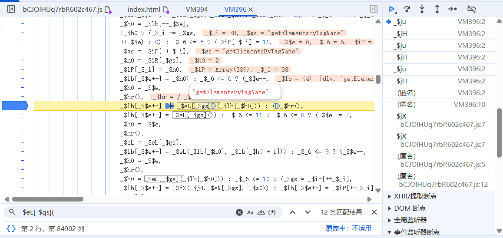

根据调试信息可以看到这个函数传入了i参数，并且返回空[]

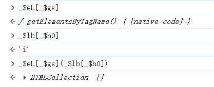

根据之前的代码报错前的内容可知，`div`调用了名为 `getElementsByTagName`的函数，该函数传入了 `i`参数并且返回为`[]`，因此在`div`中加入相关内容

```
div={
    "getElementsByTagName":function(parm){
        if(parm==='i'){
            return []
        }
    }
}
```

8、添加内容后继续执行，查看回显

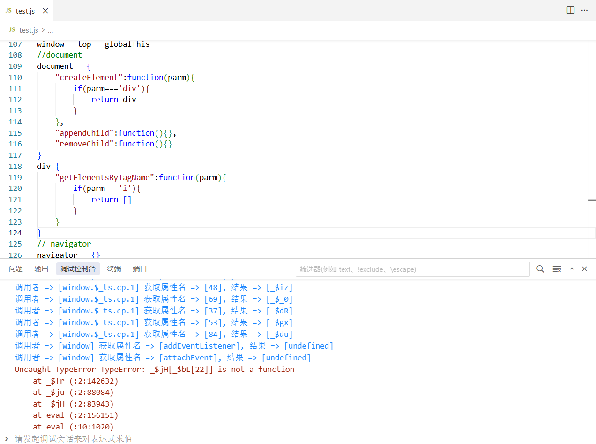

此时代理回显了`addEventListener`、`attachEvent`没有定义，同样补上这两个函数的定义

```
window.addEventListener = function(){}
window.attachEvent = function(){}
```

此时也可以在浏览器中检索`_`，可以看到相关代码的内容为

```
_$jH[_$g9[41]] ? _$jH[_$g9[41]](_$bJ, _$_W, _$a0) : (_$bJ = 'on' + _$bJ,_$jH[_$bL[22]](_$bJ, _$_W));
```

断点运行至此后可以看到

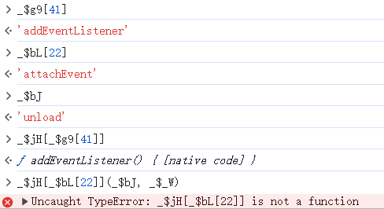

这段三段式代码其实就是用来做新旧浏览器兼容的，标准浏览器用 `addEventListener`，老IE浏览器用 `attachEvent`，三段式就是来判断是否存在 `addEventListener`，如果没有就使用 `attachEvent`，所以理论上只补上 `addEventListener`就可以了，当然这里两个全补上也没啥区别

9、补上`addEventListener`、`attachEvent`后继续执行，查看报错是否有变化

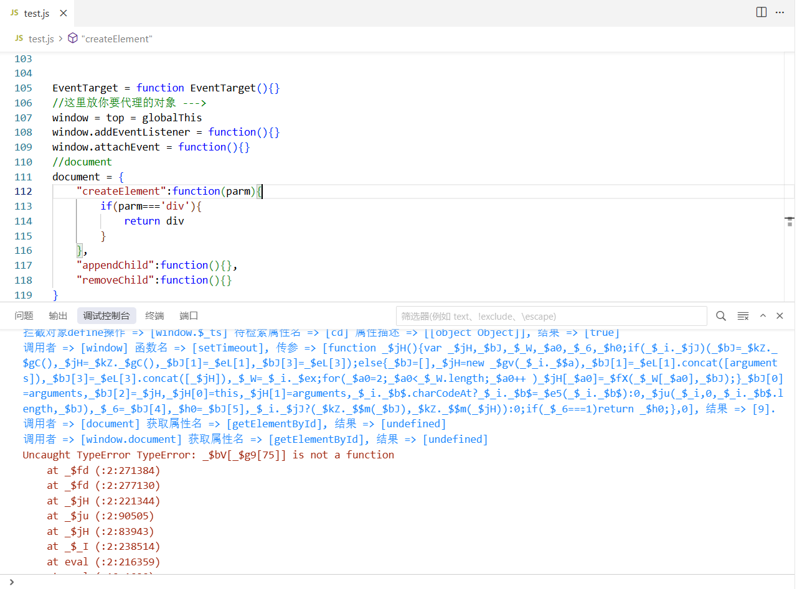

关键的显示内容还是报错以及报错前的代理回显

```
调用者 => [document] 获取属性名 => [getElementById], 结果 => [undefined]
调用者 => [window.document] 获取属性名 => [getElementById], 结果 => [undefined]
Uncaught TypeError TypeError: _$bV[_$g9[75]] is not a function
    at _$fd (:2:271384)
```

按之前的方法继续分析可以知道`document`中缺了`getElementById`，并且`_`大概率就是`getElementById`，它的位置在`2`行`271384`列

浏览器搜索找到2行271384列的_$bV[_$g9[75]]，并断点执行

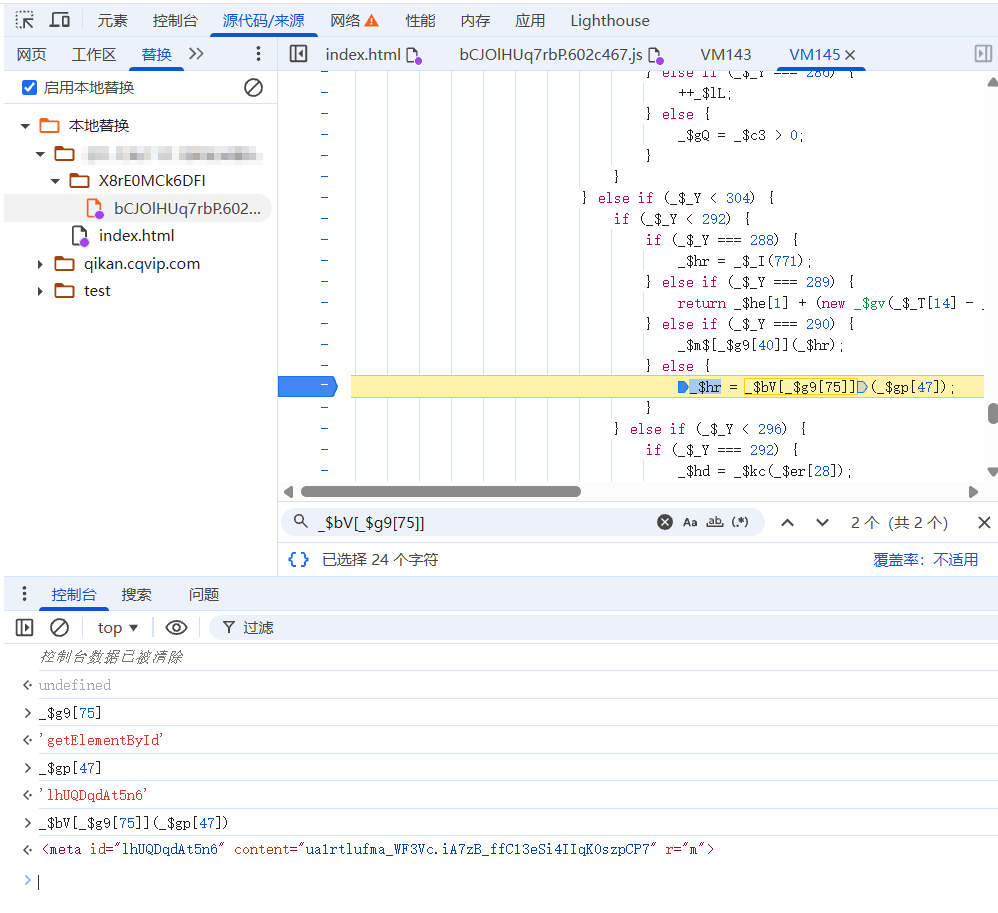

可以看到调用了`getElementById`并传参`lhUQDqdAt5n6`，并返回了一个`meta`标签，于是在`document`中补上`getElementById`以及对应的`meta`，但和之前的`div`标签一样，我们不知道内部的情况，因此`meta`加上代理看一下内部调用

10、加入`meta`以及代理后运行的调试信息显示

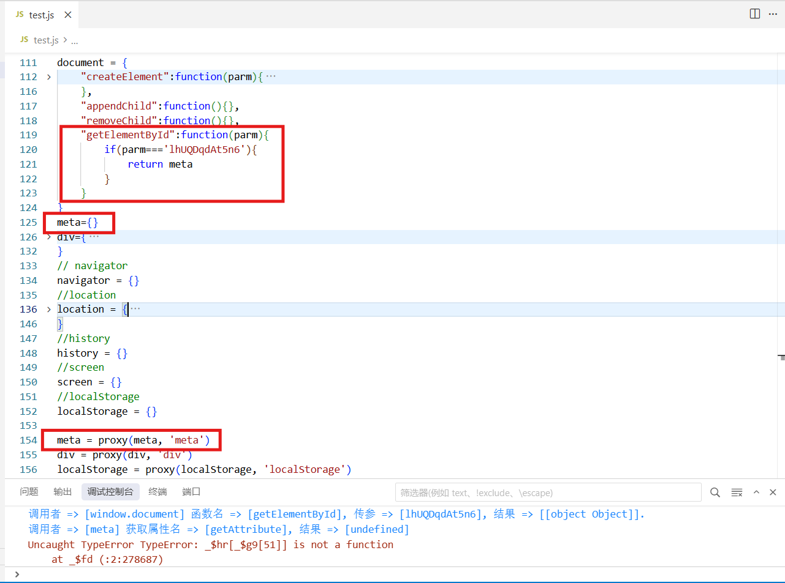

重点的内容为

```
调用者 => [meta] 获取属性名 => [getAttribute], 结果 => [undefined]
Uncaught TypeError TypeError: _$hr[_$g9[51]] is not a function
    at _$fd (:2:278687)
```

得知`meta`中应该需要调用一个`getAttribute`，而该函数大概率就是`2`行`278687`列的`_`，我们浏览器找到该位置

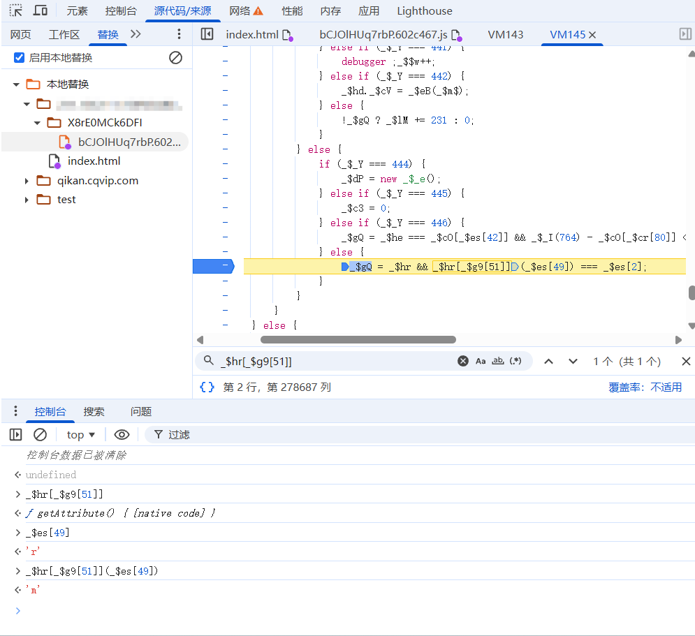

根据调试信息，知道了`getAttribute`会传入参数 `r`，并回显 `m`，按调试信息在代码中补全内容

```
meta={
    "getAttribute":function(parm){
        if(parm==='r'){
            return 'm'
        }
    }
}
```

11、补全getAttribute后继续执行

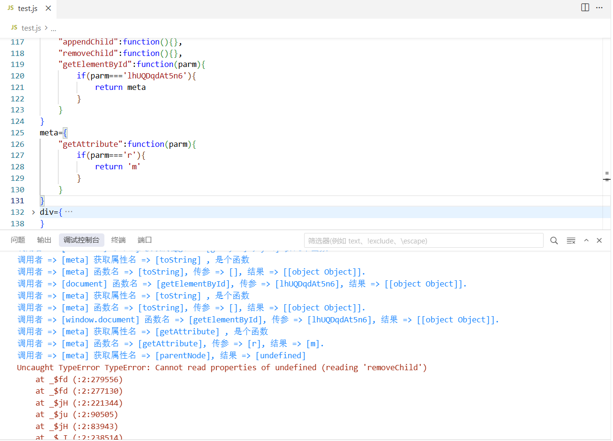

这次的报错内容不再是`not a function`了，而是与最开始的`div`报错内容一致，其实按之前div的经验也能猜出，少了`parentNode`的`removeChild`函数了

11、总之按部就班，先补上`parentNode`，由于不知道内部情况，因此添加代理

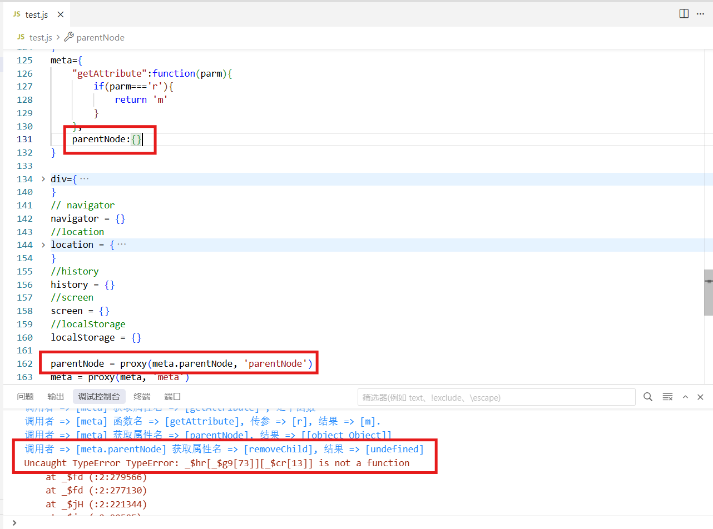

接着按照报错的内容，在浏览器找对应位置的函数，并断点执行调试

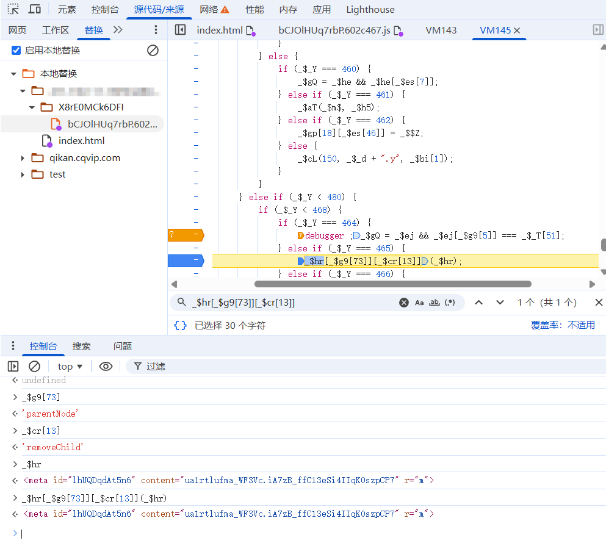

根据调试信息可以知道就是单纯的`remove`了`meta`标签，不用特别设置回显，在`parentNode`中补上

```
meta={
    "getAttribute":function(parm){
        if(parm==='r'){
            return 'm'
        }
    },
    parentNode:{
        "removeChild":function(){}
    }
}
```

11、补完`removeChild`后继续执行，查看回显

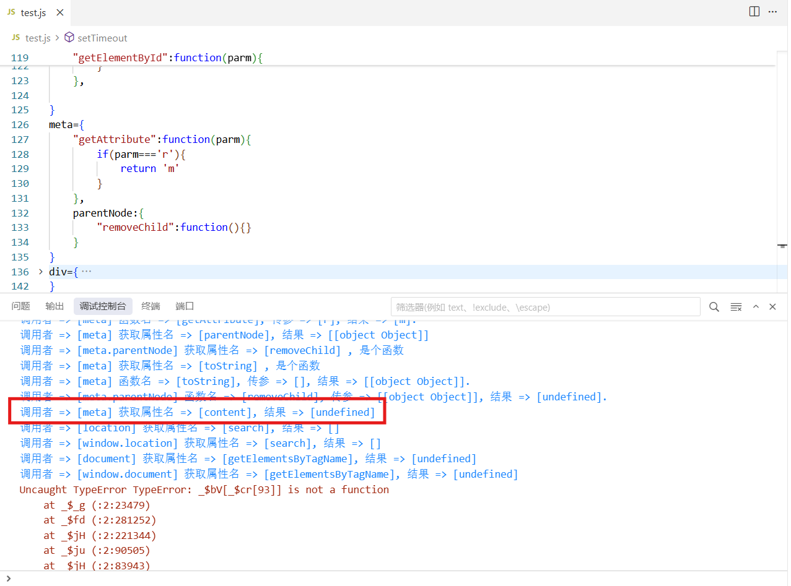

这时候要注意一下，瑞数的动态`cookie`是依赖于`meta`标签中的`content`参数的，这里content参数没有传入，所以记得也要补上，当然好习惯应该是之前看到`meta`标签里有固定的参数的时候就可以把那些参数都加上了，之前偷懒了

```
<meta id="lhUQDqdAt5n6" content="ua1rtlufma_WF3Vc.iA7zB_ffC13eSi4IIqK0szpCP7" r='m'>
```

干脆就把标签里的内容全补上去

```
meta={
    "id":"lhUQDqdAt5n6",
    "content":"ua1rtlufma_WF3Vc.iA7zB_ffC13eSi4IIqK0szpCP7",
    "r":"m",
    "getAttribute":function(parm){
        if(parm==='r'){
            return 'm'
        }
    },
    parentNode:{
        "removeChild":function(){}
    }
}
```

12、补完后继续执行，报错还是和之前一样，但明显可以看到比之前多执行了不少东西

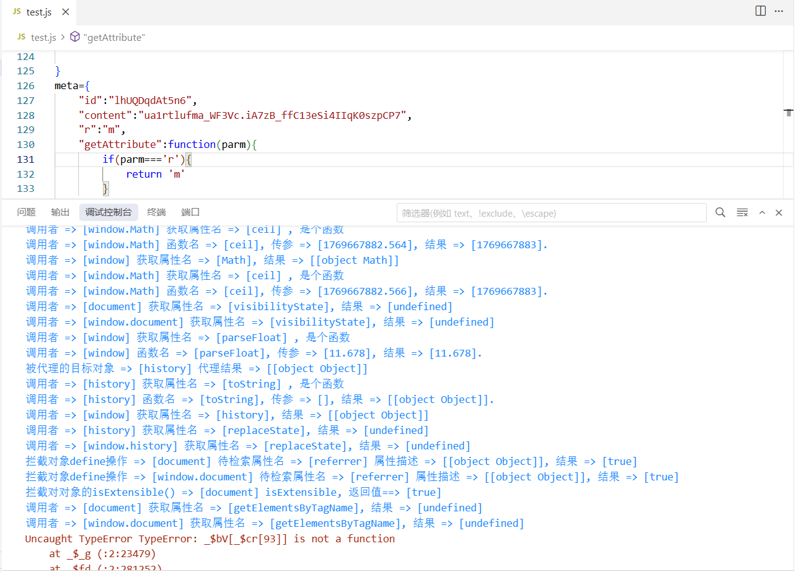

接下来就继续补`getElementsByTagName`，方法和之前一样

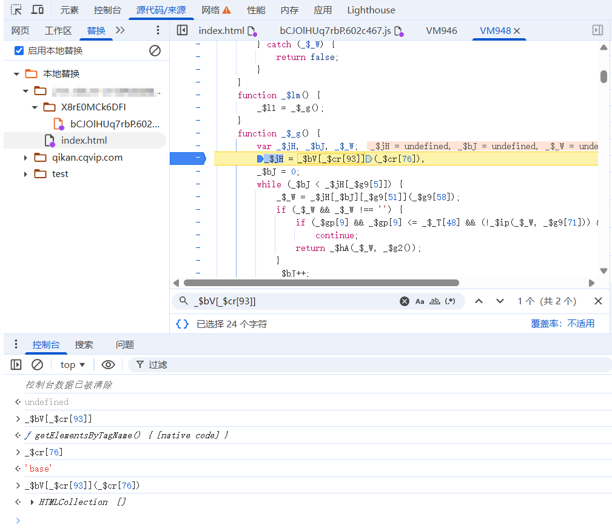

可以看到传了`base`返回`[]`

```
document = {
    "createElement":function(parm){
        if(parm==='div'){
            return div
        }
    },
    "appendChild":function(){},
    "removeChild":function(){},
    "getElementById":function(parm){
        if(parm==='lhUQDqdAt5n6'){
            return meta
        }
    },
    "getElementsByTagName":function(parm){
        if(parm==='base'){
            return []
        }
    }
}
```

13、补充`document.getElementsByTagName`后继续执行

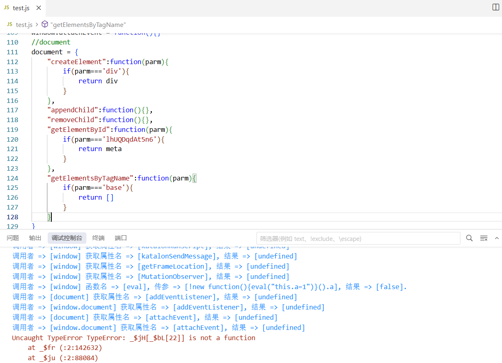

发现又是和之前一样的缺少了`attachEvent`和`addEventListener`，不过显示是在`document`下面，所以在`document`中补上

```
document = {
    "createElement":function(parm){
        if(parm==='div'){
            return div
        }
    },
    "appendChild":function(){},
    "removeChild":function(){},
    "getElementById":function(parm){
        if(parm==='lhUQDqdAt5n6'){
            return meta
        }
    },
    "getElementsByTagName":function(parm){
        if(parm==='base'){
            return []
        }
    },
    "addEventListener":function(){},
    "attachEvent":function(){}
}
```

15、在`document`中补充新旧模拟器兼容函数的定义后继续执行

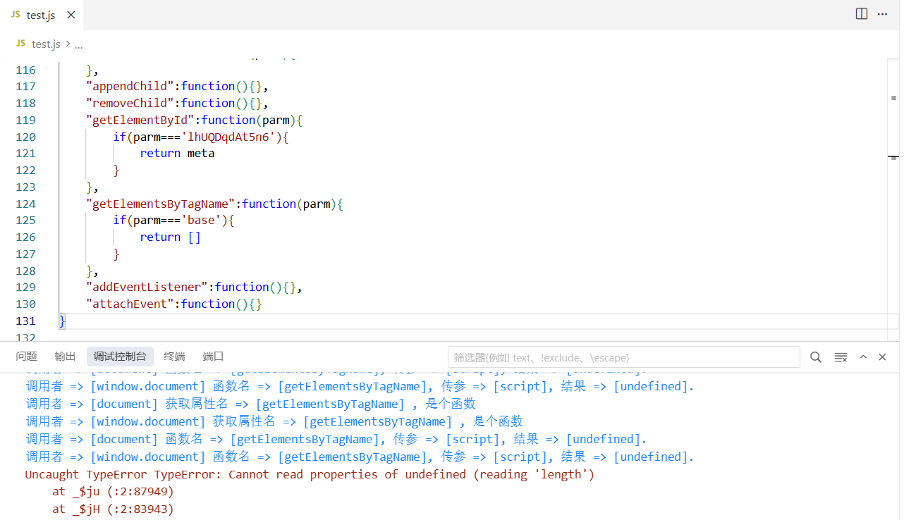

这时候就能发现之前`document`中的`getElementByTagName`函数又传入了`script`，但`script`的具体情况我们也不清楚，并且没有给出具体的函数名，因此我们还是给`script`加上代理，看看代理的回显

16、添加`script`代理后继续运行，查看回显

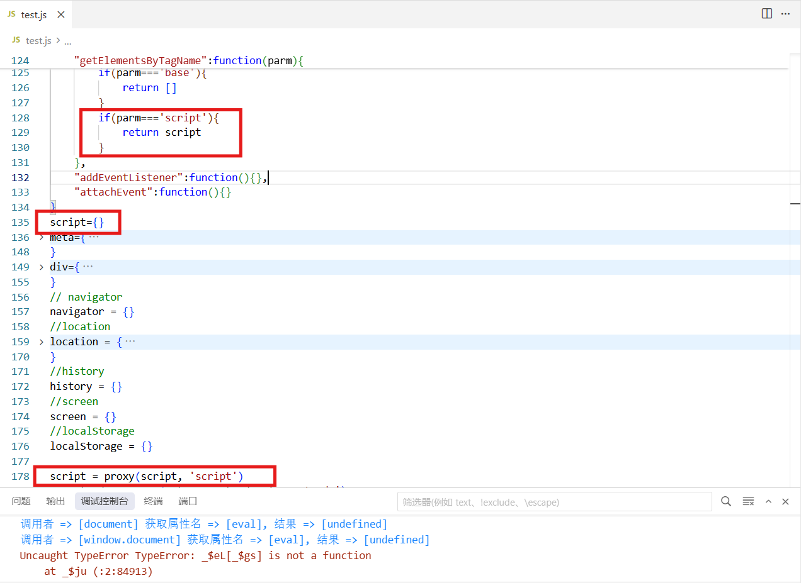

这次代理并没有监控到 `script`的调用，并且报错的内容是 `eval`，并且报错的函数就是最开始说的索引函数 `_`，那个最开始报错 `getElementsByTagName`并在调试时出现 `random`等等的函数，找到之前的调试位置，开始继续断点调试

在经过漫长的调试后(因为是索引函数，所以无意义的函数太多了)，进行了几十次F8，终于出现了需要的内容

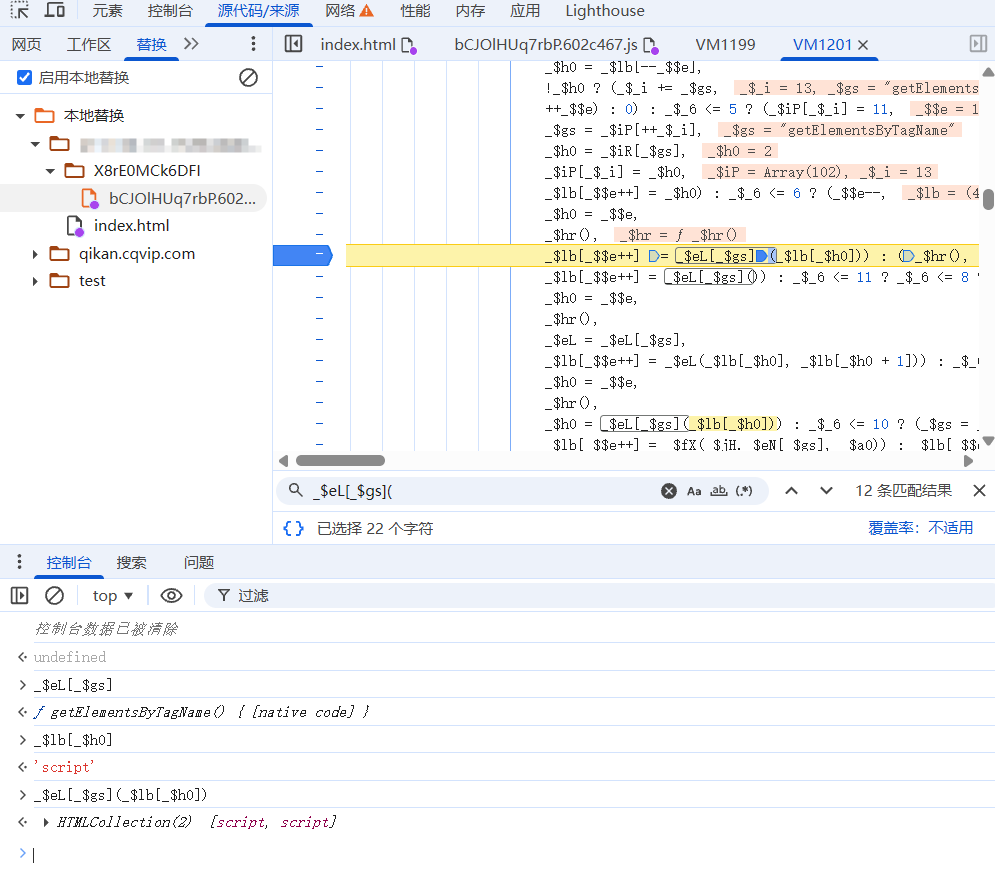

根据浏览器的调试信息可知，这次传入`script`的结果应该是`[script,script]`，我们也按照这个格式修正一下之前`return`的格式

```
document = {
    "createElement":function(parm){
        if(parm==='div'){
            return div
        }
    },
    "appendChild":function(){},
    "removeChild":function(){},
    "getElementById":function(parm){
        if(parm==='lhUQDqdAt5n6'){
            return meta
        }
    },
    "getElementsByTagName":function(parm){
        if(parm==='base'){
            return []
        }
        if(parm==='script'){
            return [script,script]
        }
    },
    "addEventListener":function(){},
    "attachEvent":function(){}
}
```

17、返回的格式从`return script`修正为`return [script,script]`后，再运行代码，查看代理

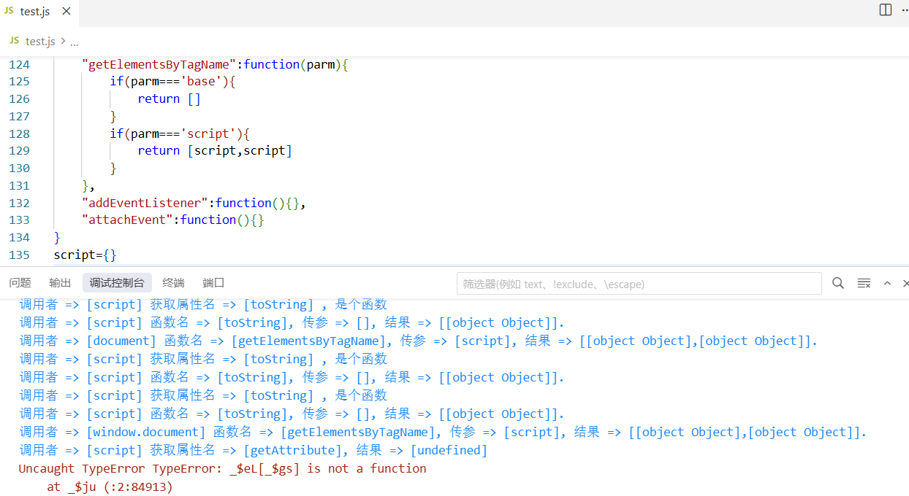

这次成功让代理监控到了`script`，可以看到其中调用了`getAttribute`函数，给的报错函数名和地址依然还是那个索引函数，那就继续在刚刚的断点处往后执行

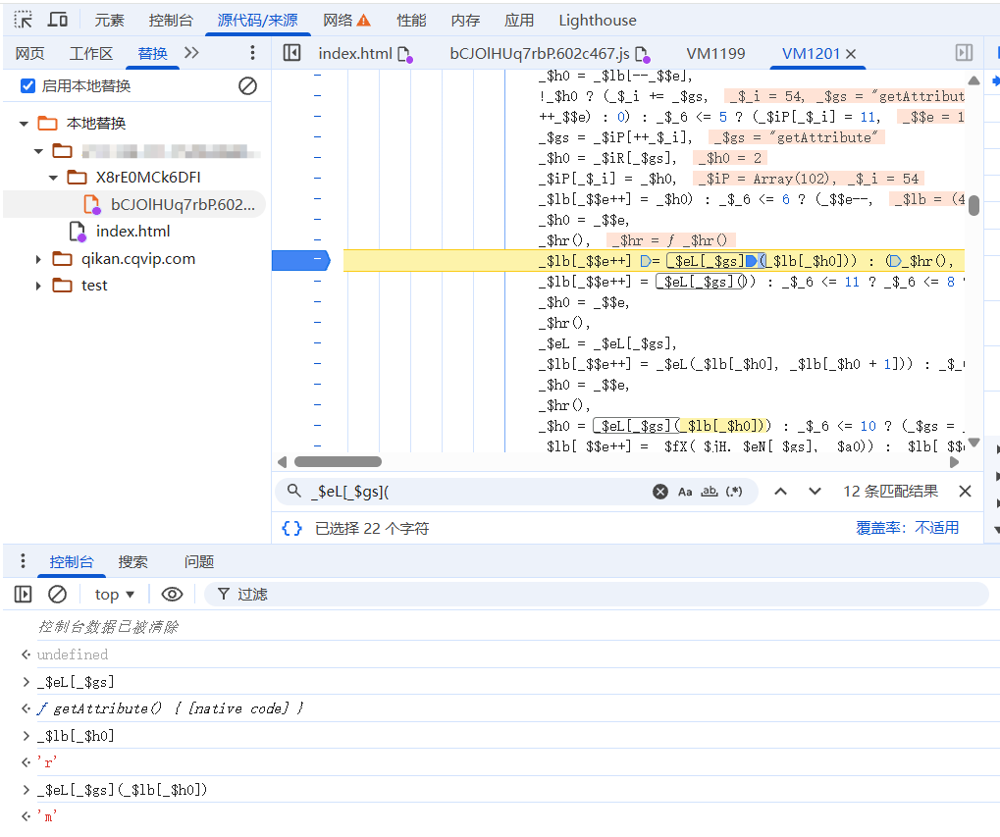

断点执行一次后，成功找到了`getAttribute`，可以看到和之前补的`getAttribute`一样，传入了`r`输出`m`，按照这个传入和输出在`script`中补上函数

```
script={
    "getAttribute":function(parm){
        if(parm==='r'){
            return 'm'
        }
    }
}
```

18、补上`script`中的`getAttribute`后，继续执行代码

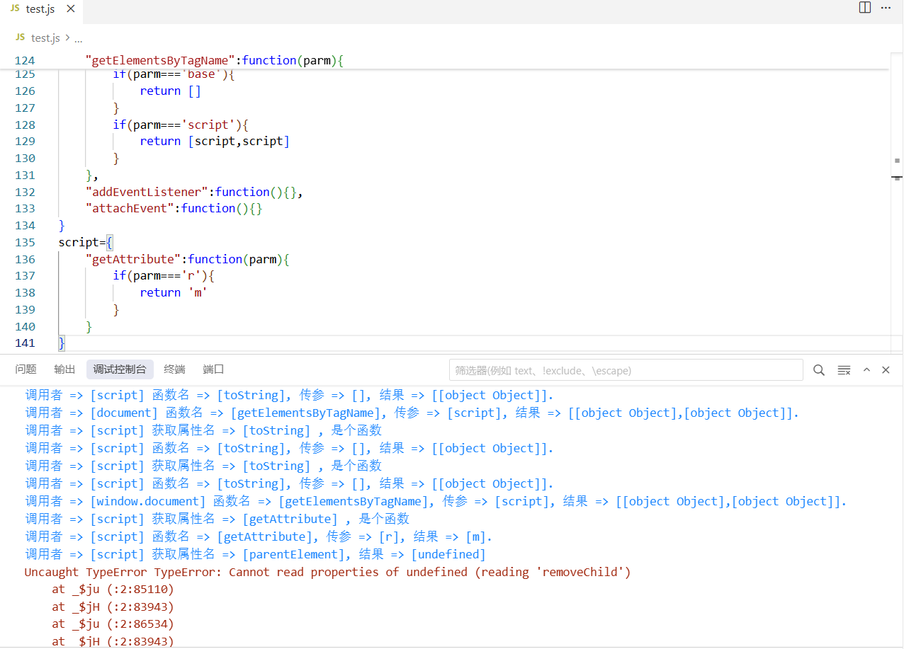

这时候又和之前`meta`标签补`parentNode`的时候一样了，还是老样子，补一个空的，代理一下，看看结果

19、补充`script.parentElement`，并且设置代理后运行代码

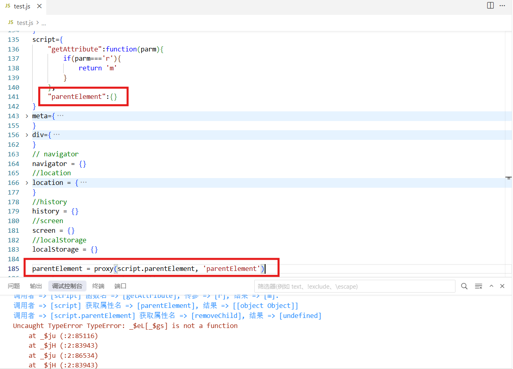

这时候可以看到和之前一样少了`removeChild`，这次虽然函数名还是那个索引函数，但注意位置变了，所以不再是之前那个断点了，找到对应位置开始调试

由于是索引函数，调试的时候无意义的函数调用太多，我们直接右键行头设置条件断点

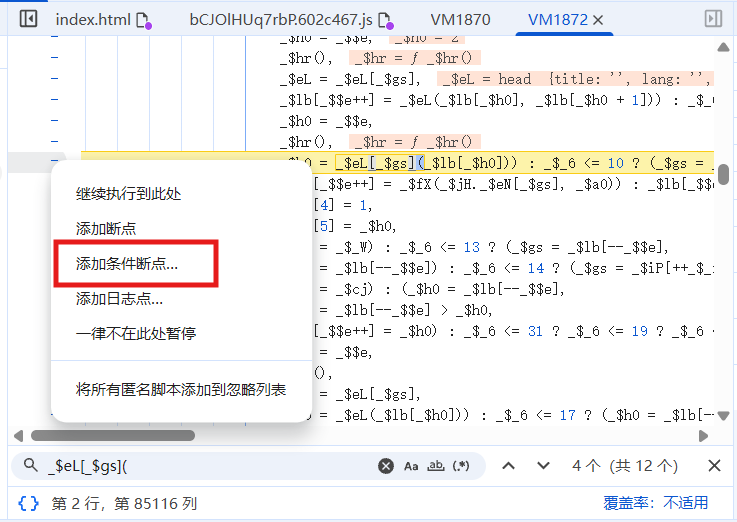

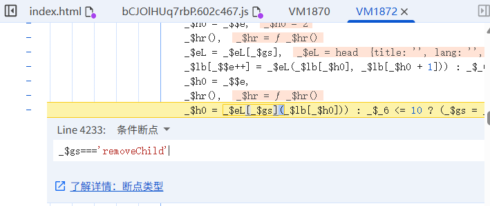

因为是靠`_$gs`字符串来传入调用什么参数的，因此条件设置为

```
_$gs==='removeChild'
```

执行一次，成功断在需要的位置

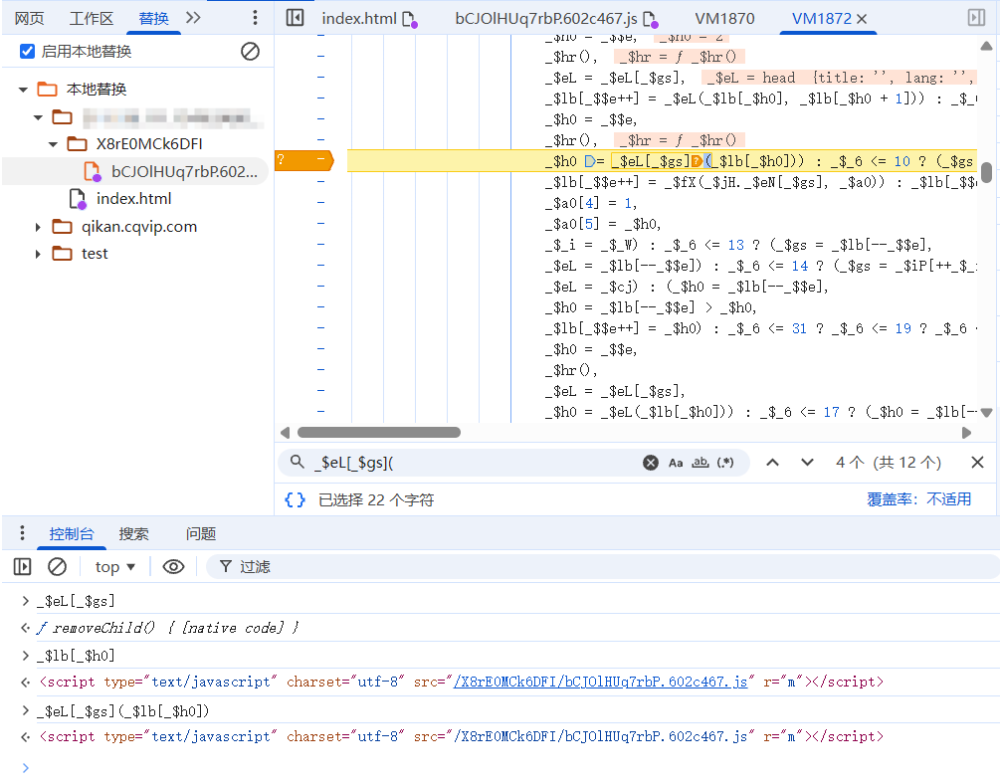

可以看到和之前`meta`标签中的`removeChild`一样，也是用来移除标签本身的，没有什么实际作用一样定义一下就行

```
script={
    "getAttribute":function(parm){
        if(parm==='r'){
            return 'm'
        }
    },
    "parentElement":{
        "removeChild":function(){}
    }
}
```

20、补充`removeChild`后，继续执行

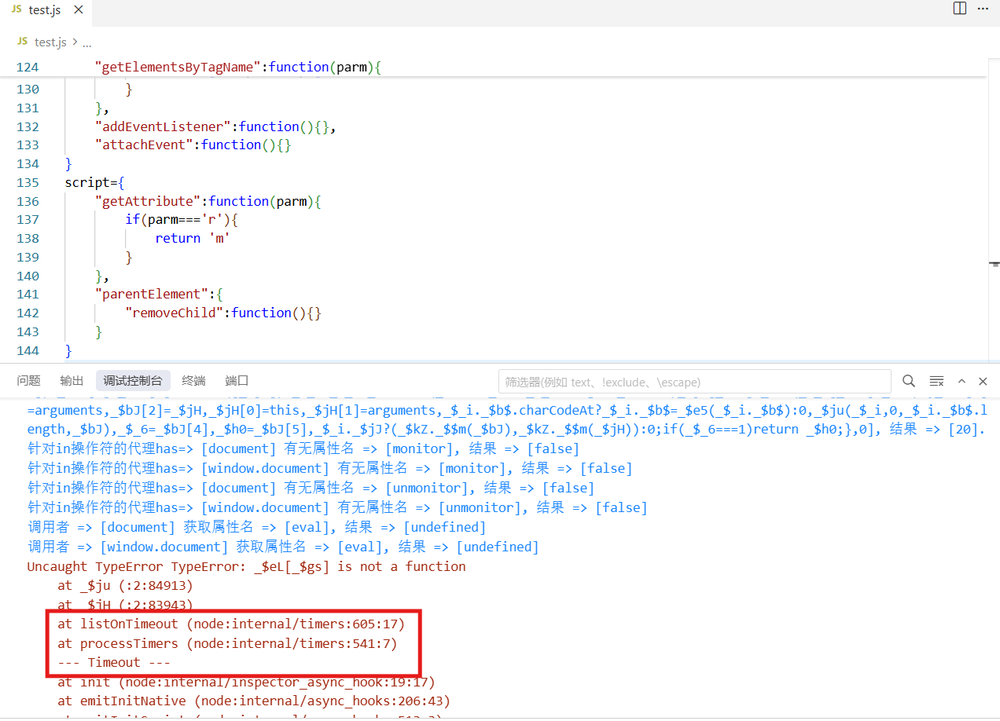

虽然依然有索引函数的报错，但可以明显发现原因是`timeout`引起的，这类似于循环定时器，在代码中将定时器置空即可

```
setInterval=function(){}
setTimeout=function(){}
```

21、清空定时器，再次执行

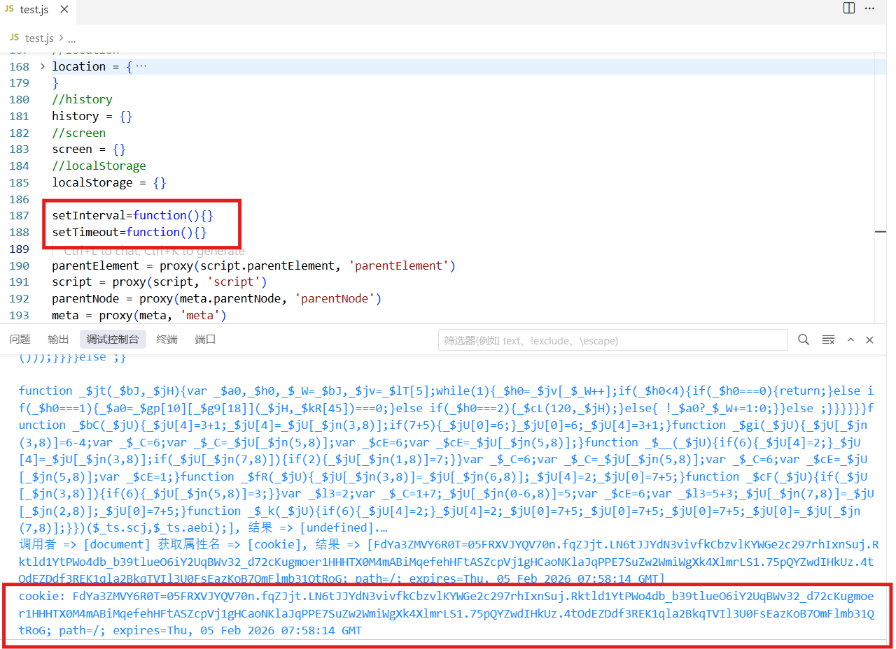

可以看到清空定时器后成功打印了cookie值

后续不断根据代理所报的undefined补全环境，直到cookie可以返回200为止。
