## 1、环境配置

MCP-Client:`Cursor`

使用模型:`composer1.5`

MCP配置:

```json
{
  "mcpServers": {
    "chrome-devtools": {
      "command": "npx",
      "args": [
        "-y",
        "chrome-devtools-mcp@latest",
        "--autoConnect"
      ]
    },
    "devtools-debugger": {
      "command": "node",
      "args": [
        "D:\\nodejs\\node_global\\node_modules\\devtools-debugger-mcp\\dist\\src\\index.js"
      ]
    }
  }
}
```

所使用的MCP-server:

[Google官方devtools工具](https://github.com/ChromeDevTools/chrome-devtools-mcp)

[浏览器调试工具](https://github.com/ScriptedAlchemy/devtools-debugger-mcp)

## 2、前期准备

1、通过大模型调用chrome-devtools工具初步分析咪咕的视频解析逻辑

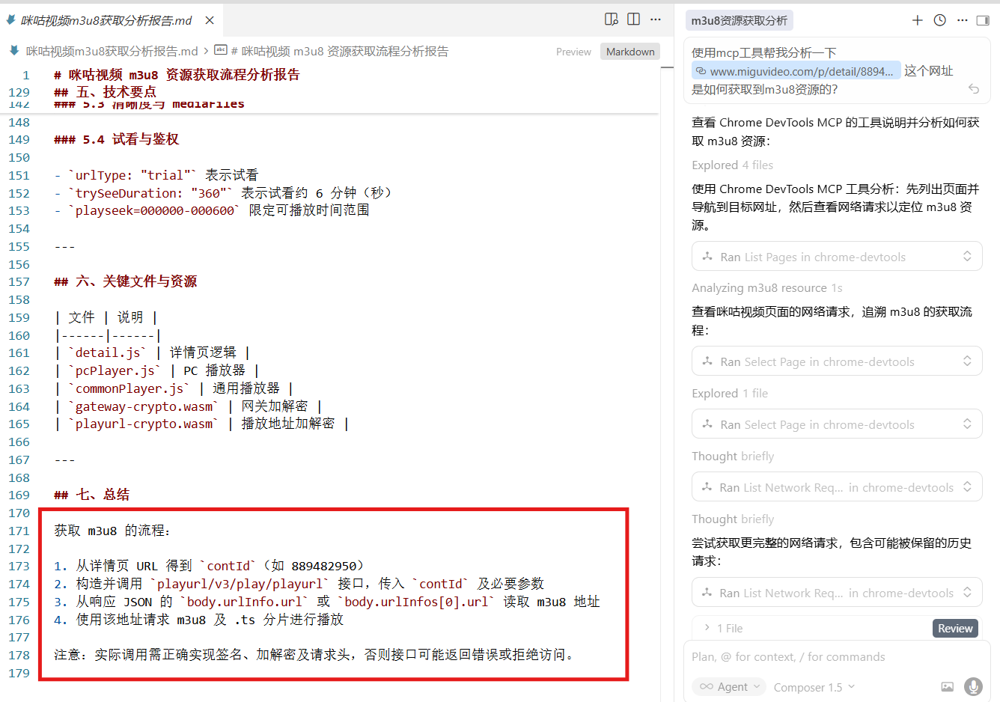

根据模型分析初步得到影片调用逻辑为

加载[影片主页面](https://www.miguvideo.com/p/detail/889482950 "https://www.miguvideo.com/p/detail/889482950")时，根据访问影片主页面带有的 `contID`，携带该ID去获取[影片详情](https://webapi.miguvideo.com/gateway/playurl/v3/play/playurl "https://webapi.miguvideo.com/gateway/playurl/v3/play/playurl")，从影片详情的返回报文中获取所需的[m3u8资源地址](https://gslbmgspvod.miguvideo.com/ "https://gslbmgspvod.miguvideo.com/")

接着直接控制台查找对应的报文

影片详情：`https://webapi.miguvideo.com/gateway/playurl/v3/play/playurl`

可以看到响应中确实带有 `gslbmgspvod.miguvideo.com`链接，与分析结果相同

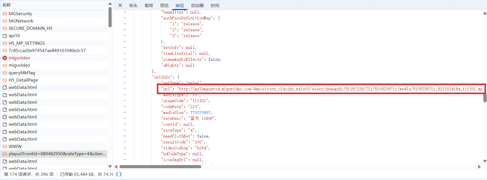

但是直接访问该地址无法正常返回影片资源，查看一下正常的请求报文对比差异

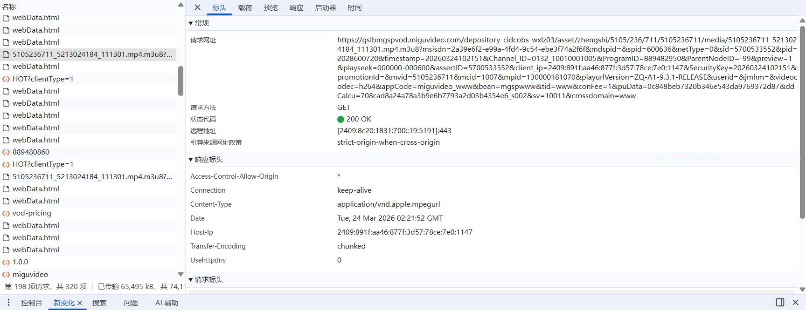

webapi请求所返回的url为：

```
http://gslbmgspvod.miguvideo.com/depository_cidcobs_wxlz03/asset/zhengshi/5105/236/711/5105236711/media/5105236711_5213024184_111301.mp4.m3u8?msisdn=2a39e6f2-e99a-4fd4-9c54-ebe3f74a2f6f&mdspid=&spid=600636&netType=0&sid=5700533552&pid=2028600720&timestamp=20260324102151&Channel_ID=0132_10010001005&ProgramID=889482950&ParentNodeID=-99&preview=1&playseek=000000-000600&assertID=5700533552&client_ip=2409:891f:aa46:877f:3d57:78ce:7e0:1147&SecurityKey=20260324102151&promotionId=&mvid=5105236711&mcid=1007&mpid=130000181070&playurlVersion=ZQ-A1-9.3.1-RELEASE&userid=&jmhm=&videocodec=h264&appCode=miguvideo_www&bean=mgspwww&tid=www&conFee=1&puData=0c848beb7320b346e543da9769372d87
```

而实际的请求url为：

```
https://gslbmgspvod.miguvideo.com/depository_cidcobs_wxlz03/asset/zhengshi/5105/236/711/5105236711/media/5105236711_5213024184_111301.mp4.m3u8?msisdn=2a39e6f2-e99a-4fd4-9c54-ebe3f74a2f6f&mdspid=&spid=600636&netType=0&sid=5700533552&pid=2028600720&timestamp=20260324102151&Channel_ID=0132_10010001005&ProgramID=889482950&ParentNodeID=-99&preview=1&playseek=000000-000600&assertID=5700533552&client_ip=2409:891f:aa46:877f:3d57:78ce:7e0:1147&SecurityKey=20260324102151&promotionId=&mvid=5105236711&mcid=1007&mpid=130000181070&playurlVersion=ZQ-A1-9.3.1-RELEASE&userid=&jmhm=&videocodec=h264&appCode=miguvideo_www&bean=mgspwww&tid=www&conFee=1&puData=0c848beb7320b346e543da9769372d87&ddCalcu=708cad8a24a78a3b9e6b7793a2d03b4354e6_s002&sv=10011&crossdomain=www
```

对比可以直观地看到原url后新增了 `&ddCalcu=708cad8a24a78a3b9e6b7793a2d03b4354e6_s002&sv=10011&crossdomain=www`这些后缀，那么目标就明确了，想要直接获取咪咕的影视资源只需要解决这个新增的后缀生成方式即可

## 3、后缀生成解析

明确需求后，就直接丢给大模型分析一下这些后缀的生成

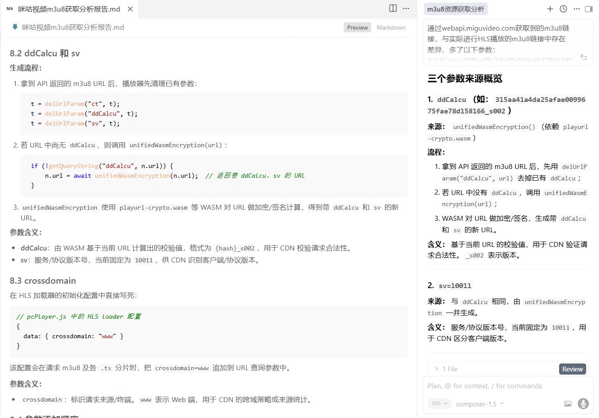

通过模型的分析可以看到，`ddCalcu`是通过调用额外的wasm文件生成的，`sv`作为版本号基本固定，而 `crossdomain`直接写死

## 4、ddCalcu参数生成

因为ddCalcu参数的生成主要通过wasm文件，那么只要正常调用，并且补齐其所需的传参理论上就可以了

所以第一步先看刚刚模型分析得到的 `unifiedWasmEncryption`函数，

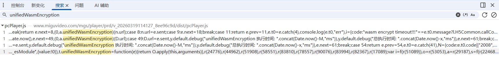

在控制台全局搜索后可以看到，`unifiedWasmEncryption`都在 `pcPlayer.js`中，那么 `ddCalcu`大概率就是由 `pcPlayer.js`进行生成的

我们在这些地方打上断点查看其入参是什么？

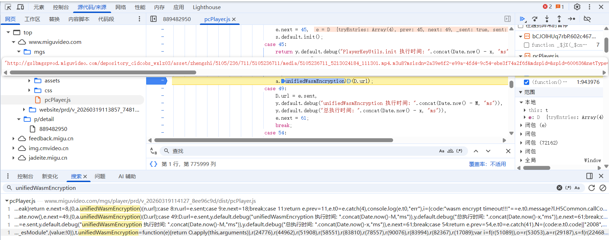

可以看到其传入的 `D.url`就是之前 `webapi.miguvideo.com`所返回的未带有 `ddCalcu`的链接

## 5、初步脚本编写

我们将这个 `pcPlayer.js`摘出，方便后续模型对其进一步分析以及编写脚本

另存为js后，发现这个js的内容由于经过了打包，所以代码全部都缩在了一行之中，对于后续的分析并不直观且友好

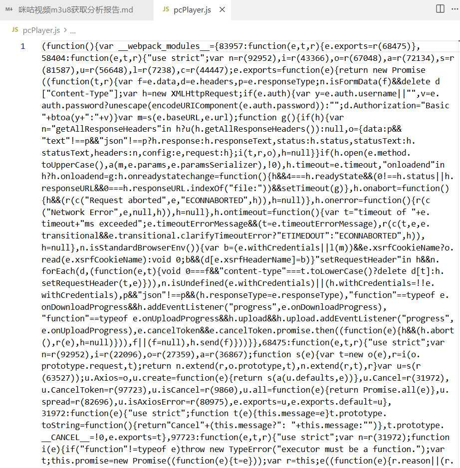

此时，可以使用jsbeauty将代码优化为存在换行和缩进的格式，方便本地查看

先安装jsbeautify

```bash
npm install js-beautify
```

[js-beautify仓库](https://github.com/beautifier/js-beautify/ "https://github.com/beautifier/js-beautify/")

写一个简单的调用

```javascript
// jsbeautify.js
const beautify = require('js-beautify').js;
const fs = require('fs');
const inputFile = process.argv[2];
const outputFile = process.argv[3] || './beauty.js'; 
const jscode = fs.readFileSync(inputFile, { encoding: "utf-8" });
const beautifiedCode = beautify(jscode, { indent_size: 2, space_in_empty_paren: true });
fs.writeFileSync(outputFile, beautifiedCode);
```

```bash
node jsbeautify.js pcPlayer.js
```

当然，如果一些网站的代码比较简短可以直接使用[在线js-beautify工具](https://beautifier.io/ "https://beautifier.io/")

经过 `jsbeautify`的处理，可以看到代码直观了许多

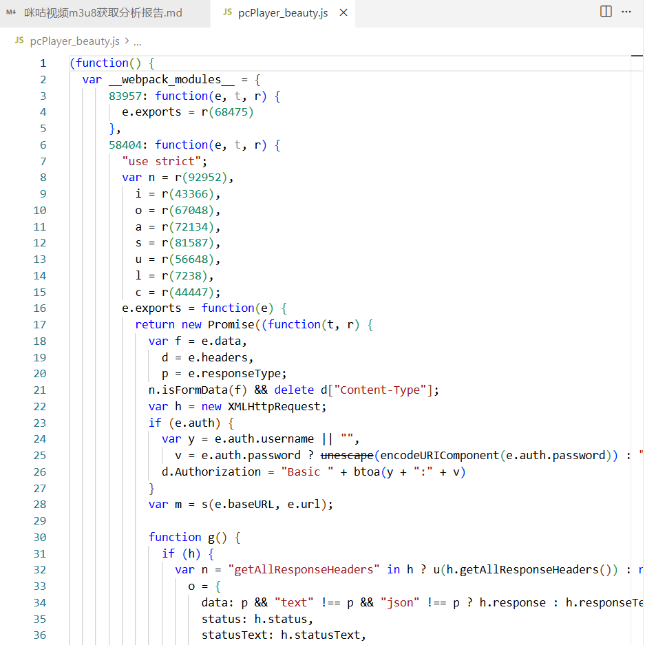

接下来简单找一下 `pcPlayer.js`中调用的 `wasm`文件是哪些

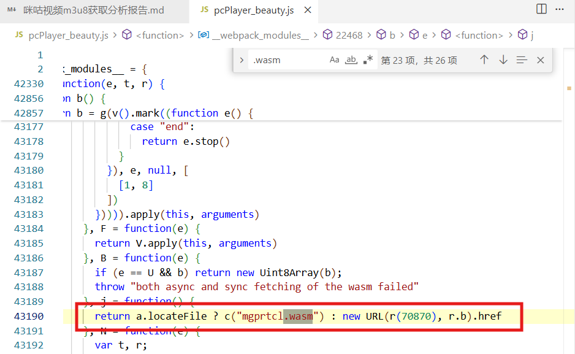

经过全局检索，可以看到pcPlayer全局只调用了 `mgprtcl.wasm`这一个wasm，

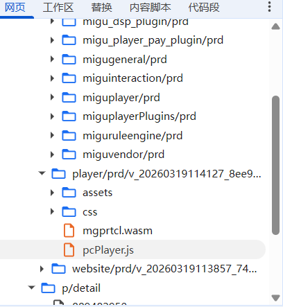

我们在网页中同样将这个wasm文件明文内容摘出(由于wasm本质是二进制文件，模型本地无法直接查看，因此从浏览器直接粘贴出保存为txt)，放于本地，方便后续模型后续分析以及调用

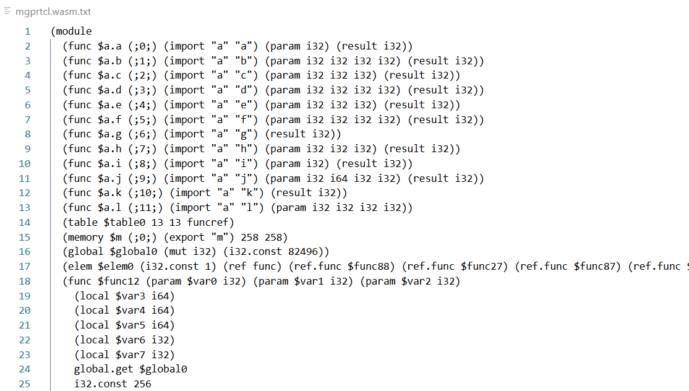

接着我准备使用补环境的方式实现生成 `ddCalcu`参数，

先准备一个代理模板

代理模板：

```javascript
dtavm = {}
dtavm.log = console.log
 
function proxy(obj, objname, type) {
    function getMethodHandler(WatchName, target_obj) {
        let methodhandler = {
            apply(target, thisArg, argArray) {
                if (this.target_obj) {
                    thisArg = this.target_obj
                }
                let result = Reflect.apply(target, thisArg, argArray)
                if (target.name !== "toString") {
                    if (target.name === "addEventListener") {
                        dtavm.log(`调用者 => [${WatchName}] 函数名 => [${target.name}], 传参 => [${argArray[0]}], 结果 => [${result}].`)
                    } else if (WatchName === "window.console") {
                    } else {
                        dtavm.log(`调用者 => [${WatchName}] 函数名 => [${target.name}], 传参 => [${argArray}], 结果 => [${result}].`)
                    }
                } else {
                    dtavm.log(`调用者 => [${WatchName}] 函数名 => [${target.name}], 传参 => [${argArray}], 结果 => [${result}].`)
                }
                return result
            },
            construct(target, argArray, newTarget) {
                var result = Reflect.construct(target, argArray, newTarget)
                dtavm.log(`调用者 => [${WatchName}] 构造函数名 => [${target.name}], 传参 => [${argArray}], 结果 => [${(result)}].`)
                return result;
            }
        }
        methodhandler.target_obj = target_obj
        return methodhandler
    }
 
    function getObjhandler(WatchName) {
        let handler = {
            get(target, propKey, receiver) {
                let result = target[propKey]
                if (result instanceof Object) {
                    if (typeof result === "function") {
                        dtavm.log(`调用者 => [${WatchName}] 获取属性名 => [${propKey}] , 是个函数`)
                        return new Proxy(result, getMethodHandler(WatchName, target))
                    } else {
                        dtavm.log(`调用者 => [${WatchName}] 获取属性名 => [${propKey}], 结果 => [${(result)}]`);
                    }
                    return new Proxy(result, getObjhandler(`${WatchName}.${propKey}`))
                }
                if (typeof (propKey) !== "symbol") {
                    dtavm.log(`调用者 => [${WatchName}] 获取属性名 => [${propKey?.description ?? propKey}], 结果 => [${result}]`);
                }
                return result;
            },
            set(target, propKey, value, receiver) {
                if (value instanceof Object) {
                    dtavm.log(`调用者 => [${WatchName}] 设置属性名 => [${propKey}], 值为 => [${(value)}]`);
                } else {
                    dtavm.log(`调用者 => [${WatchName}] 设置属性名 => [${propKey}], 值为 => [${value}]`);
                }
                return Reflect.set(target, propKey, value, receiver);
            },
            has(target, propKey) {
                var result = Reflect.has(target, propKey);
                dtavm.log(`针对in操作符的代理has=> [${WatchName}] 有无属性名 => [${propKey}], 结果 => [${result}]`)
                return result;
            },
            deleteProperty(target, propKey) {
                var result = Reflect.deleteProperty(target, propKey);
                dtavm.log(`拦截属性delete => [${WatchName}] 删除属性名 => [${propKey}], 结果 => [${result}]`)
                return result;
            },
            defineProperty(target, propKey, attributes) {
                var result = Reflect.defineProperty(target, propKey, attributes);
                dtavm.log(`拦截对象define操作 => [${WatchName}] 待检索属性名 => [${propKey.toString()}] 属性描述 => [${(attributes)}], 结果 => [${result}]`)
                // debugger
                return result
            },
            getPrototypeOf(target) {
                var result = Reflect.getPrototypeOf(target)
                dtavm.log(`被代理的目标对象 => [${WatchName}] 代理结果 => [${(result)}]`)
                return result;
            },
            setPrototypeOf(target, proto) {
                dtavm.log(`被拦截的目标对象 => [${WatchName}] 对象新原型==> [${(proto)}]`)
                return Reflect.setPrototypeOf(target, proto);
            },
            preventExtensions(target) {
                dtavm.log(`方法用于设置preventExtensions => [${WatchName}] 防止扩展`)
                return Reflect.preventExtensions(target);
            },
            isExtensible(target) {
                var result = Reflect.isExtensible(target)
                dtavm.log(`拦截对对象的isExtensible() => [${WatchName}] isExtensible, 返回值==> [${result}]`)
                return result;
            },
        }
        return handler;
    }
 
    if (type === "method") {
        return new Proxy(obj, getMethodHandler(objname, obj));
    }
    return new Proxy(obj, getObjhandler(objname));
}
 
 
EventTarget = function EventTarget(){}
//这里放你要代理的对象 --->

//document
document = {}
 
// navigator
navigator = {}

//location
location = {}
 
//history
history = {}
 
 
//screen
screen = {}
 
//localStorage
localStorage = {}
 
localStorage = proxy(localStorage, 'localStorage')
screen = proxy(screen, 'screen')
location = proxy(location, 'location')
history = proxy(history, 'history')
window = proxy(window, 'window')
document = proxy(document, 'document')
navigator = proxy(navigator, 'navigator')

```

由于 `pcPlayer.js`被webpack打包了，因此我们需要将其中需要调用的目标函数导出，用于引入代理模板之中

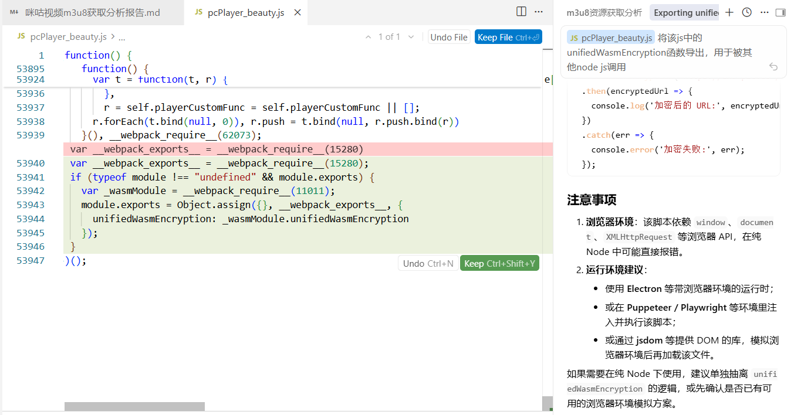

随后我们在刚刚的代理中加入 `unifiedWasmEncryption`的引用

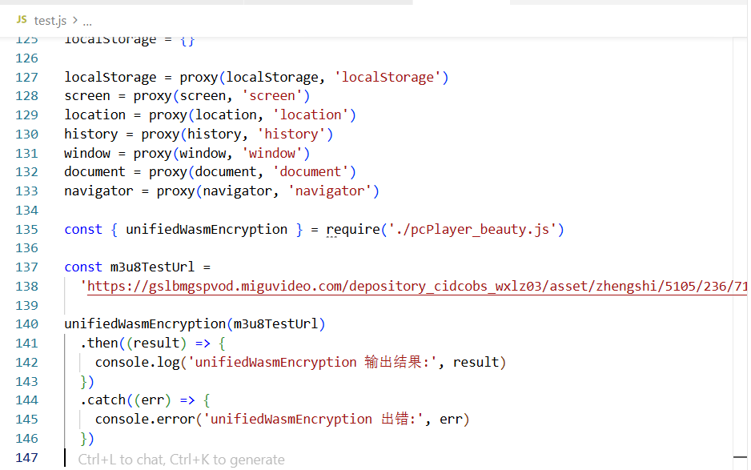

接着让模型使用mcp工具自动抓取浏览器的信息，并且自动对代理模板进行补环境

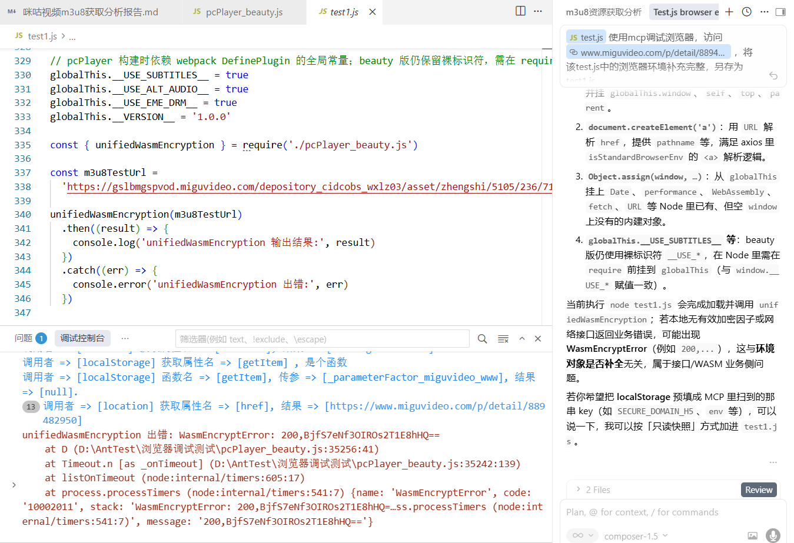

可以看到目前模型补完环境之后出现了 `WasmEncryptError: 200,BjfS7eNf3OIROs2T1E8hHQ==`的报错信息

此时，按模型的输出，这个报错大概率是wasm文件内部抛出的报错，而非js脚本抛出的报错

## 6、wasm报错分析

既然是wasm内部抛出的报错，那么我们先确认一下wasm的导入函数，查看是否是导入函数导致的问题

用模型生成了一份用以hook其导入函数调用及返回的脚本(使用油猴加载，方便多次使用)

```javascript
// ==UserScript==
// @name         咪咕 mgprtcl.wasm 导入函数 Hook
// @namespace    local.migu.mgprtcl
// @version      1.0.0
// @description  拦截 WebAssembly.instantiate / instantiateStreaming，对 mgprtcl.wasm 的 import 对象（模块 "a": a..l）打日志，记录参数与返回值
// @author       —
// @match        https://www.miguvideo.com/*
// @match        https://m.miguvideo.com/*
// @run-at       document-start
// @grant        none
// ==/UserScript==

/**
 * mgprtcl.wasm（见 mgprtcl.wasm.txt）导入约定：
 *   (import "a" "a") (param i32) (result i32)
 *   (import "a" "b") (param i32 i32 i32 i32) (result i32)
 *   (import "a" "c") (param i32 i32 i32) (result i32)
 *   (import "a" "d") (param i32 i32 i32 i32) (result i32)
 *   (import "a" "e") (param i32 i32 i32) (result i32)
 *   (import "a" "f") (param i32 i32 i32 i32) (result i32)
 *   (import "a" "g") (result i32)
 *   (import "a" "h") (param i32 i32 i32) (result i32)
 *   (import "a" "i") (param i32) (result i32)
 *   (import "a" "j") (param i32 i64 i32 i32) (result i32)
 *   (import "a" "k") (result i32)
 *   (import "a" "l") (param i32 i32 i32 i32)
 *
 * pcPlayer 中 Emscripten 传入的 importObject 形如：{ a: gt }，
 * gt 键名 a..l 与上表一一对应（见 pcPlayer_beauty.js 中 gt = { k, l, c, ... }）。
 */

;(function () {
  'use strict'

  /** 仅当 import 形如 Emscripten 的 { a: { a..l } } 时包装，避免其它 wasm 刷屏 */
  var HOOK_ONLY_MGPRTCL_SHAPE = true

  /** 为 true 时对所有 wasm 的 import 都打日志 */
  var HOOK_ALL_WASM = false

  var TAG = '[mgprtcl-wasm]'

  function isMgprtclLikeImports(imports) {
    if (!imports || typeof imports !== 'object') return false
    var a = imports.a
    if (!a || typeof a !== 'object') return false
    var keys = Object.keys(a)
    if (keys.length < 10) return false
    for (var i = 0; i < keys.length; i++) {
      if (typeof a[keys[i]] !== 'function') return false
    }
    return typeof a.a === 'function' && typeof a.g === 'function' && typeof a.k === 'function'
  }

  function formatArg(x) {
    if (typeof x === 'bigint') return x.toString() + 'n'
    if (typeof x === 'number') return x
    return String(x)
  }

  function wrapFunction(moduleName, exportName, fn) {
    return function wasmImportHook() {
      var args = Array.prototype.slice.call(arguments)
      var t0 = typeof performance !== 'undefined' && performance.now ? performance.now() : 0
      var ret
      try {
        ret = fn.apply(this, args)
      } catch (err) {
        console.error(TAG, moduleName + '.' + exportName, 'throw', err, 'args', args)
        throw err
      }
      var dt =
        typeof performance !== 'undefined' && performance.now ? performance.now() - t0 : 0
      var retLog =
        typeof ret === 'bigint'
          ? ret.toString() + 'n'
          : ret === undefined
            ? '(void)'
            : ret
      console.log(
        TAG,
        moduleName + '.' + exportName + '(' +
          args.map(formatArg).join(', ') +
          ') => ' +
          retLog +
          (dt ? ' ; ' + dt.toFixed(3) + 'ms' : '')
      )
      return ret
    }
  }

  function wrapImportObject(imports) {
    if (!imports || typeof imports !== 'object') return imports

    var shouldWrap =
      HOOK_ALL_WASM ||
      !HOOK_ONLY_MGPRTCL_SHAPE ||
      isMgprtclLikeImports(imports)

    if (!shouldWrap) return imports

    var out = {}
    var modNames = Object.keys(imports)
    for (var mi = 0; mi < modNames.length; mi++) {
      var modName = modNames[mi]
      var mod = imports[modName]
      if (!mod || typeof mod !== 'object') {
        out[modName] = mod
        continue
      }
      out[modName] = {}
      var names = Object.keys(mod)
      for (var ni = 0; ni < names.length; ni++) {
        var fnName = names[ni]
        var val = mod[fnName]
        if (typeof val === 'function') {
          out[modName][fnName] = wrapFunction(modName, fnName, val)
        } else {
          out[modName][fnName] = val
        }
      }
    }
    console.log(TAG, 'wrapped importObject modules:', Object.keys(out))
    return out
  }

  var WA = WebAssembly
  if (!WA || !WA.instantiate) return

  var origInstantiate = WA.instantiate.bind(WA)
  var origInstantiateStreaming =
    typeof WA.instantiateStreaming === 'function'
      ? WA.instantiateStreaming.bind(WA)
      : null

  WA.instantiate = function (first, imports) {
    var wrapped = imports !== undefined ? wrapImportObject(imports) : imports
    return origInstantiate(first, wrapped)
  }

  if (origInstantiateStreaming) {
    WA.instantiateStreaming = function (source, imports) {
      var wrapped = imports !== undefined ? wrapImportObject(imports) : imports
      return origInstantiateStreaming(source, wrapped)
    }
  }

  console.log(TAG, 'WebAssembly.instantiate / instantiateStreaming hook installed')
})()

```

通过油猴加载后，刷新网页，可以在控制台看到其输出

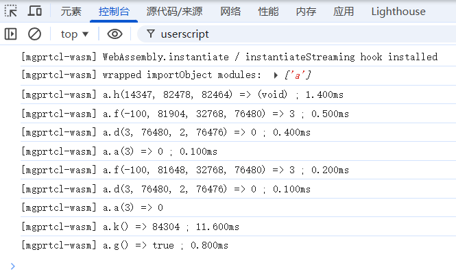

直接看这些回显分析会很麻烦，所以直接让模型使用mcp工具刷新页面读取hook的回显或者直接粘贴入对话中，让其根据本地保存的 `pcPlayer.js`分析一遍这些调用和返回的含义

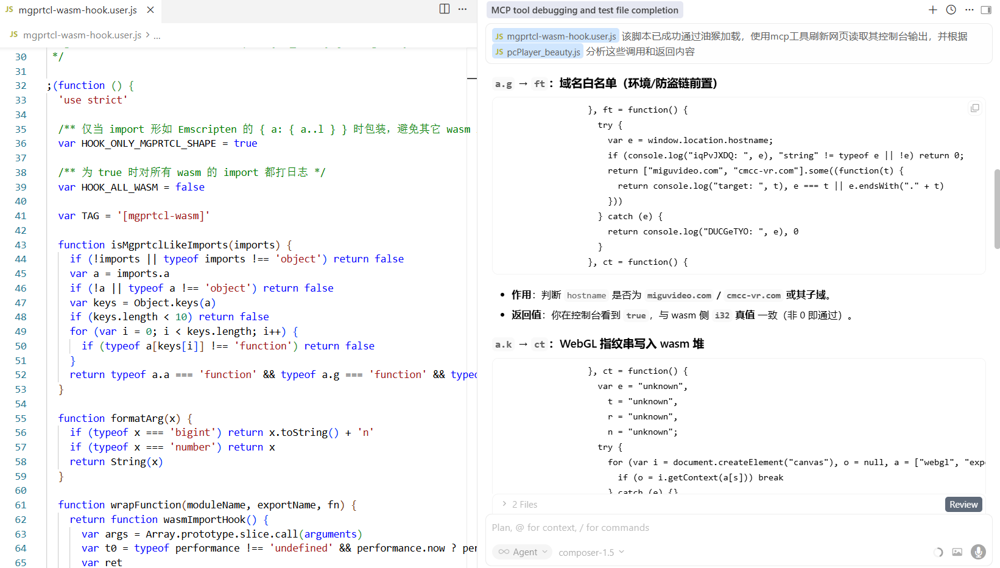

其分析结果汇总如下：

| 调用 | 作用             | 补充                                                                                                       | 返回值                                           |
| ---- | ---------------- | ---------------------------------------------------------------------------------------------------------- | ------------------------------------------------ |
| a.g  | 域名白名单       | 判断 `hostname` 是否为 `miguvideo.com` **/** `cmcc-vr.com` **或其子域**                 | true/false                                       |
| a.k  | 写入WebGL指纹    | 拼 `VERSION\|SHADING_LANGUAGE_VERSION\|RENDERER\|extensions`，经 `Qe` 写入线性内存，`dt` 为 `_malloc` | 写入的指针地址                                   |
| a.f  | 打开文件(得到fd) | **第一个参数**为对应 Emscripten 里常用的 `AT_FDCWD`（相对当前工作目录解析路径）                    | **虚拟文件系统** 上的 **文件描述符** |
| a.d  | 读取文件         | 对刚刚**文件描述符**所对应的文件做读；`ze` 从流读到 wasm 缓冲区；`O[n>>2]` 写入结果计数。        | 返回0即成功                                      |
| a.a  | 关闭文件(关闭fd) | close(**文件描述符**)                                                                                | 返回0即成功                                      |
| a.h  | 动态调用         | **第一个参数** 为在同文件 `lt` 表里注册的 **导出函数 id**                                    | 无返回值                                         |

那么现在就能知道，`a.g`、`a.k`为环境检测，`a.f`、`a.d`、`a.a`用于文件读写，`a.h`一般用于IDBS的初始化(将IndexedDB内容装载入MEMFS中)，那么导致报错的可能原因就是环境检测未通过或者未能读取到indexedDB的虚拟文件数据。

而检索当前的补环境脚本可以得知hostname已设置为 `www.miguvideo.com`，而目前环境中还缺少WebGL指纹、以及wasm构建虚拟文件系统所读取的IndexedDB内容

## 7、补充环境检测内容

### 7.1、WebGL指纹

先让模型访问主页面用MCP工具帮助我们直接抓取WebGL指纹内容，

| 字段                               | 值                                                                                          |
| ---------------------------------- | ------------------------------------------------------------------------------------------- |
| **VERSION**                  | `WebGL 1.0 (OpenGL ES 2.0 Chromium)`                                                      |
| **SHADING_LANGUAGE_VERSION** | `WebGL GLSL ES 1.0 (OpenGL ES GLSL ES 1.0 Chromium)`                                      |
| **VENDOR**                   | `WebKit`                                                                                  |
| **RENDERER**（掩码）         | `WebKit WebGL`                                                                            |
| **UNMASKED_VENDOR_WEBGL**    | `Google Inc. (NVIDIA)`                                                                    |
| **UNMASKED_RENDERER_WEBGL**  | `ANGLE (NVIDIA, NVIDIA GeForce GTX 1660 Ti (0x00002191) Direct3D11 vs_5_0 ps_5_0, D3D11)` |
| **扩展数量**                 | 35                                                                                          |
| **扩展列表（已排序）               | 与脚本返回的 `extensionsSorted` 一致（含 `WEBGL_debug_renderer_info` 等）               |

将其填充入脚本中

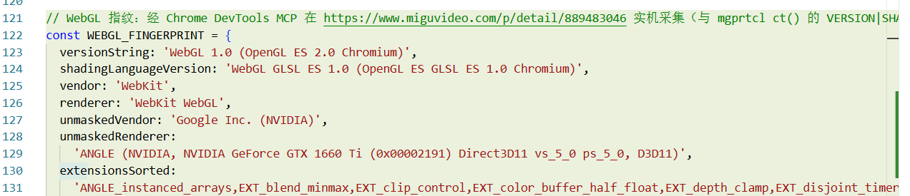

### 7.2、IndexedDB内容

由于MCP工具没有提供其读取l `ocalStorge`、`IndexedDB`等内容的功能

因此使用模型生成一个油猴脚本用于导出该页面的IndexedDB内容

```javascript
// ==UserScript==
// @name         IndexedDB 导出工具
// @namespace    http://tampermonkey.net/
// @version      2.0
// @description  导出当前网页同源下的 IndexedDB 内容，包含 key / primaryKey / value / store 元信息
// @match        https://*/*
// @match        http://*/*
// @grant        GM_registerMenuCommand
// ==/UserScript==

(function () {
  'use strict';

  function downloadText(filename, text) {
    const blob = new Blob([text], { type: 'application/json;charset=utf-8' });
    const a = document.createElement('a');
    a.href = URL.createObjectURL(blob);
    a.download = filename;
    a.click();
    setTimeout(() => URL.revokeObjectURL(a.href), 5000);
  }

  function reqToPromise(req) {
    return new Promise((resolve, reject) => {
      req.onsuccess = () => resolve(req.result);
      req.onerror = () => reject(req.error);
    });
  }

  function txDone(tx) {
    return new Promise((resolve, reject) => {
      tx.oncomplete = () => resolve();
      tx.onabort = () => reject(tx.error || new Error('transaction aborted'));
      tx.onerror = () => reject(tx.error || new Error('transaction error'));
    });
  }

  function normalizeDOMStringList(listLike) {
    return Array.from(listLike || []);
  }

  function serializeValue(value) {
    if (value instanceof Date) {
      return {
        __type: 'Date',
        value: value.toISOString(),
      };
    }

    if (value instanceof ArrayBuffer) {
      return {
        __type: 'ArrayBuffer',
        data: Array.from(new Uint8Array(value)),
      };
    }

    if (ArrayBuffer.isView(value)) {
      return {
        __type: value.constructor.name,
        data: Array.from(value),
      };
    }

    if (value instanceof Blob) {
      return {
        __type: 'Blob',
        size: value.size,
        mime: value.type,
      };
    }

    if (value instanceof Map) {
      return {
        __type: 'Map',
        entries: Array.from(value.entries()).map(([k, v]) => [serializeValue(k), serializeValue(v)]),
      };
    }

    if (value instanceof Set) {
      return {
        __type: 'Set',
        values: Array.from(value.values()).map(serializeValue),
      };
    }

    if (Array.isArray(value)) {
      return value.map(serializeValue);
    }

    if (value && typeof value === 'object') {
      const out = {};
      for (const [k, v] of Object.entries(value)) {
        out[k] = serializeValue(v);
      }
      return out;
    }

    return value;
  }

  async function getAllRecordsFromStore(db, storeName) {
    const tx = db.transaction(storeName, 'readonly');
    const store = tx.objectStore(storeName);

    const records = await new Promise((resolve, reject) => {
      const out = [];
      const cursorReq = store.openCursor();

      cursorReq.onsuccess = (event) => {
        const cursor = event.target.result;
        if (!cursor) {
          resolve(out);
          return;
        }

        out.push({
          key: serializeValue(cursor.key),
          primaryKey: serializeValue(cursor.primaryKey),
          value: serializeValue(cursor.value),
        });

        cursor.continue();
      };

      cursorReq.onerror = () => reject(cursorReq.error);
    });

    await txDone(tx);
    return records;
  }

  function getStoreMeta(store) {
    const indexes = [];
    for (const indexName of store.indexNames) {
      const idx = store.index(indexName);
      indexes.push({
        name: idx.name,
        keyPath: serializeValue(idx.keyPath),
        multiEntry: idx.multiEntry,
        unique: idx.unique,
      });
    }

    return {
      name: store.name,
      keyPath: serializeValue(store.keyPath),
      autoIncrement: store.autoIncrement,
      indexNames: normalizeDOMStringList(store.indexNames),
      indexes,
    };
  }

  async function dumpSingleDatabase(dbName) {
    const openReq = indexedDB.open(dbName);
    const db = await reqToPromise(openReq);

    try {
      const dbDump = {
        name: db.name,
        version: db.version,
        objectStoreNames: normalizeDOMStringList(db.objectStoreNames),
        stores: {},
      };

      for (const storeName of db.objectStoreNames) {
        try {
          const tx = db.transaction(storeName, 'readonly');
          const store = tx.objectStore(storeName);
          const meta = getStoreMeta(store);
          await txDone(tx);

          const records = await getAllRecordsFromStore(db, storeName);

          dbDump.stores[storeName] = {
            meta,
            count: records.length,
            records,
          };
        } catch (e) {
          dbDump.stores[storeName] = {
            __error: String(e),
          };
        }
      }

      return dbDump;
    } finally {
      db.close();
    }
  }

  async function listDatabasesSafe() {
    if (typeof indexedDB.databases === 'function') {
      const dbList = await indexedDB.databases();
      return (dbList || [])
        .filter(info => info && info.name)
        .map(info => ({
          name: info.name,
          version: info.version,
        }));
    }

    return null;
  }

  async function exportAllIndexedDB() {
    if (!window.indexedDB) {
      alert('当前页面无法访问 indexedDB');
      return;
    }

    const listed = await listDatabasesSafe();
    if (!listed) {
      alert('当前浏览器不支持 indexedDB.databases()，请使用“导出指定数据库”菜单。');
      return;
    }

    const result = {
      origin: location.origin,
      exportedAt: new Date().toISOString(),
      databases: {},
    };

    for (const info of listed) {
      try {
        result.databases[info.name] = await dumpSingleDatabase(info.name);
      } catch (e) {
        result.databases[info.name] = {
          __error: String(e),
        };
      }
    }

    const text = JSON.stringify(result, null, 2);
    downloadText(`indexeddb-export-${location.host}.json`, text);
    console.log('IndexedDB 导出完成（全部数据库）:', result);
  }

  async function exportOneIndexedDBByName() {
    if (!window.indexedDB) {
      alert('当前页面无法访问 indexedDB');
      return;
    }

    const dbName = prompt('请输入要导出的数据库名：');
    if (!dbName) return;

    const result = {
      origin: location.origin,
      exportedAt: new Date().toISOString(),
      databases: {},
    };

    try {
      result.databases[dbName] = await dumpSingleDatabase(dbName);
      const text = JSON.stringify(result, null, 2);
      downloadText(`indexeddb-export-${location.host}-${dbName}.json`, text);
      console.log(`IndexedDB 导出完成（数据库: ${dbName}）:`, result);
    } catch (e) {
      console.error('导出失败:', e);
      alert('导出失败：' + e);
    }
  }

  GM_registerMenuCommand('导出当前站点全部 IndexedDB（含键名+键值）', () => {
    exportAllIndexedDB().catch(err => {
      console.error('导出失败:', err);
      alert('导出失败：' + err);
    });
  });

  GM_registerMenuCommand('导出指定数据库（含键名+键值）', () => {
    exportOneIndexedDBByName().catch(err => {
      console.error('导出失败:', err);
      alert('导出失败：' + err);
    });
  });
})();
```

启用后点击导出全部的按钮，将IndexedDB的数据下载为json文件

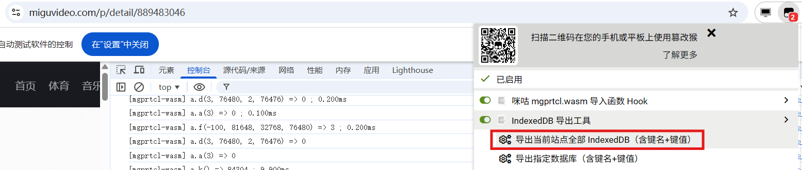

当然有些页面中可能IndexedDB的数据比较少，也可以在Devtools中直接手动粘贴出来

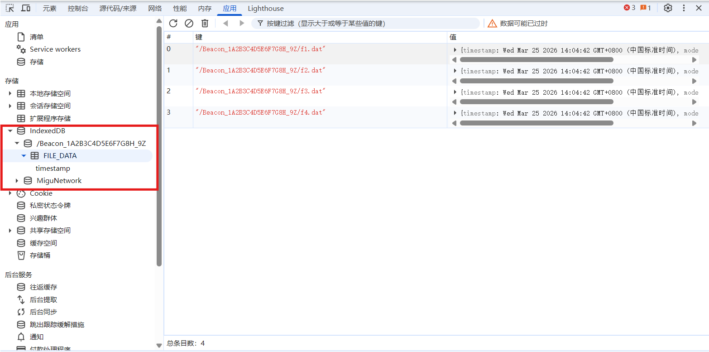

接着让模型将导出的IndexedDB数据补充进脚本中

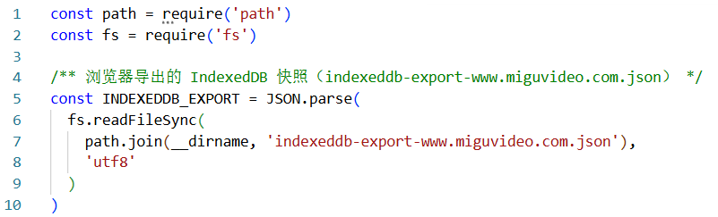

*题外话：第一次运行失败，由于没有明确让模型按照pcPlayer.js的调用方式进行构建，后续使其以pcPlayer.js的调用方式进行修改后才可正常读取indexedDB*

成功生成ddCalcu链接

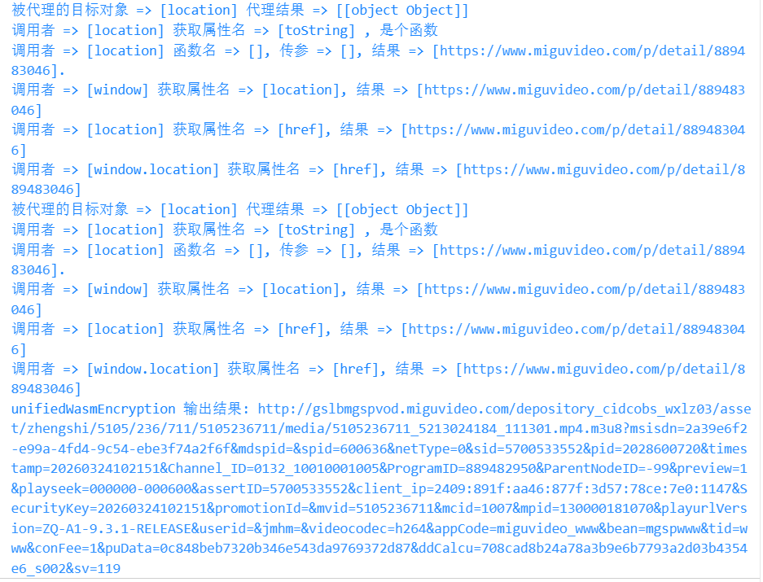

可以看到输出的ddCalcu与前文第二部分中网页实际请求带上的后缀 `&ddCalcu=708cad8a24a78a3b9e6b7793a2d03b4354e6_s002&sv=10011&crossdomain=www`一样

## 8、动态链接补充

最后补充上通过 `webapi.miguvideo.com`动态加载链接，因为静态url会因为服务端传入的`pudata`过期导致生成的资源地址无法访问

*注：当前所使用的wasm包版本为：`v_20260319114127_8ee96c9d`，以下所有内容都基于该wasm版本*

全部完成后删除相关代理与调试信息的补环境代码为

**migu_v_20260319114127_8ee96c9d.js:**

```javascript
//migu_v_20260319114127_8ee96c9d.js
const path = require('path')
const fs = require('fs')

const INDEXEDDB_EXPORT = JSON.parse(
  fs.readFileSync(
    path.join(__dirname, 'indexeddb-export-beacon-only.json'),
    'utf8'
  )
)

function deserializeIndexedDBExportValue(val) {
  if (val == null || typeof val !== 'object') return val
  if (val.__type === 'Date') return new Date(val.value)
  if (val.__type === 'Uint8Array') return new Uint8Array(val.data)
  if (Array.isArray(val)) return val.map(deserializeIndexedDBExportValue)
  const o = {}
  for (const k of Object.keys(val)) o[k] = deserializeIndexedDBExportValue(val[k])
  return o
}

function installIndexedDBMockFromExport(exportJson) {
  const databases = exportJson.databases

  function buildStoreMap(storeExport) {
    const map = new Map()
    if (!storeExport?.records) return map
    for (const rec of storeExport.records) {
      map.set(rec.key, deserializeIndexedDBExportValue(rec.value))
    }
    return map
  }

  function openKeyCursorForStore(data, _indexName) {
    const entries = []
    for (const [primaryKey, value] of data.entries()) {
      let tsDate = null
      if (value && value.timestamp instanceof Date) tsDate = value.timestamp
      else if (value && value.timestamp) tsDate = new Date(value.timestamp)
      else tsDate = new Date(0)
      entries.push({ primaryKey, indexKey: tsDate, value })
    }
    entries.sort((a, b) => a.indexKey.getTime() - b.indexKey.getTime())
    let idx = 0
    const req = {}
    function advance() {
      if (idx >= entries.length) {
        req.result = null
        if (req.onsuccess) req.onsuccess({ target: req })
        return
      }
      const row = entries[idx]
      idx++
      req.result = {
        primaryKey: row.primaryKey,
        key: row.indexKey,
        value: row.value,
        continue() {
          queueMicrotask(advance)
        }
      }
      if (req.onsuccess) req.onsuccess({ target: req })
    }
    queueMicrotask(advance)
    return req
  }

  globalThis.indexedDB = {
    open(name, version) {
      const req = {}
      queueMicrotask(() => {
        const dbEntry = databases[name]
        if (!dbEntry) {
          req.error = new Error('NotFoundError')
          if (req.onerror) req.onerror({ target: req })
          return
        }
        if (version != null && dbEntry.version != null && version < dbEntry.version) {
          req.error = new Error('VersionError')
          if (req.onerror) req.onerror({ target: req })
          return
        }
        const storeMaps = {}
        for (const sn of dbEntry.objectStoreNames) {
          const se = dbEntry.stores[sn]
          storeMaps[sn] = buildStoreMap(se)
        }
        req.result = {
          name: dbEntry.name,
          version: dbEntry.version,
          objectStoreNames: Object.assign([...dbEntry.objectStoreNames], {
            contains(n) {
              return dbEntry.objectStoreNames.includes(n)
            }
          }),
          close() {},
          transaction(storeNames, mode) {
            let pending = 0
            const rw = mode === 'readwrite'
            const tx = {
              oncomplete: null,
              onerror: null,
              onabort: null,
              objectStore(storeName) {
                const data = storeMaps[storeName]
                if (!data) throw new Error('object store ' + storeName)
                function afterOp() {
                  if (!rw) return
                  pending--
                  if (pending === 0 && tx.oncomplete) {
                    queueMicrotask(() => tx.oncomplete({ target: tx }))
                  }
                }
                return {
                  get(key) {
                    const r = {}
                    if (rw) pending++
                    queueMicrotask(() => {
                      r.result = data.get(key)
                      if (r.onsuccess) r.onsuccess({ target: r })
                      afterOp()
                    })
                    return r
                  },
                  put(val, key) {
                    const r = {}
                    if (rw) pending++
                    queueMicrotask(() => {
                      data.set(key, val)
                      r.result = key
                      if (r.onsuccess) r.onsuccess({ target: r })
                      afterOp()
                    })
                    return r
                  },
                  delete(key) {
                    const r = {}
                    if (rw) pending++
                    queueMicrotask(() => {
                      data.delete(key)
                      if (r.onsuccess) r.onsuccess({ target: r })
                      afterOp()
                    })
                    return r
                  },
                  index(_indexName) {
                    return {
                      openKeyCursor(_range) {
                        return openKeyCursorForStore(data, _indexName)
                      }
                    }
                  }
                }
              }
            }
            if (!rw) {
              queueMicrotask(() => {
                if (tx.oncomplete) tx.oncomplete({ target: tx })
              })
            }
            return tx
          }
        }
        if (req.onsuccess) req.onsuccess({ target: req })
      })
      return req
    },
    deleteDatabase() {
      const req = {}
      queueMicrotask(() => {
        if (req.onsuccess) req.onsuccess({ target: req })
      })
      return req
    },
    cmp(a, b) {
      return a < b ? -1 : a > b ? 1 : 0
    }
  }
}

installIndexedDBMockFromExport(INDEXEDDB_EXPORT)

EventTarget = function EventTarget() {}

function createLocalStorageMock() {
  const map = Object.create(null)
  return {
    getItem(k) { return map[k] == null ? null : String(map[k]) },
    setItem(k, v) { map[k] = String(v) },
    removeItem(k) { delete map[k] },
    clear() { for (const k of Object.keys(map)) delete map[k] },
    key(i) { return Object.keys(map)[i] ?? null },
    get length() { return Object.keys(map).length }
  }
}

const WEBGL_FINGERPRINT = {
  versionString: 'WebGL 1.0 (OpenGL ES 2.0 Chromium)',
  shadingLanguageVersion: 'WebGL GLSL ES 1.0 (OpenGL ES GLSL ES 1.0 Chromium)',
  vendor: 'WebKit',
  renderer: 'WebKit WebGL',
  unmaskedVendor: 'Google Inc. (NVIDIA)',
  unmaskedRenderer:
    'ANGLE (NVIDIA, NVIDIA GeForce GTX 1660 Ti (0x00002191) Direct3D11 vs_5_0 ps_5_0, D3D11)',
  extensionsSorted:
    'ANGLE_instanced_arrays,EXT_blend_minmax,EXT_clip_control,EXT_color_buffer_half_float,EXT_depth_clamp,EXT_disjoint_timer_query,EXT_float_blend,EXT_frag_depth,EXT_polygon_offset_clamp,EXT_sRGB,EXT_shader_texture_lod,EXT_texture_compression_bptc,EXT_texture_compression_rgtc,EXT_texture_filter_anisotropic,EXT_texture_mirror_clamp_to_edge,KHR_parallel_shader_compile,OES_element_index_uint,OES_fbo_render_mipmap,OES_standard_derivatives,OES_texture_float,OES_texture_float_linear,OES_texture_half_float,OES_texture_half_float_linear,OES_vertex_array_object,WEBGL_blend_func_extended,WEBGL_color_buffer_float,WEBGL_compressed_texture_s3tc,WEBGL_compressed_texture_s3tc_srgb,WEBGL_debug_renderer_info,WEBGL_debug_shaders,WEBGL_depth_texture,WEBGL_draw_buffers,WEBGL_lose_context,WEBGL_multi_draw,WEBGL_polygon_mode',
  get combinedPipeString() {
    return [
      this.versionString,
      this.shadingLanguageVersion,
      this.renderer,
      this.extensionsSorted
    ].join('|')
  }
}

function createWebGLContextMock() {
  const F = WEBGL_FINGERPRINT
  const extArr = F.extensionsSorted.split(',')
  const GL_VERSION = 0x1f00
  const GL_SHADING_LANGUAGE_VERSION = 0x8b8c
  const GL_RENDERER = 0x1f01
  const GL_VENDOR = 0x924f
  const UNMASKED_VENDOR_WEBGL = 0x9245
  const UNMASKED_RENDERER_WEBGL = 0x9246
  const mock = {
    VERSION: GL_VERSION,
    SHADING_LANGUAGE_VERSION: GL_SHADING_LANGUAGE_VERSION,
    RENDERER: GL_RENDERER,
    VENDOR: GL_VENDOR,
    getParameter(pname) {
      if (pname === GL_VERSION) return F.versionString
      if (pname === GL_SHADING_LANGUAGE_VERSION) return F.shadingLanguageVersion
      if (pname === GL_RENDERER) return F.renderer
      if (pname === GL_VENDOR) return F.vendor
      if (pname === UNMASKED_VENDOR_WEBGL) return F.unmaskedVendor
      if (pname === UNMASKED_RENDERER_WEBGL) return F.unmaskedRenderer
      return null
    },
    getSupportedExtensions() {
      return extArr.slice()
    },
    getExtension(name) {
      if (name === 'WEBGL_debug_renderer_info') {
        return {
          UNMASKED_VENDOR_WEBGL,
          UNMASKED_RENDERER_WEBGL
        }
      }
      return null
    }
  }
  return mock
}

let _documentCookie = ''

const PAGE_URL = 'https://www.miguvideo.com/p/detail/889483046'
location = {
  href: PAGE_URL,
  protocol: 'https:',
  host: 'www.miguvideo.com',
  hostname: 'www.miguvideo.com',
  port: '',
  pathname: '/p/detail/889483046',
  search: '',
  hash: '',
  origin: 'https://www.miguvideo.com',
  assign() {},
  replace() {},
  reload() {}
}
location.toString = function () { return this.href }

screen = {
  width: 1536,
  height: 864,
  availWidth: 1536,
  availHeight: 816,
  colorDepth: 32,
  pixelDepth: 32
}

history = {
  length: 4,
  pushState() {},
  replaceState() {},
  back() {},
  forward() {},
  go() {}
}

browserNavigator = {
  userAgent: 'Mozilla/5.0 (Windows NT 10.0; Win64; x64) AppleWebKit/537.36 (KHTML, like Gecko) Chrome/146.0.0.0 Safari/537.36',
  vendor: 'Google Inc.',
  platform: 'Win32',
  language: 'zh-CN',
  languages: ['zh-CN', 'en-US', 'en'],
  cookieEnabled: true,
  onLine: true,
  hardwareConcurrency: 8,
  maxTouchPoints: 0,
  deviceMemory: 8,
  webdriver: false,
  appVersion: '5.0 (Windows NT 10.0; Win64; x64) AppleWebKit/537.36 (KHTML, like Gecko) Chrome/146.0.0.0 Safari/537.36',
  appName: 'Netscape',
  appCodeName: 'Mozilla',
  product: 'Gecko',
  productSub: '20030107',
  vendorSub: '',
  doNotTrack: null,
  connection: { downlink: 10, effectiveType: '4g', rtt: 100 }
}

document = {
  referrer: '',
  title: '咪咕视频',
  baseURI: PAGE_URL,
  createElement(tag) {
    const name = String(tag).toLowerCase()
    const node = {
      tagName: String(tag).toUpperCase(),
      style: {},
      children: [],
      setAttribute() {},
      appendChild(c) { this.children.push(c); return c },
      removeChild(c) {
        const i = this.children.indexOf(c)
        if (i >= 0) this.children.splice(i, 1)
        return c
      }
    }
    if (name === 'canvas') {
      node.getContext = (type) => {
        const t = String(type || '').toLowerCase()
        if (t === 'webgl' || t === 'experimental-webgl') return createWebGLContextMock()
        if (t === 'webgl2') return null
        return null
      }
    }
    if (name === 'video') {
      node.play = async () => {}
      node.pause = () => {}
    }
    if (name === 'a') {
      const base = location.href
      const applyHref = (hrefStr) => {
        try {
          const u = new URL(hrefStr, base)
          node.href = u.href
          node.protocol = u.protocol
          node.host = u.host
          node.hostname = u.hostname
          node.port = u.port
          node.pathname = u.pathname
          node.search = u.search
          node.hash = u.hash
        } catch (e) {
          node.pathname = node.pathname || ''
        }
      }
      node.setAttribute = function (k, v) {
        if (String(k).toLowerCase() === 'href') applyHref(v)
      }
      applyHref(base)
    }
    return node
  },
  body: { appendChild() {}, removeChild() {} },
  documentElement: { appendChild() {}, removeChild() {} },
  getElementsByTagName() { return [] },
  querySelector() { return null }
}
Object.defineProperty(document, 'cookie', {
  get() { return _documentCookie },
  set(v) {
    const pair = String(v).split(';')[0].trim()
    if (!pair) return
    _documentCookie = _documentCookie ? _documentCookie + '; ' + pair : pair
  },
  configurable: true
})

localStorage = createLocalStorageMock()

const g = globalThis
window = {
  innerWidth: 1536,
  innerHeight: 816,
  outerWidth: 1536,
  outerHeight: 816,
  devicePixelRatio: 1.25,
  location,
  navigator: browserNavigator,
  screen,
  history,
  document,
  localStorage,
  performance: g.performance,
  crypto: g.crypto,
  WebAssembly: g.WebAssembly,
  fetch: g.fetch,
  indexedDB: g.indexedDB,
  URL: g.URL,
  URLSearchParams: g.URLSearchParams,
  AbortController: g.AbortController,
  addEventListener() {},
  removeEventListener() {},
  dispatchEvent() { return true },
  setTimeout: g.setTimeout.bind(g),
  clearTimeout: g.clearTimeout.bind(g),
  setInterval: g.setInterval.bind(g),
  clearInterval: g.clearInterval.bind(g),
  atob: g.atob ? g.atob.bind(g) : (s) => Buffer.from(s, 'base64').toString('binary'),
  btoa: g.btoa ? g.btoa.bind(g) : (s) => Buffer.from(s, 'binary').toString('base64')
}

window.window = window
window.self = window
window.top = window
window.parent = window
globalThis.self = window

globalThis.__USE_SUBTITLES__ = true
globalThis.__USE_ALT_AUDIO__ = true
globalThis.__USE_EME_DRM__ = true
Object.defineProperty(globalThis, 'navigator', {
  value: browserNavigator,
  configurable: true,
  writable: true,
  enumerable: true
})


async function getUrl(vid, rateType = 3) {
  const channelId = '0132_10010001005'
  const headers = {
    'User-Agent':
      'Mozilla/5.0 (Windows NT 10.0; Win64; x64) AppleWebKit/537.36 (KHTML, like Gecko) Chrome/89.0.4343.0 Safari/537.36 Edg/89.0.727.0',
    'Appcode': 'miguvideo_default_www',
    'Appid': 'miguvideo',
    'Channel': 'H5',
    'x-up-client-channel-id': channelId
  }
  const api =
    `https://webapi.miguvideo.com/gateway/playurl/v3/play/playurl?contId=${encodeURIComponent(vid)}` +
    `&rateType=${rateType}&xh265=true&chip=mgwww&channelId=${encodeURIComponent(channelId)}`
  const response = await fetch(api, { headers })
  const data = await response.json()
  const url = data?.body?.urlInfo?.url
  if (!url) throw new Error('playurl 未返回 url: ' + JSON.stringify(data).slice(0, 200))
  return url
}

const { unifiedWasmEncryption } = require('./pcPlayer_beauty.js')

async function main() {
  const vidArg = process.argv[2]
  const rateArg = process.argv[3]
  const videoId = vidArg != null && vidArg !== '' ? Number(vidArg) : 889482950
  const rateType = rateArg != null && rateArg !== '' ? Number(rateArg) : 3
  const rawUrl = await getUrl(videoId, rateType)
  const encrypted = await unifiedWasmEncryption(rawUrl)
  console.log(encrypted)
}

main().catch((err) => {
  console.error(err)
  process.exitCode = 1
})

```

**indexeddb-export-beacon-only.json:**

```json
{
  "databases": {
    "/Beacon_1A2B3C4D5E6F7G8H_9Z": {
      "name": "/Beacon_1A2B3C4D5E6F7G8H_9Z",
      "version": 21,
      "objectStoreNames": [
        "FILE_DATA"
      ],
      "stores": {
        "FILE_DATA": {
          "records": [
            {
              "key": "/Beacon_1A2B3C4D5E6F7G8H_9Z/f1.dat",
              "value": {
                "timestamp": {
                  "__type": "Date",
                  "value": "2026-03-25T09:47:17.936Z"
                },
                "mode": 33206,
                "contents": {
                  "__type": "Uint8Array",
                  "data": [
                    187,
                    62,
                    41,
                    178,
                    249,
                    2,
                    175,
                    201,
                    40,
                    255,
                    120,
                    122,
                    137,
                    8,
                    251,
                    243,
                    211,
                    135,
                    71,
                    187,
                    39,
                    166,
                    47,
                    181,
                    161,
                    46,
                    135,
                    165,
                    173,
                    160,
                    109,
                    84
                  ]
                }
              }
            },
            {
              "key": "/Beacon_1A2B3C4D5E6F7G8H_9Z/f2.dat",
              "value": {
                "timestamp": {
                  "__type": "Date",
                  "value": "2026-03-25T09:47:17.936Z"
                },
                "mode": 33206,
                "contents": {
                  "__type": "Uint8Array",
                  "data": [
                    130,
                    151,
                    187,
                    29,
                    220,
                    253,
                    104,
                    253,
                    241,
                    26,
                    40,
                    231,
                    171,
                    87,
                    82,
                    162,
                    147,
                    56,
                    27,
                    49,
                    155,
                    28,
                    52,
                    232,
                    216,
                    19,
                    1,
                    42,
                    200,
                    109,
                    21,
                    143,
                    57,
                    212,
                    49,
                    248,
                    238,
                    168,
                    82,
                    128,
                    217,
                    54,
                    255,
                    136,
                    127,
                    37,
                    24,
                    135,
                    14,
                    127,
                    126,
                    247,
                    23,
                    219,
                    84,
                    240,
                    249,
                    185,
                    187,
                    97,
                    69,
                    114,
                    110,
                    15
                  ]
                }
              }
            },
            {
              "key": "/Beacon_1A2B3C4D5E6F7G8H_9Z/f3.dat",
              "value": {
                "timestamp": {
                  "__type": "Date",
                  "value": "2026-03-25T09:47:17.936Z"
                },
                "mode": 33206,
                "contents": {
                  "__type": "Uint8Array",
                  "data": [
                    226,
                    4,
                    255,
                    180,
                    231,
                    24,
                    191,
                    92,
                    239,
                    38,
                    169,
                    203,
                    40,
                    225,
                    139,
                    244,
                    39,
                    73,
                    198,
                    148,
                    121,
                    186,
                    19,
                    51,
                    229,
                    133,
                    146,
                    207,
                    131,
                    145,
                    85,
                    93,
                    132,
                    193,
                    163,
                    243,
                    248,
                    45,
                    243,
                    149,
                    235,
                    13,
                    62,
                    236,
                    145,
                    221,
                    111,
                    5,
                    230,
                    62,
                    69,
                    87,
                    39,
                    214,
                    131,
                    22,
                    149,
                    162,
                    79,
                    56,
                    239,
                    131,
                    238,
                    239
                  ]
                }
              }
            },
            {
              "key": "/Beacon_1A2B3C4D5E6F7G8H_9Z/f4.dat",
              "value": {
                "timestamp": {
                  "__type": "Date",
                  "value": "2026-03-25T09:47:17.936Z"
                },
                "mode": 33206,
                "contents": {
                  "__type": "Uint8Array",
                  "data": [
                    211,
                    186,
                    162,
                    253,
                    42,
                    91,
                    219,
                    224,
                    49,
                    18,
                    167,
                    236,
                    151,
                    96,
                    21,
                    101,
                    234,
                    151,
                    99,
                    229,
                    89,
                    183,
                    160,
                    219,
                    16,
                    120,
                    145,
                    24,
                    44,
                    161,
                    167,
                    142
                  ]
                }
              }
            }
          ]
        }
      }
    }
  }
}
```

**pcPlayer_beauty.js:**

注：该文件为咪咕网页端的[pcPlayer.js](https://www.miguvideo.com/mgs/player/prd/v_20260319114127_8ee96c9d/dist/pcPlayer.js "https://www.miguvideo.com/mgs/player/prd/v_20260319114127_8ee96c9d/dist/pcPlayer.js")后于结尾添加了函数导出，实际体积过大，因此采用缩略形式显示

```javascript
(function() {
    var __webpack_modules__ = {…}
    },
        __webpack_module_cache__ = {},
        leafPrototypes, getProto, inProgress;

    function __webpack_require__(e) {
    }

    __webpack_require__.m = __webpack_modules__, getProto = Object.getPrototypeOf ? function(e) {…}
        } : function(e) {…}
        }, __webpack_require__.t = function(e, t) {…}
        }, __webpack_require__.d = function(e, t) {…}
        }, __webpack_require__.f = {}, __webpack_require__.e = function(e) {…}
        }, __webpack_require__.u = function(e) {…}
        }, __webpack_require__.miniCssF = function(e) {…}
        }, __webpack_require__.g = function() {…}
        }(), __webpack_require__.o = function(e, t) {…}
        }, inProgress = {}, __webpack_require__.l = function(e, t, r, n) {…}
        }, __webpack_require__.r = function(e) {…}
        }, __webpack_require__.nmd = function(e) {…}
        }, __webpack_require__.p = "/mgs/player/prd/v_20260319114127_8ee96c9d/dist/",
        function() {…}
        }(), __webpack_require__(62073);
    var __webpack_exports__ = __webpack_require__(15280);
    if (typeof module != "undefined" && module.exports) {
        var _wasmModule = __webpack_require__(11011);
        module.exports = Object.assign({}, __webpack_exports__, {
            unifiedWasmEncryption: _wasmModule.unifiedWasmEncryption
        });
    }
})();
```

## 9、碎碎念

  大模型本质是概率语言模型，因此其对于语言的分析能力(计算机语言也是语言)往往比较强大，但同时对于实际的决策、执行方向存在着由于"概率"导致的极大不稳定性，因此大模型目前体验下来较好的体验方式还是使其尽可能只服务于"**建议层**"，并且执行一些比较简单且目的明确的"**执行层**"操作，尽可能少让其有"**决策层**"的参与，越复杂的任务其决策就越容易出现问题，导致"一步错，步步错"的情况。
