使用cmliu大佬的[github项目](https://github.com/cmliu/edgetunnel "https://github.com/cmliu/edgetunnel")，膜拜大佬

先进入[cloudflare控制台](https://dash.cloudflare.com/ "https://dash.cloudflare.com/")，在侧栏选择 `Workers和Pages`，点击`创建应用程序`，并且选择`部署pages`

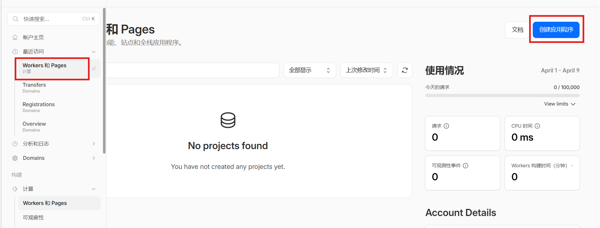

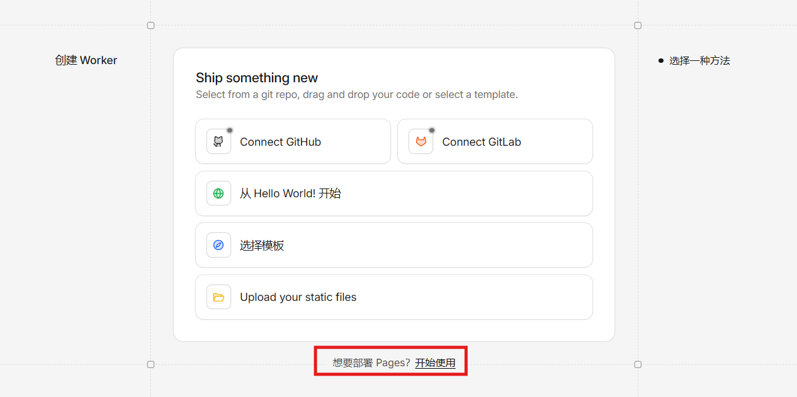

导入开头提到的[github项目](https://github.com/cmliu/edgetunnel "https://github.com/cmliu/edgetunnel")，这里直接下载压缩包后上传文件导入

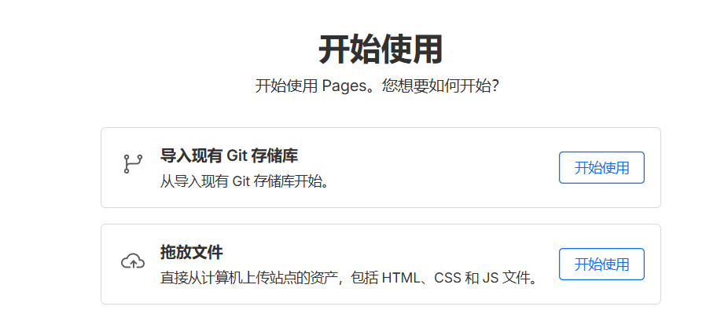

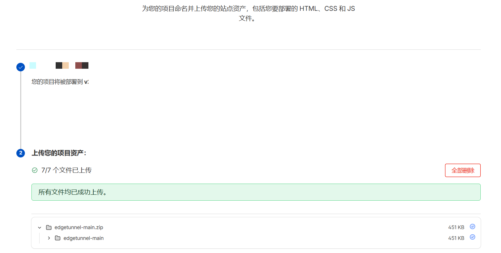

在成功后选择`继续处理项目`

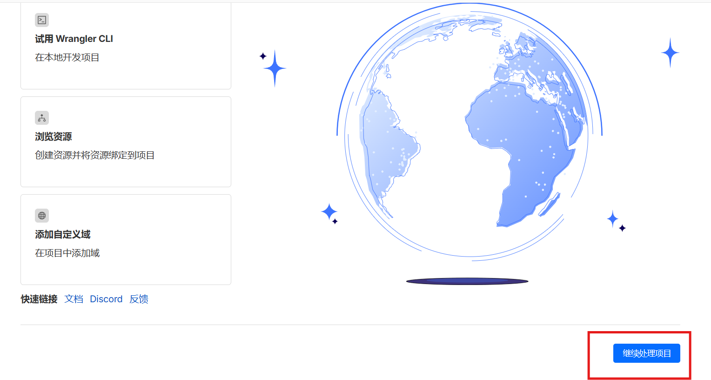

在`设置`>`变量和机密`中，添加密钥，变量名为`ADMIN`，变量值为后续登录使用的密码(**注意使用强密码**)

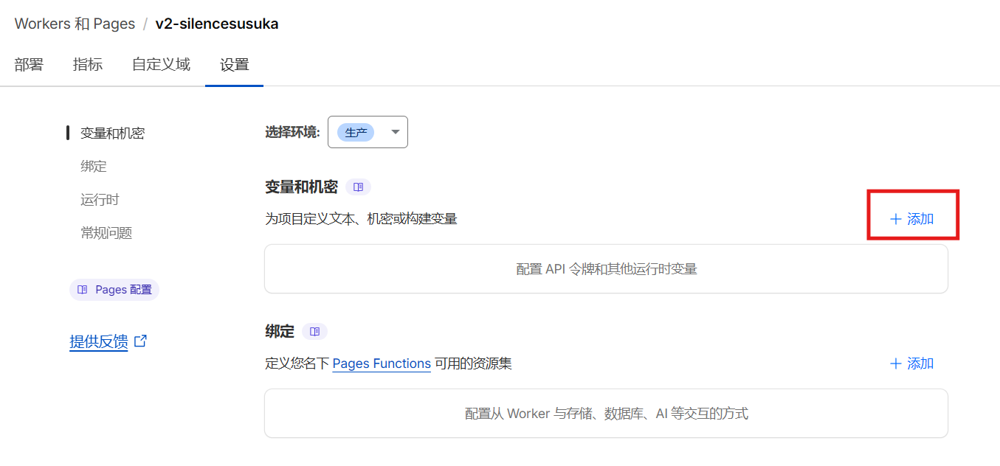

接着在`设置`>`绑定`中绑定KV命名空间，命名为`KV`

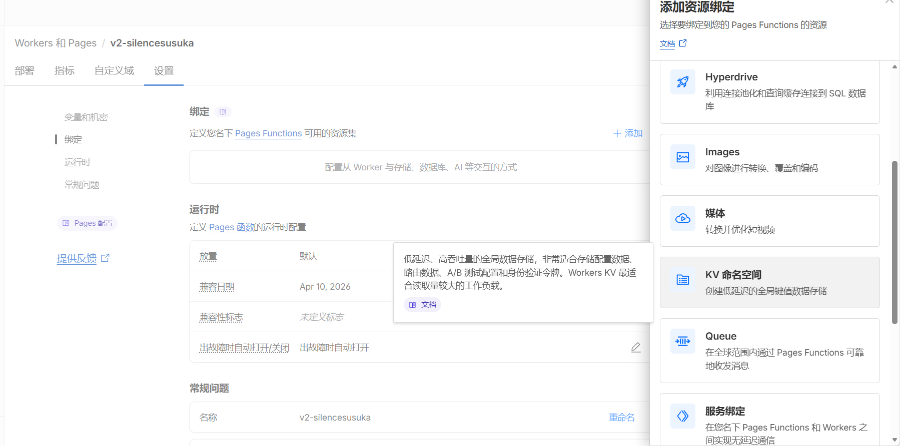

如果没有KV空间的话，就回到主页面查找 `Workers KV`创建一个空的KV空间，随便填个名称即可

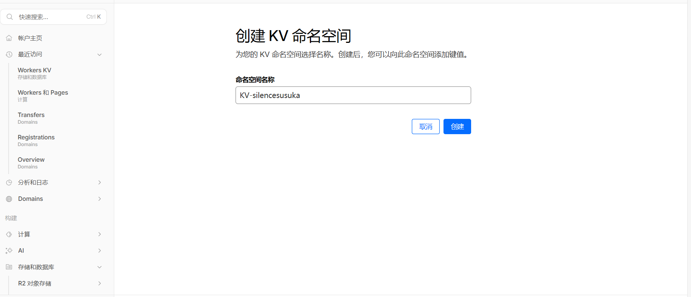

最后全部设置完后页面如下，确保含有名称为`ADMIN`的变量以及名称为`KV`的KV命名空间

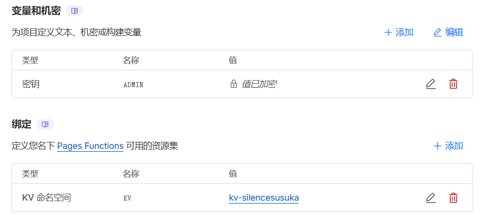

保存后，在刚刚的项目页面选择`创建新的部署`

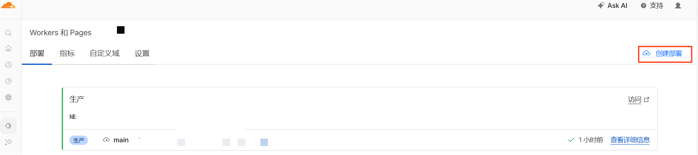

重新上传一次前文[github项目](https://github.com/cmliu/edgetunnel "https://github.com/cmliu/edgetunnel")的压缩包，点击`保存并部署`(上传文件不需要任何更改，此操作只是为了保存刚刚设置的变量)

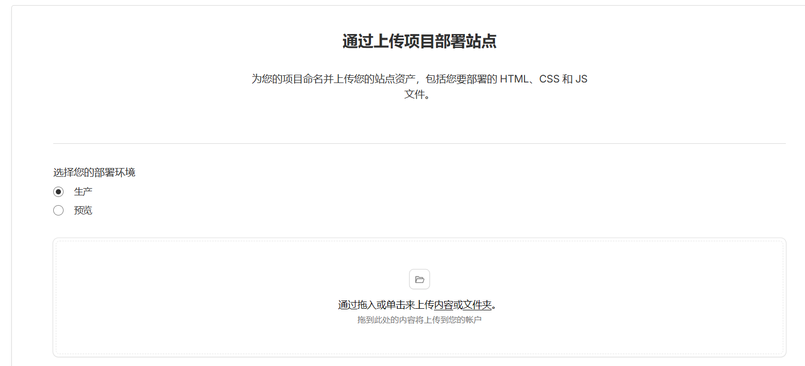

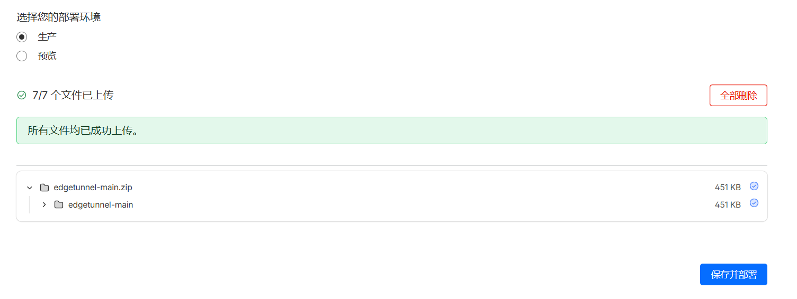

直接访问页面url

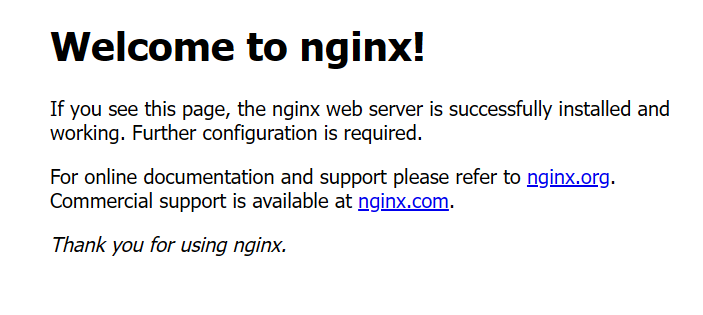

出现welcome to nginx就代表部署好了

此时在url中加入 `/admin`路径，即 `https://xxxxxx.pages.dev/admin`，输入刚刚`ADMIN`变量所设的密码即可登录后台，获取订阅链接

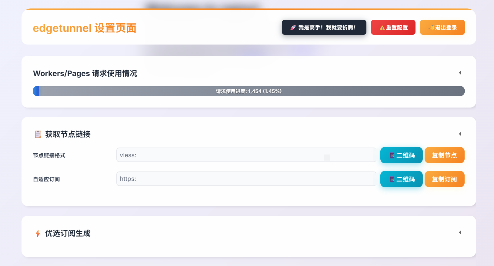

*注：请求使用情况需要额外配置API令牌才可显示*

客户端使用[v2rayN](https://github.com/2dust/v2rayN "https://github.com/2dust/v2rayN")，在订阅设置中填入网站显示的订阅地址并更新订阅即可

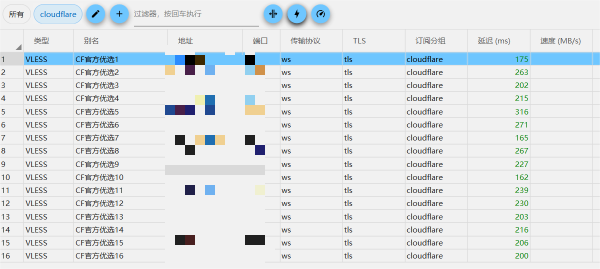
