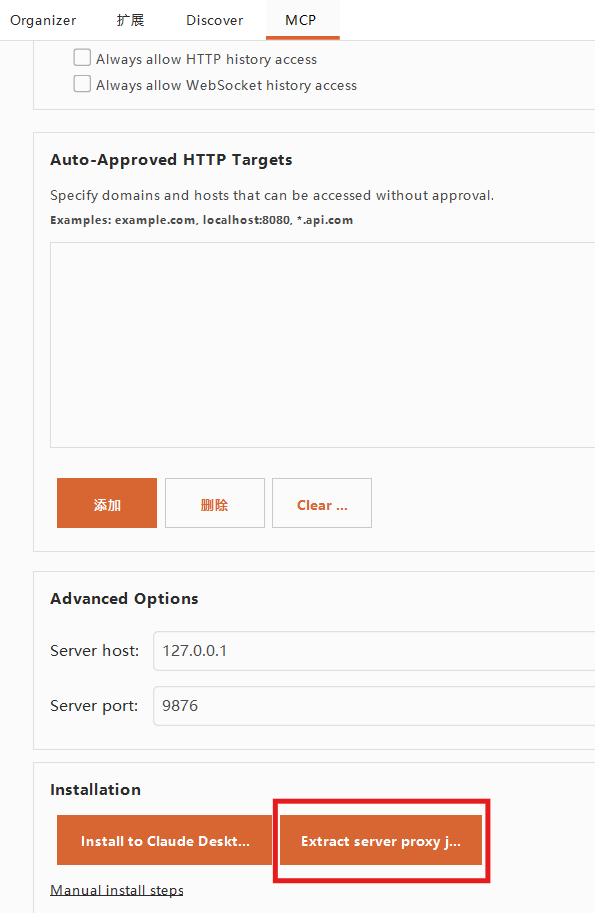
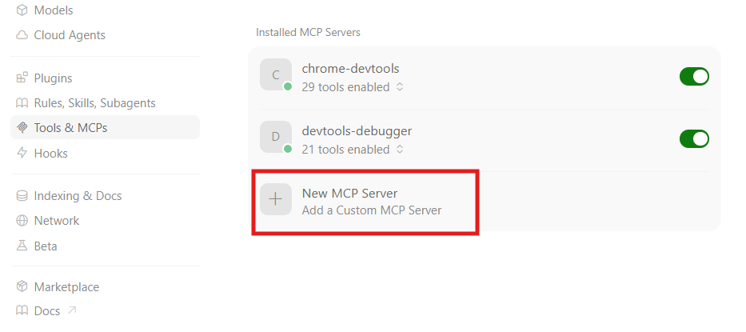
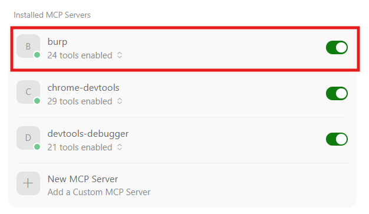
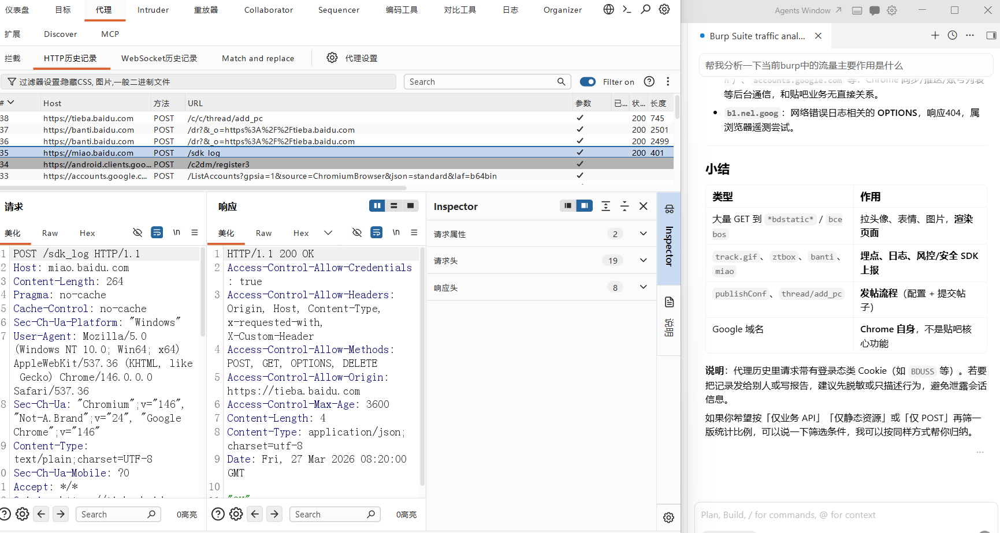

## 1）下载MCP-server插件

使用的[Datch大佬的Burpsuite](https://www.52pojie.cn/thread-2005151-1-1.html "https://www.52pojie.cn/thread-2005151-1-1.html")

进入Burp的`扩展`>`BApp商店`，搜索MCP并选择`MCP Server`


该扩展默认监听9876端口

## 2）下载监听jar包

在该扩展页面点击`Extract server proxy jar`，下载代理的jar包



## 3）Cursor配置

在MCP配置页面添加


```json
{
  "mcpServers": {
    "burp":{
      "command":"java",
      "args": [
        "-jar",
        "D:\\burp\\plugin\\MCP\\mcp-proxy.jar",
        "--sse-url",
        "http://127.0.0.1:9876"
      ]
    }
  }
}
```

配置成功



## 4）MCP调用结果

成功调用burp进行流量分析


