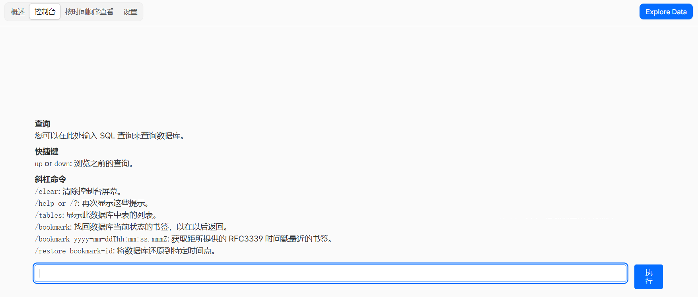
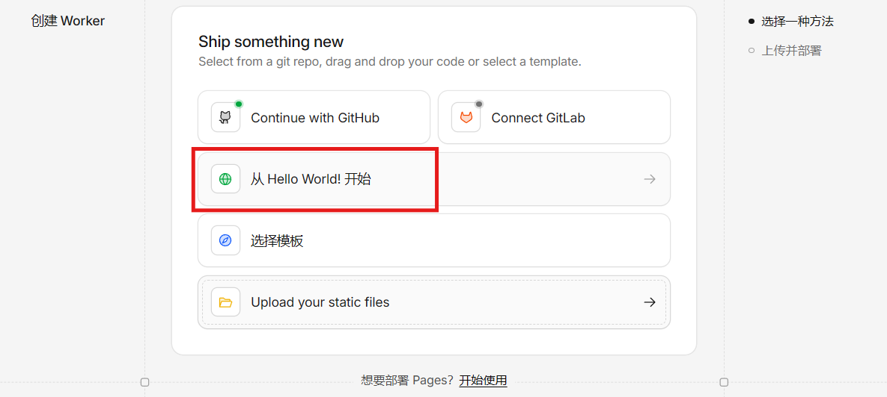
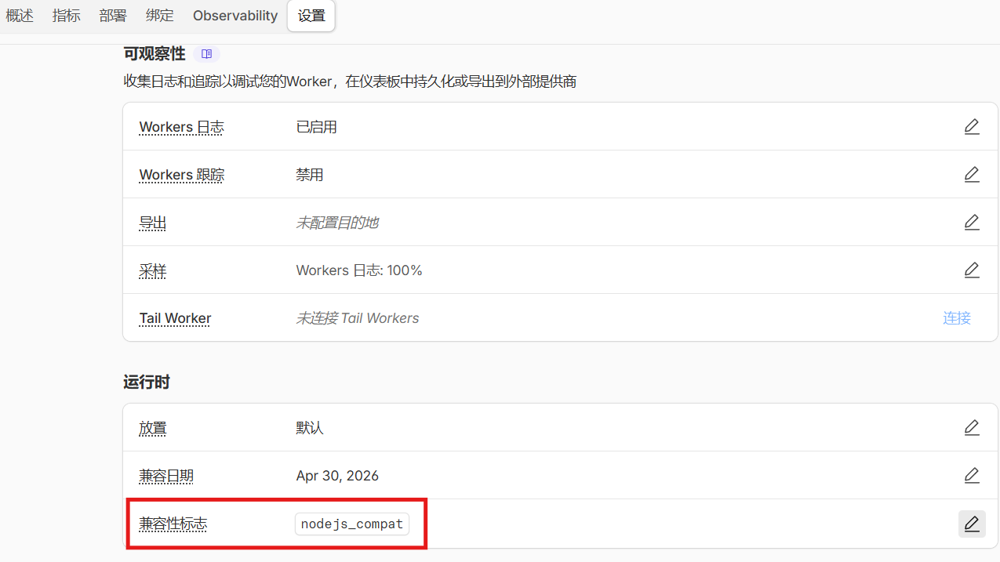
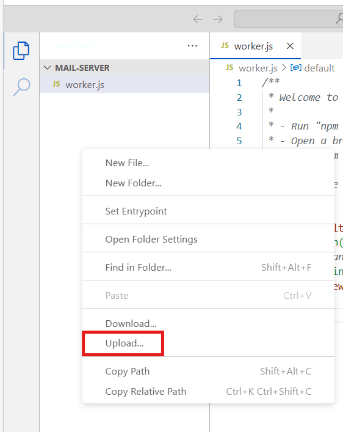
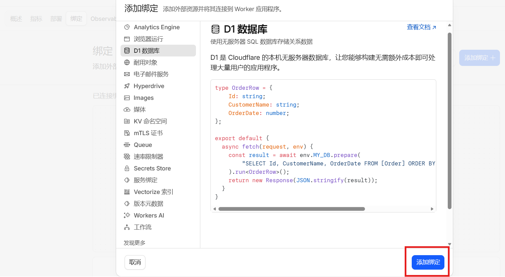
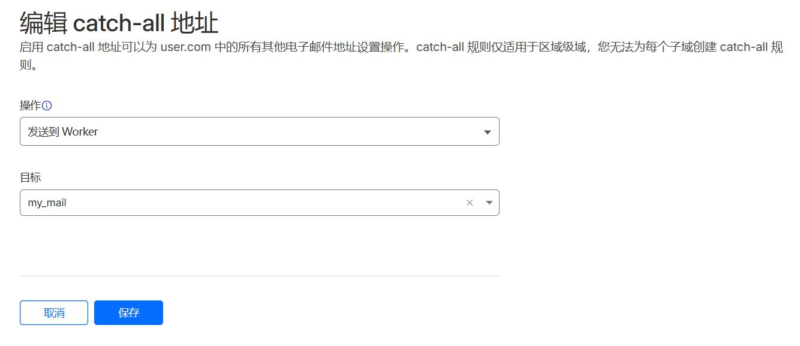
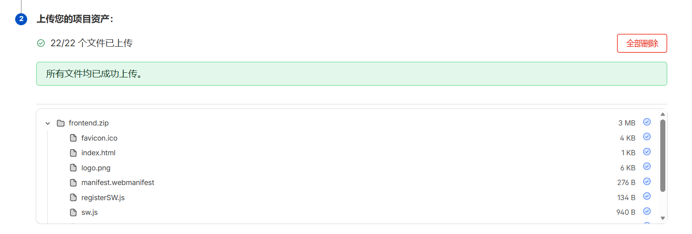

## 1.1、初始化数据库

创建新的D1数据库，在其 `控制台`页面，键入[db/shema.sql](https://github.com/dreamhunter2333/cloudflare_temp_email/blob/main/db/schema.sql "https://github.com/dreamhunter2333/cloudflare_temp_email/blob/main/db/schema.sql")文件，点击 `执行`



shema.sql:

```sql
CREATE TABLE IF NOT EXISTS raw_mails (
    id INTEGER PRIMARY KEY,
    message_id TEXT,
    source TEXT,
    address TEXT,
    raw TEXT,
    raw_blob BLOB,
    metadata TEXT,
    created_at DATETIME DEFAULT CURRENT_TIMESTAMP
);

CREATE INDEX IF NOT EXISTS idx_raw_mails_address ON raw_mails(address);

CREATE INDEX IF NOT EXISTS idx_raw_mails_created_at ON raw_mails(created_at);

CREATE INDEX IF NOT EXISTS idx_raw_mails_message_id ON raw_mails(message_id);

CREATE TABLE IF NOT EXISTS address (
    id INTEGER PRIMARY KEY AUTOINCREMENT,
    name TEXT UNIQUE,
    password TEXT,
    source_meta TEXT,
    created_at DATETIME DEFAULT CURRENT_TIMESTAMP,
    updated_at DATETIME DEFAULT CURRENT_TIMESTAMP
);

CREATE INDEX IF NOT EXISTS idx_address_name ON address(name);

CREATE INDEX IF NOT EXISTS idx_address_created_at ON address(created_at);

CREATE INDEX IF NOT EXISTS idx_address_updated_at ON address(updated_at);

CREATE INDEX IF NOT EXISTS idx_address_source_meta ON address(source_meta);

CREATE TABLE IF NOT EXISTS auto_reply_mails (
    id INTEGER PRIMARY KEY,
    source_prefix TEXT,
    name TEXT,
    address TEXT UNIQUE,
    subject TEXT,
    message TEXT,
    enabled INTEGER DEFAULT 1,
    created_at DATETIME DEFAULT CURRENT_TIMESTAMP
);

CREATE INDEX IF NOT EXISTS idx_auto_reply_mails_address ON auto_reply_mails(address);

CREATE TABLE IF NOT EXISTS address_sender (
    id INTEGER PRIMARY KEY,
    address TEXT UNIQUE,
    balance INTEGER DEFAULT 0,
    enabled INTEGER DEFAULT 1,
    created_at DATETIME DEFAULT CURRENT_TIMESTAMP
);

CREATE INDEX IF NOT EXISTS idx_address_sender_address ON address_sender(address);

CREATE TABLE IF NOT EXISTS sendbox (
    id INTEGER PRIMARY KEY,
    address TEXT,
    raw TEXT,
    created_at DATETIME DEFAULT CURRENT_TIMESTAMP
);

CREATE INDEX IF NOT EXISTS idx_sendbox_address ON sendbox(address);

CREATE INDEX IF NOT EXISTS idx_sendbox_created_at ON sendbox(created_at);

CREATE TABLE IF NOT EXISTS settings (
    key TEXT PRIMARY KEY,
    value TEXT,
    created_at DATETIME DEFAULT CURRENT_TIMESTAMP,
    updated_at DATETIME DEFAULT CURRENT_TIMESTAMP
);

CREATE TABLE IF NOT EXISTS users (
    id INTEGER PRIMARY KEY,
    user_email TEXT UNIQUE NOT NULL,
    password TEXT NOT NULL,
    user_info TEXT,
    created_at DATETIME DEFAULT CURRENT_TIMESTAMP,
    updated_at DATETIME DEFAULT CURRENT_TIMESTAMP
);

CREATE INDEX IF NOT EXISTS idx_users_user_email ON users(user_email);

CREATE TABLE IF NOT EXISTS users_address (
    id INTEGER PRIMARY KEY,
    user_id INTEGER,
    address_id INTEGER UNIQUE,
    created_at DATETIME DEFAULT CURRENT_TIMESTAMP
);

CREATE INDEX IF NOT EXISTS idx_users_address_user_id ON users_address(user_id);

CREATE INDEX IF NOT EXISTS idx_users_address_address_id ON users_address(address_id);

CREATE TABLE IF NOT EXISTS user_roles (
    id INTEGER PRIMARY KEY,
    user_id INTEGER UNIQUE NOT NULL,
    role_text TEXT,
    created_at DATETIME DEFAULT CURRENT_TIMESTAMP,
    updated_at DATETIME DEFAULT CURRENT_TIMESTAMP
);

CREATE INDEX IF NOT EXISTS idx_user_roles_user_id ON user_roles(user_id);

CREATE TABLE IF NOT EXISTS user_passkeys (
    id INTEGER PRIMARY KEY,
    user_id INTEGER NOT NULL,
    passkey_name TEXT NOT NULL,
    passkey_id TEXT NOT NULL,
    passkey TEXT NOT NULL,
    counter INTEGER DEFAULT 0,
    created_at DATETIME DEFAULT CURRENT_TIMESTAMP,
    updated_at DATETIME DEFAULT CURRENT_TIMESTAMP
);

CREATE INDEX IF NOT EXISTS idx_user_passkeys_user_id ON user_passkeys(user_id);

CREATE UNIQUE INDEX IF NOT EXISTS idx_user_passkeys_user_id_passkey_id ON user_passkeys(user_id, passkey_id);
```

## 1.2、部署邮箱后端

1.2.1、创建workers，选择 `从hello world!开始`



1.2.2、创建后，在 `设置`>`兼容性标志`中键入 `nodejs_compat`，同时注意兼容日期须晚于 `Apr 1,2025`



1.2.3、下载[worker.js](https://github.com/dreamhunter2333/cloudflare_temp_email/releases/latest/download/worker.js "https://github.com/dreamhunter2333/cloudflare_temp_email/releases/latest/download/worker.js")

1.2.4、上传worker.js

在概述页面找到 `编辑代码`


打开文件工作区，鼠标右键，选择 `upload`



1.2.5、在 `设置`>`变量和机密`选项中添加相关变量设置，更多变量参考[worker变量说明](https://temp-mail-docs.awsl.uk/zh/guide/worker-vars.html "https://temp-mail-docs.awsl.uk/zh/guide/worker-vars.html")

| 变量名                       | 类型        | 说明                                       | 示例                                   |
| ---------------------------- | ----------- | ------------------------------------------ | -------------------------------------- |
| `PREFIX`                   | 文本        | 新建邮箱名称默认前缀，不需要前缀可不配置   | `tmp`                                |
| `DOMAINS`                  | JSON        | 用于临时邮箱的所有域名, 支持多个域名       | `["awsl.uk", "dreamhunter2333.xyz"]` |
| `JWT_SECRET`               | 文本/Secret | 用于生成 jwt 的密钥, jwt 用于登录以及鉴权  | `xxx`                                |
| `ADMIN_PASSWORDS`          | JSON        | admin 控制台密码, 不配置则不允许访问控制台 | `["123", "456"]`                     |
| `ENABLE_USER_CREATE_EMAIL` | 文本/JSON   | 是否允许用户创建邮箱, 不配置则不允许       | `true`                               |
| `ENABLE_USER_DELETE_EMAIL` | 文本/JSON   | 是否允许用户删除邮件, 不配置则不允许       | `true`                               |

1.2.6 找到 `绑定`>`添加绑定`，选择绑定D1数据库

**注意:绑定的数据库名称必须为大写的 `DB`**



1.2.7 确认后端建立情况

直接访问显示 `OK`，打开 `/health_check`显示OK，打开 `/open_api/settings`显示JSON，则代表部署配置成功

## 1.3、申请邮箱路由

1.3.1、在cloudflare的域名上选择 `电子邮件路由`


1.3.2、将路由配置为发送到worker



## 1.4、部署服务器前端页面

1.4.1 下载前端[fronted.zip](https://github.com/dreamhunter2333/cloudflare_temp_email/releases/latest/download/frontend.zip "https://github.com/dreamhunter2333/cloudflare_temp_email/releases/latest/download/frontend.zip")

1.4.2 全局搜索https://temp-email-api.xxx.xxx，将其替换为刚刚后端的地址

1.4.3 创建pages，上传刚刚的zip文件



1.4.4 访问 `/admin`路径即可创建用户或者进行后台管理
