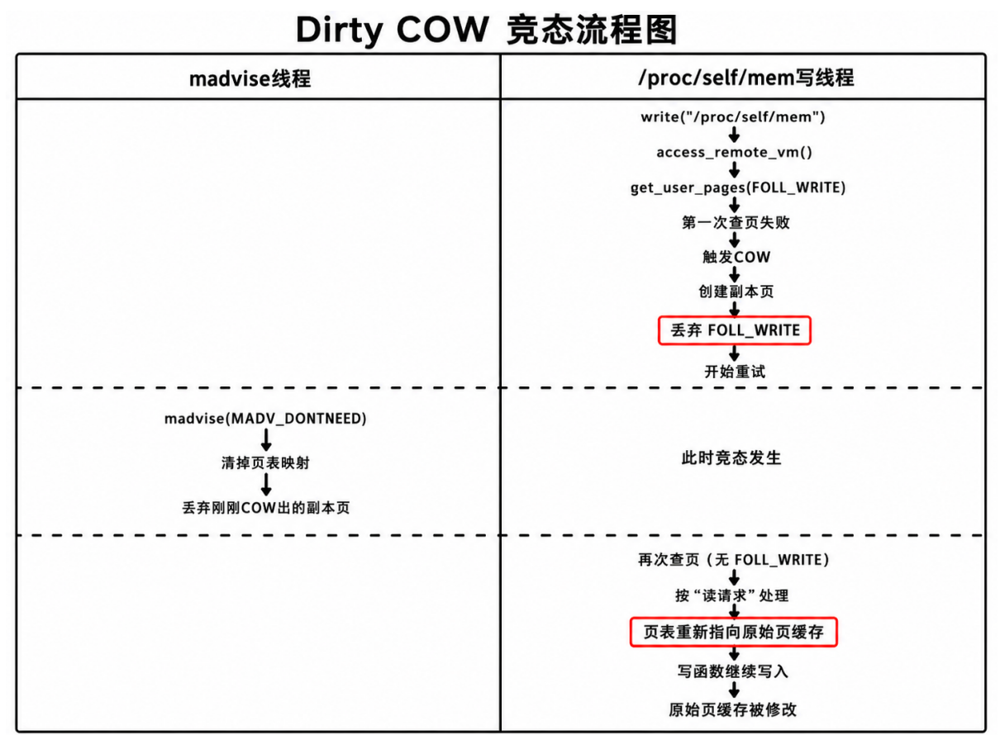
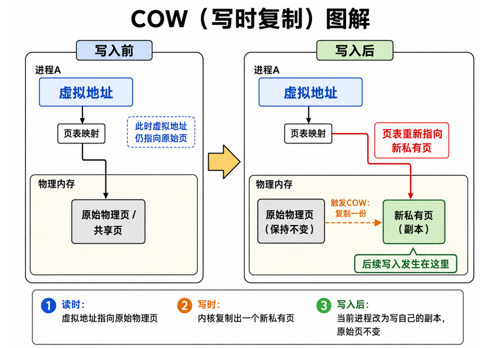

## 前言

CVE-2016-5195，也就是 Dirty COW / 脏牛漏洞，是 Linux 内核中的一个本地提权漏洞。

它的核心可以简单理解为：

> 原本一个只读文件通过 `MAP_PRIVATE` 映射后，即使进程尝试修改，也应该只修改自己的“副本页”，不应该修改原始文件。
> 但在 Dirty COW 中，内核在处理 COW 的过程中出现了竞态，导致写入操作最后没有写到副本页，而是错误写进了原始文件对应的页缓存中。

更通俗一点说：

```text
正常情况：
  写只读私有映射
  -> 触发 COW
  -> 创建副本页
  -> 写入副本页
  -> 原始文件不变

Dirty COW：
  写只读私有映射
  -> 触发 COW
  -> 创建副本页
  -> 另一个线程把副本页映射清掉
  -> 写线程重新找页
  -> 错误找回原始文件的页缓存
  -> 写入原始文件页缓存
  -> 原始文件可能被修改
```

其核心原因归结为两点

1、地址丢失：由其他线程竞态引起的，在即将写入时丢失了写入地址，需要重新查页寻址

2、鉴权丢失：由于旧内核的COW机制，在进行COW操作后，会将代表"写操作"的请求参数丢弃(认为COW写入虚拟私有页无需进行写鉴权)

这两点结合就成了：

*由于竞态丢失了写入地址，重新查页寻址时，由于"写操作"参数丢失，使得其默认按照读权限进行请求，因此此时的查页寻址不再因为写权限拒绝而返回空地址(NULL)，而是返回正常地址，使得内容成功写入。*



## 影响范围

Linux内核版本2.6.22至4.8.3

## COW（Copy On Write）

COW，即 Copy On Write，中文通常叫“写时复制”。

它的作用是：当多个地方共享同一份内容时，先不急着复制；只有当某一方真的要修改时，才复制出一个副本，让修改只发生在副本上。

*~~(不恰当的比喻：打开只读文件a.txt后，如果对其进行修改并保存，则会自动保存为a(1).txt)~~*

可以用下面这个图理解：



## madvise(DONTNEED)

`madvise()` 可以理解为进程向内核提出建议：

> 这一段内存我接下来暂时不用了，你可以把它丢掉，之后我再访问时重新加载。

*即申请清理地址映射关系表*

其中 `MADV_DONTNEED` 的作用大致是：

```text
清理某段虚拟地址对应的页表映射；
后续再次访问这段地址时，再重新建立映射。
```

在 Dirty COW 中，`madvise(DONTNEED)` 的作用不是直接写文件，而是：

> **在线程 1 创建出副本页后，线程 2 尽可能把这个副本页对应的页表项清掉。**

这样一来，线程 1 后续继续写入时，就会发现原来的页表项不见了，于是重新触发缺页异常，重新查找应该使用哪个 page。

## 缺页异常（Page Fault）

当进程访问某个虚拟地址时，如果页表中还没有对应映射，或者当前映射权限不满足访问要求，CPU 就会触发缺页异常，让内核来处理。

*主要作用为寻址并且建立映射关系表(页表)*

在 Dirty COW 中，缺页异常主要出现两次：

```text
第一次：
  写线程带着 FOLL_WRITE 访问只读私有映射
  -> 触发 COW
  -> 创建副本页

第二次：
  副本页映射被 madvise 清掉
  -> 写线程继续访问
  -> 再次缺页
  -> 由于 FOLL_WRITE 已经被旧内核丢弃
  -> 内核错误返回原始文件页缓存
```

## FOLL_WRITE 是什么？

`FOLL_WRITE` 可以理解成内核查页时携带的一个标志。

*携带FOLL_WRITE则视为该操作需要进行写入，不携带则默认为读取操作*

当 `/proc/self/mem` 想向某个地址写入内容时，内核需要先根据这个虚拟地址找到实际的 page。因为这是写操作，所以一开始查页时会带上 `FOLL_WRITE`。

可以简单理解为：

```text
带 FOLL_WRITE：
  我要找一个可以作为“写入目标”的 page。

不带 FOLL_WRITE：
  我只是找一个可以读取/返回的 page。
```

所以，`FOLL_WRITE` 的作用不是最终写入动作本身，而是告诉查页函数：

> 这次查页是为了写入，不能随便返回一个只读页。

这也是 Dirty COW 的关键：
旧内核在 COW 完成后，**错误地把 `FOLL_WRITE` 丢弃了**，导致后续查页逻辑把写请求近似当成读请求处理。

## 漏洞概述

下面使用两个线程来理解 Dirty COW 的竞态过程。

前置条件：

```text
目标文件：
  只读打开

目标映射：
  mmap(PROT_READ, MAP_PRIVATE)

线程 1：
  通过 /proc/self/mem 尝试写入该映射地址

线程 2：
  不断调用 madvise(MADV_DONTNEED)
```

### 1. 线程 1 尝试写入

线程 1 通过 `/proc/self/mem` 尝试向目标地址写入内容。

由于这是写入操作，所以内核查页时会带着 `FOLL_WRITE`

*即：我要通过"缺页异常"去进行第一次查页，找一个允许写入的地址。*

### 2. 第一次查页返回 NULL

线程 1 第一次查页时，内核发现：

```text
目标地址当前指向原始文件页缓存；
但是这个映射是只读的；
而线程 1 的请求又带着 FOLL_WRITE。
```

因此，查页函数不能直接把原始文件页缓存返回给线程 1。

因为如果直接返回，就相当于允许线程 1 写入原始文件页缓存了。

所以这里返回 `NULL`

*即：你要写，但当前这个页不能直接给你写，需要先处理一下。*

### 3. 返回 NULL 后触发 COW，创建副本页

线程 1 收到 `NULL` 后，内核会进入缺页处理流程。

由于这次访问是写访问，所以内核触发 COW：

```text
原始文件页缓存
  -> 复制内容
  -> 创建一个新的副本页
```

然后页表被更新：

```text
触发 COW 前：

虚拟地址
  -> 原始文件页缓存

触发 COW 后：

虚拟地址
  -> 副本页
```

也就是说，正常情况下，后续写入应该写到这个副本页中。

这一阶段的关键操作是：

> **触发 COW，创建副本页，并让页表指向副本页。**

### 4. COW 后旧内核丢弃 FOLL_WRITE

问题出现在 COW 完成之后。

旧内核认为：

> COW 已经完成了，副本页已经创建好了，后面直接拿这个副本页写就行。

于是旧内核把查页标志中的 `FOLL_WRITE` 清掉了。

也就是：

```text
原本：
  FOLL_WRITE = 1

COW 后：
  FOLL_WRITE 被清除
```

这一步是漏洞的关键之一：

> **旧内核在 COW 后丢弃了 `FOLL_WRITE`。**

为什么这会出问题？

因为后续如果再次查页，查页函数**已经不知道这是一个"写请求"了，它会像处理"读请求"一样去找允许的地址**。

### 5. 线程 2 使用 madvise 清掉副本页映射

在线程 1 创建副本页之后，线程 2 不断执行：

```c
madvise(addr, len, MADV_DONTNEED);
```

它的目标是抢在线程 1 真正写入副本页之前，把刚刚建立的副本页映射清掉。

也就是：

```text
线程 1 刚刚建立：

虚拟地址-> 副本页

线程 2 执行 madvise 后：

虚拟地址-> 映射被清掉(即映射缺失)
```

这里被清掉的是页表项，也就是 PTE。

这一阶段的关键操作是：

> **madvise 清掉了“虚拟地址 -> 副本页”的页表映射。**

### 6. 线程 1 继续写入，再次触发缺页异常

线程 1 后续继续执行写入。

但由于线程 2 已经把对应页表项清掉了，所以线程 1 再次访问该虚拟地址时，会发现：

```text
当前虚拟地址没有有效 PTE
```

于是再次触发缺页异常。

此时最关键的问题出现了：

```text
线程 1 原本是写请求；
但 FOLL_WRITE 已经在COW后被旧内核丢弃；
所以这次重新查页时，不再带FOLL_WRITE。
```

也就是说，此时线程 1 的查页过程变成了：

```text
不再强制要求返回“可写目标页”(可以返回只读页地址)
```

于是内核重新查页时，可能直接返回原始文件页缓存。

过程可以理解为：

```text
正常应该是：

虚拟地址
  -> 再次触发 COW
  -> 新的副本页

但漏洞中变成：

虚拟地址
  -> 原始文件页缓存
```

这一阶段的关键操作是：

> **由于 `FOLL_WRITE` 已被丢弃，重新查页时没有再次触发 COW，而是错误返回了原始文件页缓存。**

### 7. 写函数拿到原始页缓存后，继续写入

虽然重新查页时已经没有 `FOLL_WRITE`，但外层的 `/proc/self/mem` 写函数并没有变。

也就是说，外层逻辑仍然认为：

```text
我要把 payload 写入目标地址。
```

于是发生了问题：

```text
查页函数：
  错误返回了原始文件页缓存

写函数：
  拿到 page 后继续写入

结果：
  payload 被写入原始文件页缓存
```

最终效果就是：

> **写入没有落到副本页，而是落到了原始文件页缓存。**

如果这个被写脏的页缓存后续被回写到底层文件，就可能导致原本只读的文件被修改。

## 函数调用流程

### 线程 1：通过 /proc/self/mem 写入

```text
write("/proc/self/mem", payload)
  -> mem_write()
  -> access_remote_vm(write=1)
  -> get_user_pages(FOLL_WRITE | FOLL_FORCE | ...)
```

这里的重点是：

```text
access_remote_vm(write=1)
```

它表示外层语义仍然是写入。

### 第一次查页

```text
follow_page_mask()
  -> 发现目标 PTE 不可写
  -> 但本次请求带有 FOLL_WRITE
  -> 不能直接返回原始文件页缓存
  -> 返回 NULL
```

这里的重点是：

```text
带 FOLL_WRITE 时，不能直接返回只读的原始页缓存。
```

### 触发 COW

```text
faultin_page()
  -> handle_mm_fault(FAULT_FLAG_WRITE)
  -> 触发 COW
  -> 创建副本页
  -> 页表 PTE 指向副本页
```

对应关系变成：

```text
虚拟地址->副本页
```

### 漏洞点：清除 FOLL_WRITE

旧内核中，COW 完成后会出现类似逻辑：

```text
COW 已经完成
  -> 清除 FOLL_WRITE
```

也就是：

```text
FOLL_WRITE 被丢弃
```

这一步导致后续重试请求时不再需要进行写鉴权。

### 线程 2：madvise 清除副本页映射

```text
madvise(MADV_DONTNEED)
  -> 清掉该虚拟地址对应的 PTE
  -> 刚刚创建的副本页不再能通过该虚拟地址找到
```

对应关系从：

```text
虚拟地址
  -> 副本页
```

变成：

```text
虚拟地址
  -> 无有效 PTE
```

### 线程 1：retry 重新查页

```text
retry follow_page_mask()
  -> 当前地址没有有效 PTE
  -> 再次 fault
  -> 但此时已经没有 FOLL_WRITE
  -> 内核按读访问重新建立映射
  -> 返回原始文件页缓存
```

对应关系变成：

```text
虚拟地址
  -> 原始文件页缓存
```

### 最终写入

```text
access_remote_vm(write=1)
  -> 拿到 GUP 返回的 page
  -> copy_to_user_page(..., payload, ...)
  -> set_page_dirty_lock(page)
```

重点是：

```text
虽然 GUP retry 时没有 FOLL_WRITE，
但 access_remote_vm(write=1) 仍然会执行写入。
```

因此，原始文件页缓存被写脏。

## 总结

Dirty COW 的核心并不是“文件本身突然变成可写”，也不是“普通用户态写指令绕过了页表权限”。

它真正的问题是：

1. `/proc/self/mem` 的写路径一开始确实是写请求；
2. 写请求触发 COW，创建了副本页；
3. 旧内核在 COW 后 **错误丢弃了 FOLL_WRITE**；
4. `madvise` 又 **清掉了副本页映射**；
5. retry 时，内核 **错误返回原始文件页缓存**；
6. 外层写函数仍然执行写入；
7. 最终导致原始文件页缓存被写脏。

一句话记忆：

> **脏牛漏洞就是：本该写副本页，结果因为 `FOLL_WRITE` 被丢弃 + `madvise` 清掉副本映射，最终写到了原始文件页缓存。**

## 参考文档

- [NVD - CVE-2016-5195](https://nvd.nist.gov/vuln/detail/cve-2016-5195)
- [Linux kernel commit - mm: remove gup_flags FOLL_WRITE games from __get_user_pages()](https://github.com/torvalds/linux/commit/19be0eaffa3ac7d8eb6784ad9bdbc7d67ed8e619)
- [mmap(2) - Linux manual page](https://man7.org/linux/man-pages/man2/mmap.2.html)
- [madvise(2) - Linux manual page](https://man7.org/linux/man-pages/man2/madvise.2.html)
- [Dirty COW and why lying is bad even if you are the Linux kernel](https://chao-tic.github.io/blog/2017/05/24/dirty-cow)
- [CVE-2016-5195漏洞分析与复现 - 先知社区](https://xz.aliyun.com/news/7156)
