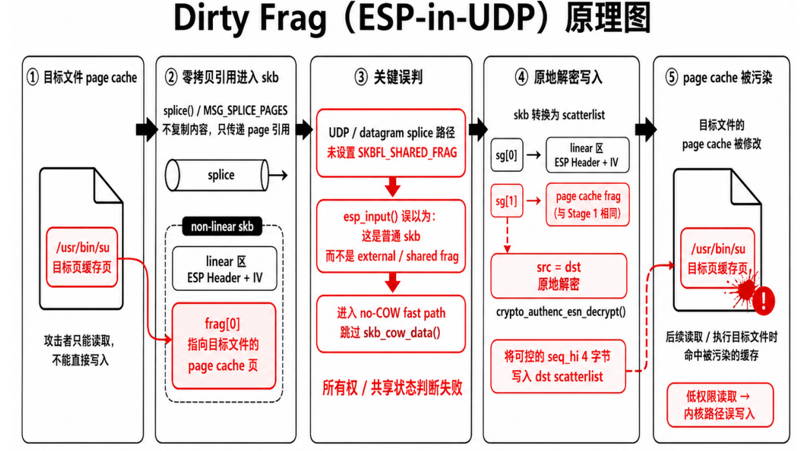

## 漏洞概述

Dirty Frag 是 Linux 内核中的本地提权漏洞链，核心问题是:

> 攻击者可以通过零拷贝路径，把只读文件的 `page cache` 页引用进网络数据包的 `skb frag` 中。后续 ESP / RxRPC 解密路径误以为这些 frag 是普通的私有网络缓冲区，并在原地解密过程中写入数据，最终导致目标文件的 `page cache` 被污染。

该漏洞主要涉及两个漏洞利用链：

- `CVE-2026-43284`：xfrm-ESP / IPsec ESP Page-Cache Write
- `CVE-2026-43500`：RxRPC Page-Cache Write

受影响版本:

* Linux 内核 4.10 至 7.0
* 大多数甚至全部Linux发行版都受到了影响，这可以追溯到好几年前

---

## 核心成因

Dirty Frag 的核心成因可以概括为三点：

1. **外部页引入:**零拷贝技术引入了非线性连续的sk_buff，使得其非连续的frag块可以引用外部的物理页，而非必须使用自己申请的物理页
2. **共享状态丢失:**UDP / datagram splice 路径没有像TCP 一样正确设置 `SKBFL_SHARED_FRAG`，导致后续路径无法识别该 frag 来自外部共享页，因此会跳过核心鉴权函数 `skb_cow_data()`
3. **原地操作:**写入与输出地址使用相同的内存块，使得对高权限文件的可控写入能够直接落在其物理页上。



简化流程如下：

```text
只读目标文件
    ↓
splice() 引用文件 page cache
    ↓
page cache 页进入 skb frag
    ↓
UDP 路径未设置 SKBFL_SHARED_FRAG
    ↓
ESP / RxRPC 误以为这是普通 skb
    ↓
跳过 skb_cow_data() / unshare
    ↓
src = dst 原地解密
    ↓
写入落到目标文件 page cache
    ↓
后续读取或执行目标文件时命中被污染的缓存
```

## 关键对象说明

### 零拷贝技术

为了满足万兆甚至更高速率网络的数据传输需求，减少用户态与内核态之间不必要的上下文切换，Linux 引入了 splice() 和 sendfile() 等零拷贝系统调用，其会使用 `sk_buff`来管理网络数据包

`sk_buff`可以有两种主要形态：

```text
linear skb(线性连续):
    数据主要位于 skb 自己的连续缓冲区中

non-linear skb(非线性连续):
    一部分数据位于线性区
    另一部分数据通过 frags[] 引用外部 page
```

Dirty Frag 依赖的是 `non-linear skb`*(因为可以引用外部page，所以也可以直接引用只读高权限文件的物理页)*。

简化结构如下：

```text
sk_buff
├── linear 区
│   └── ESP Header + IV
│
└── frags[0]
    └── 指向目标文件的 page cache 页
```

### 原地操作 (In-place Operation)

为了追求极致的吞吐量和最低的延迟，内核网络开发者倾向于使用原地操作（In-place Operation）来进行密码学运算，即密码引擎直接在密文所在的原始内存地址上进行解密计算，并将生成的明文直接覆盖在原本的密文之上，从而彻底免除了分配新内存和进行数据拷贝的开销。

*(差不多就是不开辟新的物理页，直接原地覆写)*

## ESP-in-UDP 路径原理(Dirty Frag典型利用链)

### 零拷贝引入目标页

攻击者先读取一个只能读、不能写的目标文件，例如：

```text
/usr/bin/su
/usr/bin/sudo
```

随后通过 `splice()` / `MSG_SPLICE_PAGES`，把该文件的 `page cache` 页引用进 UDP skb 的 `frag` 中。

这里不是复制文件内容，而是传递 page 引用。

```text
目标文件 page cache
    ↓
splice()
    ↓
skb frag
```

---

### UDP 路径缺少 shared frag 标记

正常情况下，如果 skb 的 frag 来自外部共享页，后续路径应该能识别这一点。

但UDP / datagram splice 路径不会正确设置 `SKBFL_SHARED_FRAG`

结果导致该 skb 看起来像普通的 `uncloned non-linear skb(非外部引用的skb)`

后续 ESP 接收路径无法意识到：

```text
这个 frag 不是网络栈私有拥有的可写页
而是外部文件的 page cache 页
```

---

### ESP input 误判并跳过 COW

ESP 接收路径处理该 skb 时，会误以为这是普通 skb。

于是进入：

```text
no-COW fast path
```

并跳过：

```text
skb_cow_data()
```

`skb_cow_data()` 的作用可以理解为：

```text
如果 skb 数据不是私有可写的
就复制 / 私有化一份
避免直接修改外部共享页
```

*(不恰当的比喻:修改a.txt保存时会自动另存为a(1).txt，此时便无法成功修改高权限文件内容)*

但由于共享状态判断失败，ESP 没有进行这一步。

---

### 原地解密导致写入落到 page cache

ESP 解密路径为了性能，会使用原地解密：

```text
src = dst
```

也就是：

```text
输入数据和输出数据使用同一组 scatterlist
```

处理流程大致如下：

```text
skb_to_sgvec()
    ↓
将 skb linear 区 + frag 转换为 scatterlist
    ↓
aead_request_set_crypt(src = sg, dst = sg)
    ↓
crypto_authenc_esn_decrypt()
```

此时 scatterlist 中包含：

```text
sg[0] -> skb linear 区
sg[1] -> 目标文件的 page cache frag
```

因此，解密流程中的写入会落到 `sg[1]`，也就是目标文件的 `page cache` 页。

---

### ESP 路径中的可控写入

`crypto_authenc_esn_decrypt()` 会产生一次关键的 4 字节写入。

这 4 字节来自攻击者可控的 `seq_hi`

即 ESP ESN 的高 32 位序列号。

简化理解：

```text
写入来源：攻击者可控的 seq_hi
写入目标：dst scatterlist 的某个偏移
危险点：dst scatterlist 中包含目标文件的 page cache frag
结果：4 字节写入落到目标文件 page cache
```

因此，ESP 路径不是简单地：

```text
恶意密文解密成恶意明文
```

而更准确地说是：

```text
攻击者让目标文件 page cache 页出现在 dst scatterlist 中
随后 ESP 解密流程中的可控 4 字节 STORE 写入该 page cache
多次触发后逐步拼出目标修改内容
```

---

## 参考文档

[NVD - CVE-2026-43284](https://nvd.nist.gov/vuln/detail/CVE-2026-43284)

[dirtyfrag/assets/write-up.md at master · V4bel/dirtyfrag](https://github.com/V4bel/dirtyfrag/blob/master/assets/write-up.md)

[Dirty Frag Linux kernel local privilege escalation vulnerability mitigations | Ubuntu](https://ubuntu.com/blog/dirty-frag-linux-vulnerability-fixes-available)

[Dirty Frag (CVE-2026-43284 and CVE-2026-43500): Detecting unpatched local privilege escalation via Linux Kernel ESP and RxRPC | Sysdig](https://www.sysdig.com/blog/dirty-frag-cve-2026-43284-and-cve-2026-43500-detecting-unpatched-local-privilege-escalation-via-linux-kernel-esp-and-rxrpc)

[Dirty Frag 漏洞曝光，影响所有主流 Linux 发行版 - 蚁景网安实验室 - 博客园](https://www.cnblogs.com/hetianlab/p/20029620)
